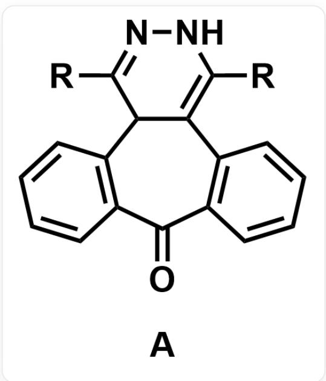
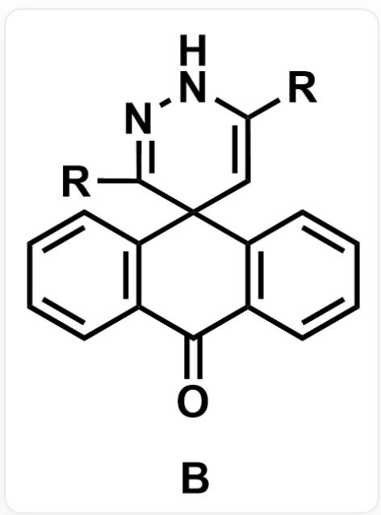
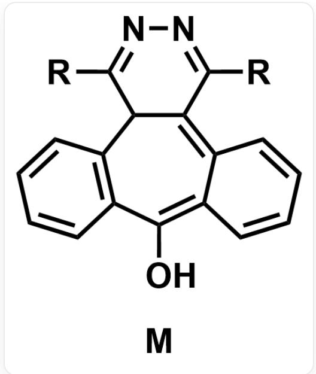
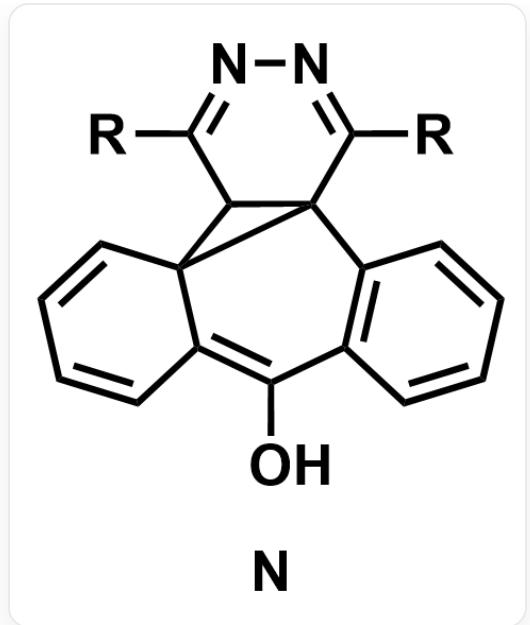

# 题目

如下两种物质可以在一定条件下相互转化。A在条件X下可转化为B，B在条件Y下可转化为A。条件X,Y是(a)加热或可见光照射；(b)紫外光照射中的一者。A到B的转变过程中有两个中间体，依次为M,N，其中一个含有一个三元环。

[R]C1=NNC([R])=C2C1C(C=CC=C3)=C3C(C4=C2C=CC=C4)=O，物质代号为A

$\mathrm{O = C1C2 = C(C = CC = C2)C3(C = C([R])NN = C3[R])C4 = C1C = CC = C4}$  ，物质代号为B

# 有如下说法：

1.  $\mathbf{M}, \mathbf{N}$  中含有三元环的是  $\mathbf{N}$  。  
2.M,N中至少一者存在N-H键。  
3.条件X是(a)，条件Y是(b)。

选出所有的正确说法。

A. 1,2,3  
B. 1,2  
C. 1,3  
D. 2,3

E. 1  
F. 2  
G. 3  
H. 其他所有说法均不对

# 答案

正确答案: C

# 详细解析

A 的共轭范围比 B 更大，A 的 LUMO - HOMO 能差比 B 更小，吸收波长更长的光。所以条件 X 是 (a) 加热或可见光照射，条件 Y 是 (b) 紫外光照射，说法3正确。

# CHECKPOINT

1 PTS

A的共轭范围比B更大

# CHECKPOINT

1 PTS

条件  $\mathbf{X}$  是(a)，条件  $\mathbf{Y}$  是(b)

A 到 B 经历两个中间体 M, N。若 M 含有三元环，则下一步 M 的三元环打开后就直接得到 B，不会有另一个中间体。此外，由 A 直接形成三元环需要烯胺进攻连有羰基的芳香环，二者亲核性和亲电性不强，在加热或可见光照射条件下很难发生。所以 A 到 B 反应的第一步是为形成三元环准备合适结构。

根据此思路，可以推出在烯胺和酮的推电子和吸电子效应下A互变异构生成M，结构如下。

[R]C1=NN=C([R])C2=C3C(C=CC=C3)=C(O)C4=C(C=CC=C4)C12，物质代号为M

# CHECKPOINT

1 PTS

在烯胺和酮的推电子和吸电子效应下A互变异构生成M

M到N经历  $6\pi$  电环化，将七元环变为六并三结构，N结构如下。

[R]C1=NN=C([R])C23C1C(C=CC=C4)2C4=C(O)C5=C3C=CC=C5，物质代号为N

# CHECKPOINT

1 PTS

M到N经历  $6\pi$  电环化

在烯醇和亚胺的推电子和吸电子效应下  $\mathbf{N}$  互变异构生成B。

# CHECKPOINT

1 PTS

在烯醇和亚胺的推电子和吸电子效应下  $\mathbf{N}$  互变异构生成  $\mathbf{B}$

所以M,N中含有三元环的是N，说法1正确。M,N中都是偶氮结构，没有N-H键，说法2错误。

# CHECKPOINT

1 PTS

N含三元环，M不含三元环

# CHECKPOINT

1 PTS

M,N中都没有N-H键

综上所述，正确的说法为1和3，答案为选项C。