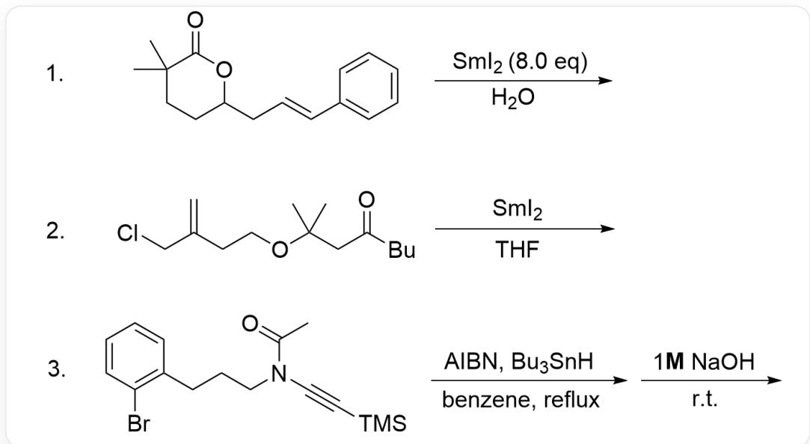
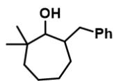
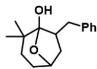
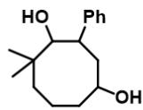
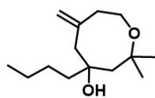
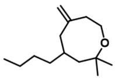
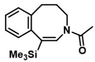
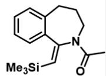

# Question

The construction of medium-sized rings is different from the construction of five- or six-membered rings. Due to their larger ring strain, some relatively more special reaction conditions are required to achieve this. Radical chemistry can play a good role in the construction of this type of ring system. By using simple reduction conditions, medium-sized rings can also be constructed efficiently. Select the final products of the following 3 reactions, without requiring stereochemistry.

  
Reaction 1: CC1(C)CCC(C/C=C/C2=CC=CC=C2)OC1=O reacts with  $SmI_{2}$  in  $H_{2}O$  Reaction 2:  
C=C(CCCOC(C)(C)CC(CCCC)=O)CCI reacts with  $SmI_{2}$  in THF Reaction 3:  
BrC1=CC=CC=C1CCCN(C(C)=O)C#C[Si](C)(C)C reacts with  $Bu_{3}SnH$ , AIBN, NaOH in benzene  
underflux

  
a)

  
b)

  
c)

  
d)

  
e)

  
f)

  
g)

  
h)

  
i)

a) CC(C1O)(C)CCCCC1CC2=CC=CC=C2 b) OC(CC1CC2=CC=CC=C2)CCC(C)(C)C1O c)

CC1(C)CCC(CC2CC3=CC=CC=C3)OC12O d) CC1(C)CCCC(O)CC(C2=CC=CC=C2)C1O e)

C=C1CCOC(C)(C)CC(CCCC)(O)C1 f) C=C1CCOC(C)(C)CC(CCCC)C1 g) CC(N1/C=C([Si](C)

(C)C)\C2=C(C=CC=CC=C2)CCC1)=O h) C[Si](/C1=C/NCCCCC2=C1C=CC=C2)(C)C i

$\mathrm{O = C(C)N1 / C(C2 = CC = CC = C2CCC1) = C / [Si](C)(C)C}$

A. All other options are incorrect  
B. a.e.g.  
C. c.e.g.  
D. b.e.g.  
E. d.e.h.  
F. b.f.g.  
G. c.e.i.  
H. d.e.i.

I. b.e.h.

# Answer

Correct Answer: D

# Detailed Explanation

Reaction 1:

CC1(C)CCC(C/C=C/C2=CC=CC=C2)OC1=O reacts with  $SmI_{2}$  in  $H_{2}O$ , the carbonyl group is reduced to a hydroxyl group and a carbon radical, undergoing a 5-exo ring closure, to obtain OC(CC1C[X, X is a single electron]C2=CC=CC=C2)CCC(C)(C)C1O

# CHECKPOINT

1 PTS

OC(CC1C[X, X is a single electron]C2=CC=CC=C2)CCC(C)(C)C1O

OC(CC1C[X, X is a single electron]C2=CC=CC=C2)CCC(C)(C)C1O is further reduced and quenched with water to obtain c.

# CHECKPOINT

1 PTS

OC(CC1C[X, X is a single electron]C2=CC=CC=C2)CCC(C)(C)C1O is further reduced and quenched with water to obtain c.

c can undergo ring-opening in water and is further reduced to obtain b.

# CHECKPOINT

1 PTS

c can undergo ring-opening in water and is further reduced to obtain b.

# Reaction 2:

Allyl chloride is reduced to an allyl radical, and the carbonyl group is also reduced to a carbon radical and an oxygen anion. The two radicals couple and quench to obtain e.

# CHECKPOINT

1 PTS

Reaction 2, allyl chloride is reduced to an allyl radical, and the carbonyl group is also reduced to a carbon radical and an oxygen anion. The two radicals couple and quench to obtain e.

# Reaction 3:

Under radical initiation conditions, Sn radicals are generated, abstracting Br to obtain phenyl radicals, undergoing 8-endo ring closure on the alkyne to obtain CC(N1/C[X, X is a single electron]=C([Si](C) (C)C)\C2=C(C=CC=C2)CCC1)=O

CC(N1/C[X, X is a single electron] = C([Si](C)(C)C)\C2 = C(C = CC = C2)CCC1) = O is quenched by Sn-H to obtain g.

Because Si can stabilize  $\beta$ -position radicals, 7-endo ring closure does not occur.

The amide bond is difficult to hydrolyze at room temperature, and the acetyl group will not leave, so the product is not h.

# CHECKPOINT

1 PTS

Because Si can stabilize  $\beta$ -position radicals, 7-endo ring closure does not occur.

# CHECKPOINT

1 PTS

Undergoing 8-endo ring closure to obtain CC(N1/C[X, X is a single electron] = C([Si](C) (C)C) $C2 = C(C = CC = C2)CCC1) = O$

# CHECKPOINT

1 PTS

CC(N1/C[X, X is a single electron] = C([Si](C)(C)C)\C2 = C(C = CC = C2)CCC1) = O is quenched by Sn-H to obtain g.

# CHECKPOINT

1 PTS

The amide bond is difficult to hydrolyze at room temperature, the product is not h

In summary, option D is reasonable.