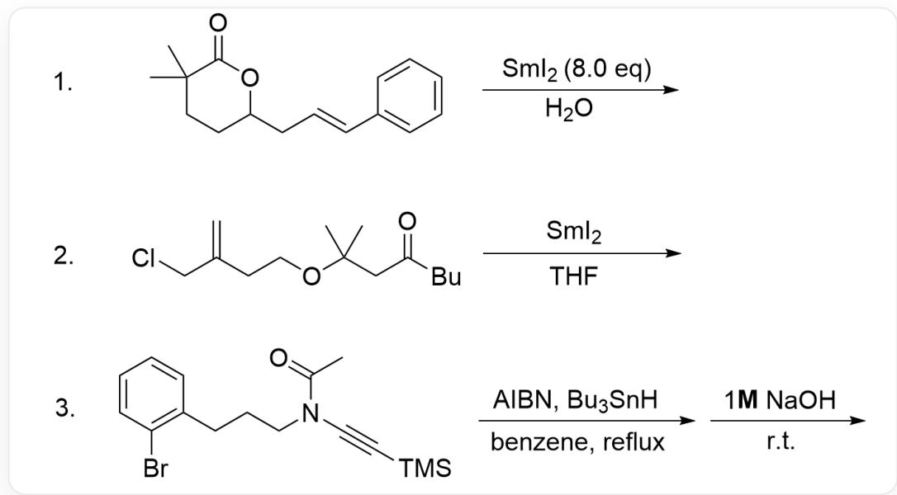
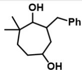
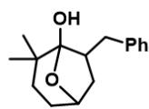
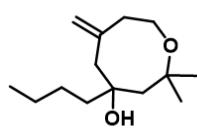
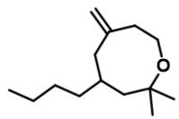
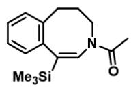
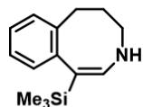
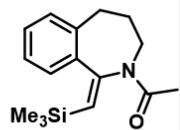

# 题目

中环的构建不同于五六元环的构建，由于其较大的环张力需要一些相对更特殊的反应条件实现。自由基化学可以在该类环系的构建中起到好的效果。利用简单的还原条件，也可以高效地构筑中环。选出下面3个反应的最终产物，不要求立体化学。

  
反应1: CC1(C)CCC(C/C=C/C2=CC=CC=C2)OC1=O与SmI2在H2O中反应 反应2: C=C(CCOC(C) (C)CC(CCCC)=O)CCI在THF中与SmI2反应 反应3: BrC1=CC=CC=C1CCCN(C(C)=O)C#C[Si](C)(C)C先 在benzene中回流下与Bu3SnH, AIBN反应，之后在室温与1MNaOH反应。

  
a)

  
b)

  
c)

  
d)

  
e)

  
f)

  
g)

  
h)

  
i)

a) CC(C1O)(C)CCCCC1CC2=CC=CC=C2 b) OC(CC1CC2=CC=CC=C2)CCC(C)(C)C1O c)

CC1(C)CCC(CC2CC3=CC=CC=C3)OC12O d) CC1(C)CCCC(O)CC(C2=CC=CC=C2)C1O e)

C=C1CCOC(C)(C)CC(CCCC)(O)C1 f) C=C1CCOC(C)(C)CC(CCCC)C1 g) CC(N1/C=C([Si](C)

(C)C)\C2=C(C=CC=C2)CCC1)=O h) C[Si](/C1=C/NCCCCC2=C1C=CC=C2)(C)C i)

$\mathrm{O = C(C)N1 / C(C2 = CC = CC = C2CCC1) = C / [Si](C)(C)C}$

A. 其他选项均不正确  
B. a.e.g.  
C. c.e.g.  
D. b.e.g.  
E. d.e.h.  
F. b.f.g.  
G. c.e.i.  
H. d.e.i.  
I. b.e.h.

# 答案

正确答案: D

# 详细解析

反应1:

CC1(C)CCC(C/C=C/C2=CC=CC=C2)OC1=O与  $SmI_{2}$  在  $H_{2}O$  中反应，羰基被还原成羟基和碳自由基，发生一次5 exo关环，得到OC(CC1C[X,X是单电子]C2=CC=CC=C2)CCC(C)(C)C1O

# CHECKPOINT

1 PTS

OC(CC1C[X,X是单电子]C2=CC=CC=C2)CCC(C)(C)C1O

OC(CC1C[X,X是单电子]C2=CC=CC=C2)CCC(C)(C)C1O被进一步还原，并被水淬灭得到c.

# CHECKPOINT

1 PTS

OC(CC1C[X,X是单电子]C2=CC=CC=C2)CCC(C)(C)C1O被进一步还原，并被水淬灭得到c.

c在水中可以开环，并且被进一步还原得到b。

# CHECKPOINT

1 PTS

c在水中可以开环，并且被进一步还原得到b。

反应2:

烯丙基氯被还原得到烯丙基自由基，羰基也被还原得到碳自由基和氧负离子，两个自由基偶联并淬灭，得到e.

# CHECKPOINT

1 PTS

反应2，烯丙基氯被还原得到烯丙基自由基，羰基也被还原得到碳自由基和氧负离子，两个自由基偶联并淬灭，得到e.

反应3:

自由基引发条件下产生  $Sn$  自由基，攫取  $Br$  得到苯基自由基，对炔基发生8-endo关环得到CC(N1/C[X，X是单电子  $) = C([Si](C)(C)C)\backslash C2 = C(C = CC = C2)CCC1) = 0$

CC(N1/C[X，X是单电子]  $\equiv$  C([Si](C)(C)C)\C2  $=$  C(C=CC=C2)CCC1)=O被Sn-H淬灭得到g。

因为Si能稳定β位自由基，因此不发生7-endo关环。

室温下酰胺键难以水解，乙酰基不会离去，因此产物不为h。

# CHECKPOINT

1 PTS

因为Si能稳定β位自由基，因此不发生7-endo关环。

# CHECKPOINT

1 PTS

发生8-endo关环得到CC(N1/C[X，X是单电子]  $\equiv$  C([Si](C)(C)C)\C2=  $\mathrm{C(C = CC = C2)CCC1)} = 0$

# CHECKPOINT

1 PTS

CC(N1/C[X，X是单电子]  $\equiv$  C([Si](C)(C)C)\C2  $=$  C(C=CC=C2)CCC1)=O被Sn-H淬灭得到g。

# CHECKPOINT

1 PTS

室温下酰胺键难以水解，产物不为h

综上，D选项是合理的。