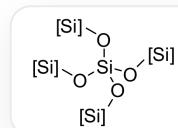
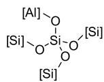
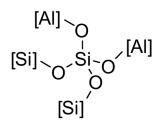
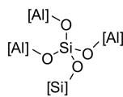
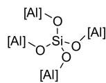

# Question

$\mathrm{Na}^{+}$ ions and water molecules may exist in the cages of Y- type zeolites, and their content varies with preparation conditions. The chemical formula of a certain artificially prepared Y-type zeolite can be written as Double subscripts: use braces to clarify. The following determination results are known:

(1) Complete dehydration of more than  $100.0 \mathrm{~g}$  of zeolite sample yields  $72.6 \mathrm{~g}$  of anhydrous solid Double subscripts: use braces to clarify;  
(2)  $^{29}\mathrm{Si}$ -NMR measurements show that there are five silicons with different chemical shifts in the crystal, and the ratio of their contents is:

Silicon-oxygen tetrahedron connected to four silicon atoms, silicon-oxygen tetrahedron connected to three silicon atoms and one aluminum atom, silicon-oxygen tetrahedron connected to two silicon atoms and two aluminum atoms, silicon-oxygen tetrahedron connected to one silicon atom and three aluminum atoms, and silicon-oxygen tetrahedron connected to four aluminum atoms, from left to right.

1.24:10.46:14.24:6.30:0.60

Which of the following options are incorrect:

1.  $\frac{m + x}{n} > 2$  
$2.m\times n <   0.3$  
3.  $\frac{x - m}{n} < 1.4$  
4.  $\frac{m}{n} > 0.4$  
5.  $\frac{n - m}{x} > 0.32$

$6.\frac{m}{x} < 0.25$  
7.  $n > \frac{x}{1.8}$  
$8.m\times x > 0.40$  
A. 2,6  
B. 1,2,6,8  
C. 3,5,7  
D. 2,3,5,7  
E. 1,2,6  
F. 2,3,5,7,8  
G.  $1,2,3,4,5,6,7,8$  
H. 3,4,7  
1,2,4,6  
J. All of the above options are incorrect or the answer is incomplete.

# Answer

Correct Answer: C

# Detailed Explanation

Lowenstein's rule states that in aluminosilicates (such as zeolites), two aluminum-oxygen tetrahedra cannot be connected by a corner, that is, there is no Al - O - Al oxygen bridge.

# CHECKPOINT

1 PTS

there is no  $\mathrm{Al - O - Al}$  oxygen bridge

The relative content of Si in the crystal is:  $1.24 + 10.46 + 14.24 + 6.30 + 0.60 = 32.84$

# CHECKPOINT

1 PTS

The relative content of Si is: 32.84

The relative content of Al in the crystal is:  $\frac{10.46 + 2 \times 14.24 + 3 \times 6.30 + 4 \times 0.60}{4} = 15.06$

# CHECKPOINT

1 PTS

The relative content of Al is: 15.06

According to charge conservation,  $m + n = 1$

# CHECKPOINT

1 PTS

$$
m + n = 1
$$

Therefore:  $n = \frac{32.84}{32.84 + 15.06} = 0.686$

# CHECKPOINT

1 PTS

$$
n = 0. 6 8 6
$$

$$
m = 1 - n = 0. 3 1 4
$$

# CHECKPOINT

1 PTS

$$
m = 0. 3 1 4
$$

From:  $\frac{M(\mathrm{Na}_{0.314}[\mathrm{Al}_{0.314}\mathrm{Si}_{0.686}\mathrm{O}_2])}{M(\mathrm{Na}_{0.314}[\mathrm{Al}_{0.314}\mathrm{Si}_{0.686}\mathrm{O}_2]\cdot x\mathrm{H}_2\mathrm{O})} = \frac{72.6}{100.0}$

We get:  $x = 1.40$

# CHECKPOINT

1 PTS

$$
x = 1. 4 0
$$

Substituting into the calculation:

Option 1,  $\frac{m + x}{n} = 2.50 > 2$ , correct

Option 2,  $mn = 0.215 < 0.3$ , correct

Option 3,  $\frac{x - m}{n} = 1.58 > 1.4$ , incorrect

Option 4,  $\frac{m}{n} = 0.458 > 0.4$ , correct

Option 5,  $\frac{n - m}{x} = 0.266 < 0.32$ , incorrect

Option 6,  $\frac{m}{x} = 0.224 < 0.25$ , correct

Option 7,  $\frac{x}{1.8} = 0.778 > n$ , incorrect

Option 8,  $mx = 0.440 > 0.4$ , correct

In summary, options 3, 5, and 7 are incorrect, so the correct answer is C.

# CHECKPOINT

# 1 PTS

Options 3, 5, and 7 are incorrect, so the correct answer is C.