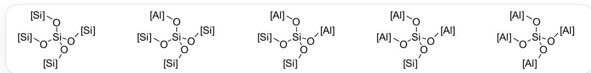

# 题目

Y型分子筛的笼中可能存在  $\mathrm{Na}^{+}$  离子和水分子，其含量随制备条件而变化。某种人工制备的Y型分子筛，其化学式可记为 Double subscripts: use braces to clarify，已知以下测定结果：

(1) 将  $100.0 \mathrm{~g}$  以上分子筛样品完全脱水, 得到  $72.6 \mathrm{~g}$  的无水固体 Double subscripts: use braces to clarify;  
(2)  $^{29}\mathrm{Si}$ -NMR 测定表明该晶体中存在以下五种化学位移不同的硅, 其含量比依次为:

从左到右依次为硅氧四面体连接四个硅原子、硅氧四面体连接三个硅原子和一个铝原子、硅氧四面体连接两个硅原子和两个铝原子、硅氧四面体连接一个硅原子和三个铝原子、硅氧四面体连接四个铝原子。

1.24:10.46:14.24:6.30:0.60

下列选项错误的有：

1.  $\frac{m + x}{n} > 2$  
$2.m\times n <   0.3$  
3.  $\frac{x - m}{n} < 1.4$  
4.  $\frac{m}{n} > 0.4$  
5.  $\frac{n - m}{x} > 0.32$  
$6.\frac{m}{x} < 0.25$  
7.  $n > \frac{x}{1.8}$

$$
8. m \times x > 0. 4 0
$$

A. 2,6  
B. 1,2,6,8  
C. 3,5,7  
D. 2,3,5,7  
E. 1,2,6  
F. 2,3,5,7,8  
G. 1,2,3,4,5,6,7,8  
H. 3,4,7  
1,2,4,6  
J. 以上选项均错误或答案不完全

# 答案

正确答案: C

# 详细解析

Lowenstein规则指出，在铝硅酸盐（如沸石）中，两个铝氧四面体不能共角相连，即不存在  $\mathrm{Al}-\mathrm{O}-\mathrm{Al}$  氧桥。

CHECKPOINT

1 PTS

不存在  $\mathrm{Al - O - Al}$  氧桥

晶体中 Si 的相对含量为:  $1.24 + 10.46 + 14.24 + 6.30 + 0.60 = 32.84$

CHECKPOINT

1 PTS

Si 的相对含量为：32.84

晶体中 A1 的相对含量为:  $\frac{10.46 + 2 \times 14.24 + 3 \times 6.30 + 4 \times 0.60}{4} = 15.06$

CHECKPOINT

1 PTS

Al的相对含量为：15.06

由电荷守恒，  $m + n = 1$

# CHECKPOINT

1 PTS

$$
m + n = 1
$$

故：  $n = \frac{32.84}{32.84 + 15.06} = 0.686$

# CHECKPOINT

1 PTS

$$
n = 0. 6 8 6
$$

$$
m = 1 - n = 0. 3 1 4
$$

# CHECKPOINT

1 PTS

$$
m = 0. 3 1 4
$$

由：  $\frac{M(\mathrm{Na}_{0.314}[\mathrm{Al}_{0.314}\mathrm{Si}_{0.686}\mathrm{O}_2])}{M(\mathrm{Na}_{0.314}[\mathrm{Al}_{0.314}\mathrm{Si}_{0.686}\mathrm{O}_2]\cdot x\mathrm{H}_2\mathrm{O})} = \frac{72.6}{100.0}$

得：  $x = 1.40$

# CHECKPOINT

1 PTS

$$
x = 1. 4 0
$$

代入计算：

选项1，  $\frac{m + x}{n} = 2.50 > 2$  ，正确

选项2，  $mn = 0.215 < 0.3$  ，正确

选项3，  $\frac{x - m}{n} = 1.58 > 1.4$  ，错误

选项4,  $\frac{m}{n} = 0.458 > 0.4$ , 正确

选项5，  $\frac{n - m}{x} = 0.266 < 0.32$  ，错误

选项6，  $\frac{m}{x} = 0.224 < 0.25$  ，正确

选项7，  $\frac{x}{1.8} = 0.778 > n$  ，错误

选项8，  $mx = 0.440 > 0.4$  ，正确

综上，选项3、5、7错误，故正确答案为C。

# CHECKPOINT

1 PTS

选项3、5、7错误，正确答案为C