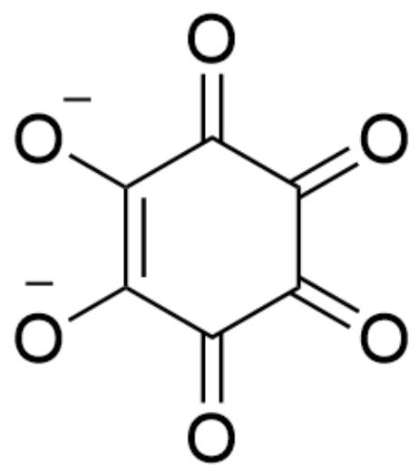
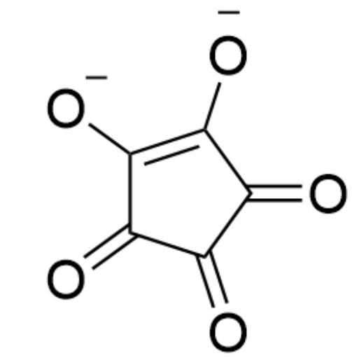

# Question

Sodium salt  $\mathrm{Na}_2\mathbf{X}$  contains a unique cyclic anion, in which each atom in the anion has the same chemical environment. Sodium salt  $\mathrm{Na}_2\mathbf{X}$  is often used to test metal cations such as  $\mathrm{Ba}^{2+} \cdot \mathrm{Pb}^{2+}$ , and even when in contact with the surface of certain insoluble lead salts (such as PbS), it can seize  $\mathrm{Pb}^{2+}$  from them and form a characteristic purplish-red substance.  $\mathrm{Na}_2\mathbf{X}$  is unstable to both light and heat and is very sensitive to oxidizing environments. Under acidic conditions,  $\mathrm{I}_2$  reacts with  $\mathrm{Na}_2\mathbf{X}$  in equal proportions, yielding only NaI and gas M;  $\mathrm{KMnO}_4$  reacts with  $\mathrm{Na}_2\mathbf{X}$ , yielding gas N. If the gas M obtained from the reaction of  $1.498\mathrm{gNa}_2\mathbf{X}$  with  $\mathrm{I}_2$  is passed through sufficient  $\mathrm{I}_2\mathrm{O}_5$ ,  $\mathrm{I}_2\mathrm{O}_5$  decreases in mass by  $0.672\mathrm{g}$ . A weakly acidic  $\mathrm{PbAc}_2$  solution is divided into two portions, one with  $\mathrm{Na}_2\mathbf{X}$ , forming a basic salt precipitate A containing one water of crystallization (in which the stoichiometric ratio of each ion contained is  $2:1:2$ ), precipitate A is scarlet; the other

is added with sufficient  $\mathrm{Na}_2\mathrm{CO}_3$  to obtain precipitate  $\mathbf{B}$ , heating precipitate  $\mathbf{B}$  in aqueous solution yields precipitate  $\mathrm{Pb}_{3}(\mathrm{OH})_{2}(\mathrm{CO}_{3})_{2}$  with the same elemental composition as  $\mathbf{A}$ .

Please select the option below that best fits the meaning of the question:

A. All other options are incorrect  
B. A The chemical formula after removing water of crystallization contains 16 atoms.  
C.  $\mathbf{X}^{2-}$  ion does not possess aromaticity.  
D. The chemical equation for the reaction of  $\mathrm{Na}_{2} \mathrm{X}$  with  $\mathrm{I}_{2}$ , when balanced with the simplest integer ratio, has a sum of product coefficients equal to 6.  
E. The ion equation for the reaction of  $\mathrm{Na}_2\mathbf{X}$  with acidic  $\mathrm{KMnO}_4$ , when balanced to the simplest integer ratio, has a sum of product coefficients equal to 60.

F. Ions  $\mathbf{Y}^{2-}$  that are structurally similar to  $\mathbf{X}^{2-}$  and have a relative molecular mass 28.01 smaller exhibit extremely low stability.  
G. Multiple options are correct among options B-F.

# Answer

Correct Answer: A

# Detailed Explanation

The starting point of this question is to use  $\mathrm{I}_2\mathrm{O}_5$  to test the gas  $\mathbf{M}$ . According to chemical knowledge, the gas  $\mathbf{M}$  is CO, and the reaction is quantitative:

# CHECKPOINT

1 PTS

M is CO

$$
\mathrm {I} _ {2} \mathrm {O} _ {5} + 5 \mathrm {C O} = \mathrm {I} _ {2} + 5 \mathrm {C O} _ {2}
$$

# CHECKPOINT

1 PTS

$$
\mathrm {I} _ {2} \mathrm {O} _ {5} + 5 \mathrm {C O} = \mathrm {I} _ {2} + 5 \mathrm {C O} _ {2}
$$

According to the mass given in the question, the amount of substance of CO produced is

$$
0. 6 7 2 / 1 6 \times 5 = 0. 0 4 2 \mathrm {m o l}
$$

$\mathrm{I}_2$  reacts with  $\mathrm{Na}_2\mathbf{X}$  in equal proportions to obtain NaI and CO, indicating that the cyclic anion  $\mathbf{X}^{2-}$  is composed only of carbon and oxygen elements;

# CHECKPOINT

1 PTS

Cyclic anion  $\mathbf{X}^{2-}$  is composed only of carbon and oxygen elements;

$1.498\mathrm{gNa}_{2}\mathbf{X}$  can produce  $0.042\mathrm{mol}$  of CO, that is, the content of sodium element in  $\mathrm{Na}_2\mathbf{X}$  is  $1.498 - 0.042\times 28.01 = 0.322\mathrm{g} = 0.014\mathrm{mol}$ , thus the relative molecular mass of  $\mathbf{X}^{2 - }$  is calculated as  $(1.498 - 0.322) / (0.014 / 2) = 168$  , which is six CO, so the chemical formula of  $\mathbf{X}^{2 - }$  is

$$
\mathrm {C} _ {6} \mathrm {O} _ {6} ^ {2 -}.
$$

# CHECKPOINT

1 PTS

The relative molecular mass of  $\mathbf{X}^{2 - }$  is 168

# CHECKPOINT

1 PTS

The chemical formula of  $\mathbf{X}^{2 - }$  is  $\mathrm{C_6O_6^{2 - }}$

Since  $\mathbf{X}^{2-}$  is a cyclic anion, it can be deduced that it contains a six-membered carbon ring, composed of six carbonyl groups; the structure is O=C(C([O-])=C([O-])C(C1=O)=O)C1=O, the six carbons/oxygen have the same chemical environment due to tautomerism, which is consistent with the description of the question.

# CHECKPOINT

1 PTS

The structure of  $\mathbf{X}^{2 - }$  is  $O = C(C([O - ]) = C([O - ])C(C1 = O) = O)C1 = 0$

  
The structure of  $\mathbf{X}^{2-}$ :  $O = C(C([O-]) = C([O-])C(C1 = O) = O)$ ,  $C1 = O$

In the structure of  $\mathrm{O} = \mathrm{C}(\mathrm{C}([\mathrm{O}-]) = \mathrm{C}([\mathrm{O}-])\mathrm{C}(\mathrm{C}1 = \mathrm{O}) = \mathrm{O})\mathrm{C}1 = \mathrm{O}$ , there is a pair of electrons delocalized on the six-membered ring, which conforms to the  $4\mathrm{n} + 2$  rule ( $n = 0$ ) and has certain aromaticity, so option C is incorrect.

# CHECKPOINT

1 PTS

$\mathbf{X}^{2-}$  has a pair of electrons delocalized on the six-membered ring, and has certain aromaticity

Therefore, it is easy to write the reaction equations of  $\mathrm{C_6O_6^{2 - }}$  with iodine and acidic potassium permanganate:

$$
\mathrm {N a} _ {2} \mathrm {C} _ {6} \mathrm {O} _ {6} + \mathrm {I} _ {2} = 2 \mathrm {N a I} + 6 \mathrm {C O}
$$

# CHECKPOINT

1 PTS

$$
\mathrm {N a} _ {2} \mathrm {C} _ {6} \mathrm {O} _ {6} + \mathrm {I} _ {2} = 2 \mathrm {N a I} + 6 \mathrm {C O}
$$

$$
5 \mathrm {C} _ {6} \mathrm {O} _ {6} ^ {2 -} + 1 4 \mathrm {M n O} _ {4} ^ {-} + 5 2 \mathrm {H} ^ {+} = 1 4 \mathrm {M n} ^ {2 +} + 2 6 \mathrm {H} _ {2} \mathrm {O} + 3 0 \mathrm {C O} _ {2}
$$

# CHECKPOINT

1 PTS

$$
5 \mathrm {C} _ {6} \mathrm {O} _ {6} ^ {2 -} + 1 4 \mathrm {M n O} _ {4} ^ {-} + 5 2 \mathrm {H} ^ {+} = 1 4 \mathrm {M n} ^ {2 +} + 2 6 \mathrm {H} _ {2} \mathrm {O} + 3 0 \mathrm {C O} _ {2}
$$

According to the equation, options D and E are both incorrect.

The ion  $\mathbf{Y}^{2-}$  with a relative molecular mass of 28.01 less than that of  $\mathrm{C}_6\mathrm{O}_6^{2-}$  is obviously  $\mathrm{C}_5\mathrm{O}_5^{2-}$ , which becomes a five-membered ring [O-] $\mathrm{C}(\mathrm{C}(1=\mathrm{O})=\mathrm{O})=\mathrm{C}([\mathrm{O}-])\mathrm{C}(1=\mathrm{O})$ , but it also has a pair of electrons delocalized on the five-membered ring and has certain aromaticity, so the stability is not extremely low, and option F is incorrect.

# CHECKPOINT

2 PTS

$$
\mathbf {Y} ^ {2 -} \text {i s} \mathrm {C} _ {5} \mathrm {O} _ {5} ^ {2 -}, \text {a n d t h e s t r u c t u r e i s [ O - ] C (C (C 1 = O) = O) = C ([ O - ]) C 1 = O}
$$

# CHECKPOINT

1 PTS

$$
\mathbf {Y} ^ {2 -} \mathrm {h a s a p a i r o f e l e c t r o n s d e l o c a l i z e d o n t h e f i l e - m e m b e r e d r i g , a n d h a s c e r t a i n a r o m a t i c i t y}
$$

The structure of  $\mathbf{Y}^{2-}$ : [O-]C(C(C1=O)=O)=C([O-])C1=O

A and  $\mathrm{Pb}_{3}(\mathrm{OH})_{2}(\mathrm{CO}_{3})_{2}$  have the same constituent elements, so they both contain carbon, hydrogen, and oxygen elements as negative ions; A contains  $\mathrm{C}_{6}\mathrm{O}_{6}^{2-}$ , since it is a basic salt, considering the  $+2$  valence of lead, and combining the stoichiometric ratio of each ion, the chemical formula of A can only be  $\mathrm{Pb}_{2}[\mathrm{C}_{6}\mathrm{O}_{6}](\mathrm{OH})_{2} \cdot \mathrm{H}_{2}\mathrm{O}$ , which contains 18 atoms after removing the crystal water, so option B is incorrect.

# CHECKPOINT

1 PTS

The chemical formula of  $\mathbf{A}$  is  $\mathrm{Pb}_2[\mathrm{C}_6\mathrm{O}_6](\mathrm{OH})_2\cdot \mathrm{H}_2\mathrm{O}$

In summary, options B-F are all incorrect, and option A is correct.