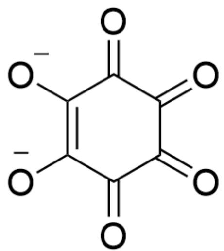
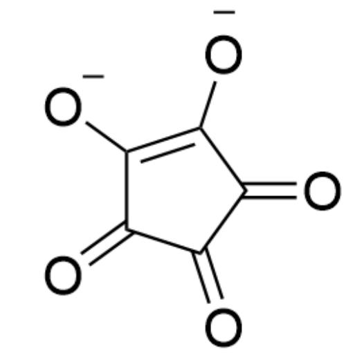

# 题目

钠盐  $\mathrm{Na}_{2} \mathrm{X}$  中含有独特的环状阴离子, 其阴离子中每种原子的化学环境相同。钠盐  $\mathrm{Na}_{2} \mathrm{X}$  常用于检验  $\mathrm{Ba}^{2+}$  、 $\mathrm{Pb}^{2+}$  等金属阳离子, 甚至在接触某些难溶铅盐（如 PbS）表面时, 可夺取其中的  $\mathrm{Pb}^{2+}$  并与之生成特征性紫红色物质。 $\mathrm{Na}_{2} \mathrm{X}$  对光热均不稳定, 对氧化性环境也十分敏感。在酸性条件下  $\mathrm{I}_{2}$  与  $\mathrm{Na}_{2} \mathrm{X}$

等比例反应, 只得到  $\mathrm{NaI}$  和气体  $\mathbf{M}; \mathrm{KMnO}_4$  与  $\mathrm{Na}_2\mathrm{X}$  反应, 得到气体  $\mathbf{N}$  。若将  $1.498 \mathrm{~g} \mathrm{Na}_2\mathrm{X}$  与  $\mathrm{I}_2$  反应得到的气体  $\mathbf{M}$  通过足量  $\mathrm{I}_2\mathrm{O}_5, \mathrm{I}_2\mathrm{O}_5$  的质量减少  $0.672 \mathrm{~g}$  。将呈弱酸性的  $\mathrm{PbAc}_2$  溶液分为两份, 一份加入  $\mathrm{Na}_2\mathrm{X}$ , 形成含一个结晶水的碱式盐沉淀  $\mathbf{A}$  （其中所含各离子的化学计量比为  $2:1:2$  ), 沉淀  $\mathbf{A}$  呈猩红色; 另一份

加入足量  $\mathrm{Na}_2\mathrm{CO}_3$  得到沉淀B，在水溶液中加热沉淀B得到与A组成元素相同的沉淀 $\mathrm{Pb}_{3}(\mathrm{OH})_{2}(\mathrm{CO}_{3})_{2}$ 。

请选择下列选项中最符合题意的一项：

A. 其他选项均不正确  
B. A 去掉结晶水后的化学式含有16个原子  
C.  $\mathbf{X}^{2-}$  离子不具有芳香性  
D.  $\mathrm{Na}_{2} \mathrm{X}$  与  $\mathrm{I}_{2}$  反应的化学方程式, 配平为最简整数比时, 产物系数和为  $6$  。  
E.  $\mathrm{Na}_{2} \mathrm{X}$  与酸性  $\mathrm{KMnO}_{4}$  反应的离子方程式, 配平为最简整数比时, 产物系数和为  $60$  。  
F. 与  $\mathbf{X}^{2-}$  结构相似且相对分子质量小28.01的  $\mathbf{Y}^{2-}$  离子稳定性极低。  
G. 选项B-F中有多项正确

# 答案

正确答案: A

# 详细解析

本题目入手点在利用  $\mathrm{I}_2\mathrm{O}_5$  检验气体M，根据化学常识可知气体M为CO，且反应是定量的：

# CHECKPOINT

1 PTS

M为CO

$$
\mathrm {I} _ {2} \mathrm {O} _ {5} + 5 \mathrm {C O} = \mathrm {I} _ {2} + 5 \mathrm {C O} _ {2}
$$

# CHECKPOINT

1 PTS

$$
\mathrm {I} _ {2} \mathrm {O} _ {5} + 5 \mathrm {C O} = \mathrm {I} _ {2} + 5 \mathrm {C O} _ {2}
$$

根据题目给出的质量可得，产生的CO物质的量为

$$
0. 6 7 2 / 1 6 \times 5 = 0. 0 4 2 \mathrm {m o l}
$$

$\mathrm{I}_2$  与  $\mathrm{Na}_2\mathrm{X}$

等比例反应, 得到  $\mathrm{NaI}$  和  $\mathrm{CO}$ , 说明环状阴离子  $\mathbf{X}^{2-}$  只由碳氧元素构成;

# CHECKPOINT

1 PTS

环状阴离子  $\mathbf{X}^{2-}$  只由碳氧元素构成;

1.498 g  $\mathrm{Na}_{2} \mathrm{X}$  可产生  $0.042 \mathrm{~mol}$  的  $\mathrm{CO}$ , 也即  $\mathrm{Na}_{2} \mathrm{X}$  中钠元素的含量为  $1.498 - 0.042 \times 28.01 = 0.322 \mathrm{~g} = 0.014 \mathrm{~mol}$ , 从而算出  $\mathbf{X}^{2-}$  的相对分子质量为  $(1.498 - 0.322) / (0.014 / 2) = 168$ , 为六个  $\mathrm{CO}$ , 从而  $\mathbf{X}^{2-}$  的化学式为

$\mathrm{C}_6\mathrm{O}_6^{2 - }$  。

# CHECKPOINT

1 PTS

$\mathbf{X}^{2-}$  的相对分子质量为168

# CHECKPOINT

1 PTS

$\mathbf{X}^{2-}$  的化学式为  $\mathrm{C}_{6} \mathrm{O}_{6}^{2-}$

由于  $\mathbf{X}^{2-}$  为环状阴离子，可以推出其含有碳六元环，由六个羰基组成；结构为  $O = C(C([O-]) = C([O-])C(C1 = O) = O)C1 = O$  ，六个碳/氧因为互变异构化学环境完全一致，符合题目描述。

# CHECKPOINT

1 PTS

$\mathbf{X}^{2-}$  结构为  $O = C(C([O-]) = C([O-]))C(C1 = O) = O)$ $C1 = 0$

$\mathbf{X}^{2 - }$  的结构：  $O = C(C([O - ]) = C([O - ])C(C1 = O) = O)C1 = O$

$\mathrm{O = C(C([O - ]) = C([O - ])C(C1 = O) = O)C1 = O}$  的结构中有一对电子在六元环上离域，符合  $4\mathrm{n} + 2$  规则  $(n = 0)$  ，具有一定的芳香性，选项C错误。

# CHECKPOINT

1 PTS

$\mathbf{X}^{2-}$  有一对电子在六元环上离域，具有一定的芳香性

从而很容易写出  $\mathrm{C}_{6} \mathrm{O}_{6}^{2-}$  与碘和酸性高锰酸钾的反应方程式:

$$
\mathrm {N a} _ {2} \mathrm {C} _ {6} \mathrm {O} _ {6} + \mathrm {I} _ {2} = 2 \mathrm {N a I} + 6 \mathrm {C O}
$$

# CHECKPOINT

1 PTS

$$
\mathrm {N a} _ {2} \mathrm {C} _ {6} \mathrm {O} _ {6} + \mathrm {I} _ {2} = 2 \mathrm {N a I} + 6 \mathrm {C O}
$$

$$
5 \mathrm {C} _ {6} \mathrm {O} _ {6} ^ {2 -} + 1 4 \mathrm {M n O} _ {4} ^ {-} + 5 2 \mathrm {H} ^ {+} = 1 4 \mathrm {M n} ^ {2 +} + 2 6 \mathrm {H} _ {2} \mathrm {O} + 3 0 \mathrm {C O} _ {2}
$$

# CHECKPOINT

1 PTS

$$
5 \mathrm {C} _ {6} \mathrm {O} _ {6} ^ {2 -} + 1 4 \mathrm {M n O} _ {4} ^ {-} + 5 2 \mathrm {H} ^ {+} = 1 4 \mathrm {M n} ^ {2 +} + 2 6 \mathrm {H} _ {2} \mathrm {O} + 3 0 \mathrm {C O} _ {2}
$$

根据方程式，选项D,E均错误。

比  $\mathrm{C_6O_6^{2 - }}$  少28.01相对分子量的离子  $\mathbf{Y}^{2 - }$  很明显为  $\mathrm{C}_5\mathrm{O}_5^{2 - }$  ，变为五元环[O-] $\mathrm{C(C(C1 = O) = O)} = \mathrm{C([O - ])C1 = O}$  但同样有一对电子在五元环上离域，具有一定芳香性，稳定性并不极低，选项F错误。

# CHECKPOINT

2 PTS

$\mathbf{Y}^{2-}$  为  $\mathrm{C}_{5} \mathrm{O}_{5}^{2-}$ ，结构为  $[\mathrm{O}-]\mathrm{C}(\mathrm{C}(\mathrm{C}1=\mathrm{O})=\mathrm{O})=\mathrm{C}([\mathrm{O}-]) \mathrm{C}1=\mathrm{O}$

# CHECKPOINT

1 PTS

$\mathbf{Y}^{2-}$  有一对电子在五元环上离域，具有一定芳香性

  
$\mathbf{Y}^{2 - }$  的结构：[O-]C(C(C1=O)=O)=C([O-])C1=O

A 与  $\mathrm{Pb}_{3}(\mathrm{OH})_{2}(\mathrm{CO}_{3})_{2}$  的组成元素相同, 则均含有碳氢氧元素作为负离子; A 中含有  $\mathrm{C}_{6} \mathrm{O}_{6}^{2-}$ , 由于为碱式盐, 考虑铅的 +2 化合价, 再结合各离子的计量比可得 A 的化学式只能为  $\mathrm{Pb}_{2}[\mathrm{C}_{6} \mathrm{O}_{6}](\mathrm{OH})_{2} \cdot \mathrm{H}_{2} \mathrm{O}$ , 去掉结晶水后含18个原子, 选项B错误。

# CHECKPOINT

1 PTS

A 的化学式为  $\mathrm{Pb}_{2}\left[\mathrm{C}_{6} \mathrm{O}_{6}\right](\mathrm{OH})_{2} \cdot \mathrm{H}_{2} \mathrm{O}$

综上，选项B-F均不正确，选项A正确。