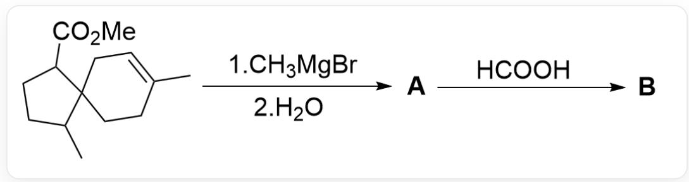
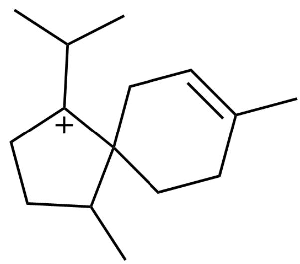
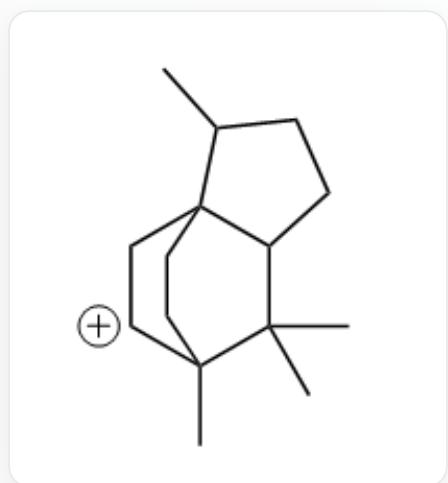

# Question

Spiro compounds are often used in the synthesis of complex polycyclic compounds. The following figure describes a reaction of a spiro compound:

The image describes an organic multi-step reaction. The substrate is

CC1CCC(C(OC)=O)C12CCC(C)=CC2, which reacts with C[Mg]Br and then water is added to generate

$^{**}\mathrm{A}^{**}$ .  ${}^{**}\mathrm{A}^{**}$  reacts with  $O = CO$  to generate  ${}^{**}\mathrm{B}^{**}$

Known: B contains two five-membered rings and one six-membered ring.

Which of the following statements is correct:

A. B contains 5 chiral carbon atoms.  
B. B contains two unsaturation bonds.

C.

  
D.

CC(C)[C+]1C2(CCC(C)  $=$  CC2)C(C)CC1

The above image is the key intermediate for the generation of  $\mathbf{B}$

CC1CCC(C12CCC([CH+]C2)3C)C3(C)C

The above image shows the key intermediate for generating  $\mathbf{B}$ .

E. B is completely oxidized to C by acidic potassium permanganate solution, then the chemical formula of C is  $\mathrm{C_{15}H_{24}O_3}$

F. All other options are incorrect.

# Answer

Correct Answer: E

# Detailed Explanation

The reaction involving the addition of methyl Grignard reagent is relatively straightforward, as the Grignard reagent reacts with an ester to yield a tertiary alcohol.

# CHECKPOINT

1 PTS

Grignard reagent reacts with ester to form tertiary alcohol

Thus, the structure of  $\mathbf{A}$  is

CC1CCC(C(C)(O)C)C12CCC(C)  $=$  CC2.

# CHECKPOINT

1 PTS

Structure of  $\mathbf{A}$  is CC1CCC(C(C)(O)C)C12CCC(C) = CC2

Tertiary alcohols readily undergo dehydration in a strongly acidic environment such as formic acid, forming a stable tertiary carbocation. Therefore, the intermediate leading to B includes CC1CCC([C+] (C)C)C12CCC(C) = CC2.

# CHECKPOINT

1 PTS

Tertiary alcohol dehydrates in formic acid to form tertiary carbocation

# CHECKPOINT

1 PTS

Intermediate of  $\mathbf{B}$  includes CC1CCC([C+](C)C)C12CCC(C)=CC2

B contains three rings, indicating an intramolecular cyclization reaction. The carbocation, being a strong electrophile, can only react intramolecularly with the remaining alkene as the nucleophile, leading to ring formation.

# CHECKPOINT

1 PTS

Alkene nucleophilically attacks carbocation, forming a ring intramolecularly.

Given that  $\mathbf{B}$  contains two five-membered rings and one six-membered ring, while  $\mathbf{A}$  already has a spiro ring system (five + six), the newly formed ring must be a five-membered ring. Consequently, the carbon linking the alkene and the carbocation must be a secondary carbon, resulting in the tricyclic intermediate CC1CCC(C(C)2C)C13CC[C+](C)C2C3.

# CHECKPOINT

1 PTS

Newly formed ring is a five-membered ring, so the alkene-linked carbon must be secondary

# CHECKPOINT

1 PTS

Tricyclic intermediate formed: CC1CCC(C(C)2C)C13CC[C+](C)C2C3

This intermediate eliminates a hydride ion, following the rule of forming a stable alkene, resulting in an endocyclic double bond. Thus,  $\mathbf{B}$  is CC1CCC(C12CC=C(C3C2)C)C3(C)C.

# CHECKPOINT

2 PTS

B is CC1CCC(C12CC=C(C3C2)C)C3(C)C

B contains four chiral carbons and one unsaturated bond, so options A and B are incorrect.

# CHECKPOINT

1 PTS

B has four chiral carbons and one unsaturated bond, options A and B are incorrect.

The endocyclic double bond in  $\mathbf{B}$  is oxidized by potassium permanganate, cleaving the double bond to form a ketone carbonyl and an aldehyde carbonyl, with the latter further oxidized to a carboxylic acid. The oxidation product has the structure CC1CCC2C(C)(C(CC21CC(O)=O)C(C)=O)C.

# CHECKPOINT

1 PTS

Oxidation product structure: CC1CCC2C(C)(C(CC21CC(O)=O)C(C)=O)C

Its molecular formula is  $\mathrm{C_{15}H_{24}O_3}$ , so option E is correct.

# CHECKPOINT

0.5 PTS

Oxidation product molecular formula:  $\mathrm{C_{15}H_{24}O_3}$ , option E is correct.

The intermediate in option C is derived from CC1CCC([C+](C)C)C12CCC(C) = CC2 after a single migration, forming a carbocation. This intermediate is more prone to rearrangement, converting the spiro ring to a fused ring. If the alkene were to nucleophilically attack, the resulting product would have excessive ring strain and would not match the description of B, so the tricyclic product cannot form, making option C incorrect.

# CHECKPOINT

1 PTS

Intermediate in C tends to rearrange, converting spiro to fused ring, unable to form tricyclic product, so C is incorrect

Option D represents the product of a tertiary carbocation CC1CCC([C+](C)C)C12CCC(C) = CC2 reacting with the alkene to form a secondary carbocation. However, if the nucleophilic attack occurs at the other carbon, a more stable tertiary carbocation CC1CCC(C(C)2C)C13CC[C+](C)C2C3 forms instead. Thus, it is not the key intermediate, making option D incorrect.

# CHECKPOINT

1 PTS

Carbocation nucleophilic attack favors forming a more stable carbocation: CC1CCC(C(C)2C)C13CC[C+] (C)C2C3

# CHECKPOINT

0.5 PTS

Option D is not the key intermediate, so D is incorrect.

Therefore, option E is correct.

# CHECKPOINT

0.5 PTS

Therefore, option E is correct.