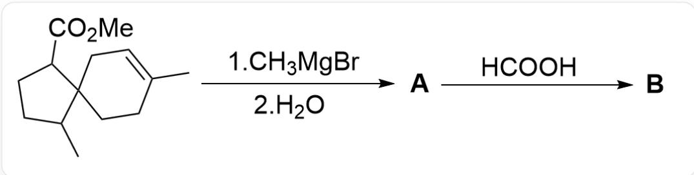
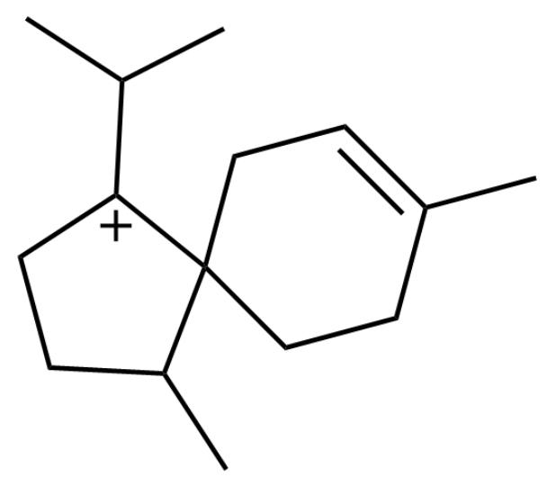
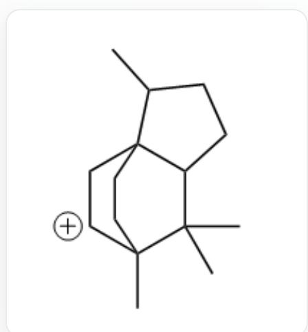

# 题目

螺环化合物常用于合成复杂的多环化合物。下图描述了一个螺环化合物的反应：

该图片描述了一个有机多步反应。底物为CC1CCC(C(OC)=O)C12CCC(C)=CC2，其与C[Mg]Br反应后再加入水，生成\*\*A\*\*，\*\*A\*\*与O=CO反应生成\*\*B\*\*

已知：B含有两个五元环和一个六元环。

下列说法正确的是：

A. B中存在5个手性碳原子  
B. B中含有两个不饱和键  
C.

  
D.

CC(C)[C+]1C2(CCC(C)  $\equiv$  CC2)C(C)CC1

上图是生成B的关键中间体

CC1CCC(C12CCC([CH+]C2)3C)C3(C)C

上图是生成B的关键中间体

E. B被酸性高锰酸钾溶液完全氧化为C, 则C的化学式为  $\mathrm{C}_{15} \mathrm{H}_{24} \mathrm{O}_{3}$

# F. 其他选项均不正确

# 答案

正确答案: E

# 详细解析

加入甲基格氏试剂的反应较为简单，格氏试剂与酯反应生成三级醇。

# CHECKPOINT

1 PTS

格氏试剂与酯反应生成三级醇

故A的结构为

CC1CCC(C(C)(O)C)C12CCC(C)  $=$  CC2。

# CHECKPOINT

1 PTS

A的结构为 CC1CCC(C(C)(O)C)C12CCC(C)=CC2

三级醇在甲酸这种强酸性环境下极易脱水生成稳定的三级碳正离子，故生成B的中间体包含CC1CCC([C+](C)C)C12CCC(C)=CC2。

# CHECKPOINT

1 PTS

三级醇在甲酸环境下脱水生成三级碳正离子

# CHECKPOINT

1 PTS

生成B的中间体包含CC1CCC([C+](C)C)C12CCC(C) = CC2

B包含三个环，意味着发生了分子内的环化反应。碳正离子作为强亲电物种，分子内只剩下烯烃作为亲核物种了，从而烯烃亲核碳正离子，分子内成环。

# CHECKPOINT

1 PTS

烯烃亲核碳正离子，分子内成环。

考虑到B存在两个五元环和一个六元环，而A已经存在五+六的螺环，因此新生成的环为五元环，因此烯烃与碳正离子相连的碳只能为二级碳，形成了三环中间体CC1CCC(C(C)2C)C13CC[C+](C)C2C3。

# CHECKPOINT

1 PTS

新生成的环为五元环，因此烯烃与碳正离子相连的碳只能为二级碳

# CHECKPOINT

1 PTS

形成了三环中间体CC1CCC(C(C)2C)C13CC[C+](C)C2C3

该中间体消除一分子氢离子，按照生成稳定烯烃的规则，得到环内双键，从而B为CC1CCC(C12CC=C(C3C2)C)C3(C)C

# CHECKPOINT

2 PTS

B为CC1CCC(C12CC=C(C3C2)C)C3(C)C

B含有四个手性碳和一个不饱和键，选项A，B错误。

# CHECKPOINT

1 PTS

B含有四个手性碳和一个不饱和键，选项A，B错误。

B的环内双键被高锰酸钾氧化，首先双键断裂生成一个酮羰基和一个醛羰基，醛羰基被进一步氧化为羧酸。氧化产物结构式为CC1CCC2C(C)(C(CC21CC(O)=O)C(C)=O)C

# CHECKPOINT

1 PTS

氧化产物结构式为CC1CCC2C(C)(C(CC21CC(O)=O)C(C)=O)C

其分子式为  $\mathrm{C_{15}H_{24}O_3}$  ，选项E正确。

# CHECKPOINT

0.5 PTS

氧化产物分子式为  $\mathrm{C}_{15} \mathrm{H}_{24} \mathrm{O}_{3}$ , 选项E正确。

选项C的中间体是CC1CCC([C+](C)C)C12CCC(C)=CC2经过一步迁移得到的碳正离子，该中间体更易发生重排，螺环变为并环；若烯烃强行亲核，产物的环张力太大且并不符合B的描述，故生成不了三环产物，故C错误。

# CHECKPOINT

1 PTS

C的中间体更易发生重排，螺环变为并环，生成不了三环产物，故C错误

选项D是三级碳正离子CC1CCC([C+](C)C)C12CCC(C)=CC2与双键亲核生成二级碳正离子的产物，但若亲核位点在另一碳原子上，可生成更稳定的三级碳正离子CC1CCC(C(C)2C)C13CC[C+](C)C2C3，因此不是主要关键中间体，选项D错误。

# CHECKPOINT

1 PTS

碳正离子亲核倾向于生成更稳定的碳正离子，生成CC1CCC(C(C)2C)C13CC[C+](C)C2C3

# CHECKPOINT

0.5 PTS

选项D不是关键中间体，选项D错误

因此，E选项正确。

# CHECKPOINT

0.5 PTS

因此，E选项正确。