# Question

PIDA is a commonly used relatively mild oxidizing agent.

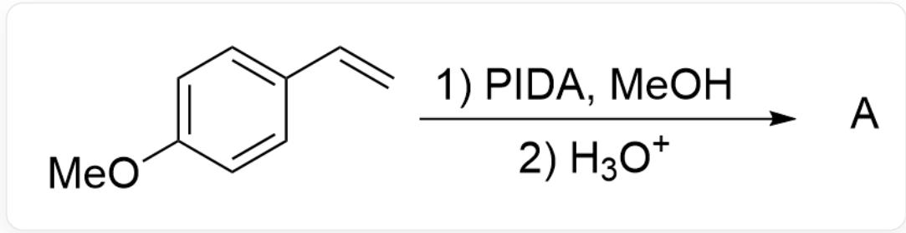

C=CC1=CC=C(OC)C=C1>PIDA.MeOH>HO+>[A],A is the reaction product

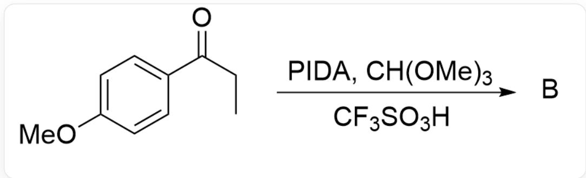

$\mathrm{O = C(CC)C1 = CC = C(OC)C = C1 > PIDA.CH(OMe)_3.CF_3SO_3H > [B],B}$  is the reaction product

Please try to predict the main products of the above two reactions.

A. All other options are incorrect  
B.

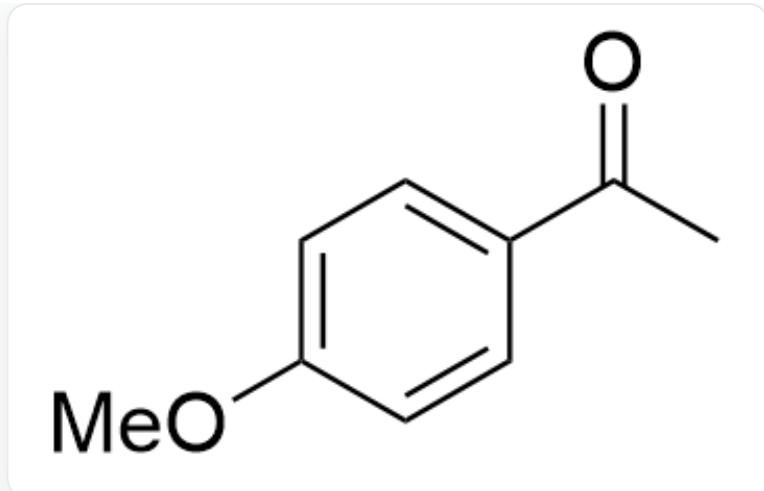

CC(C1=CC=C(OC)C=C1)=O,Product A

Product A

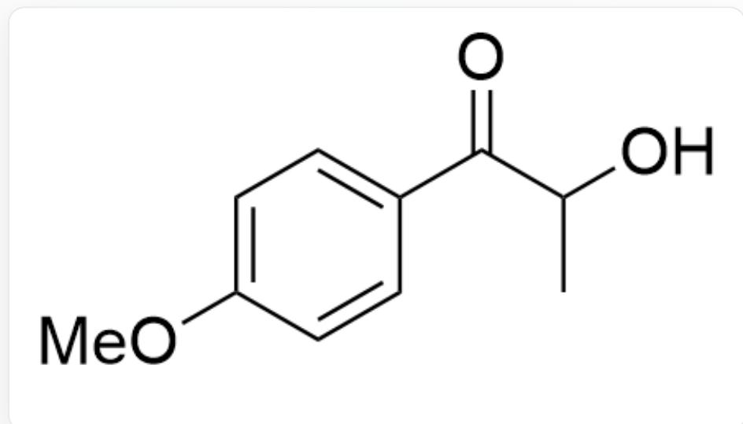

$\mathrm{O = C(C(O)C)C1 = CC = C(OC)C = C1,ProductB}$

Product B

C.

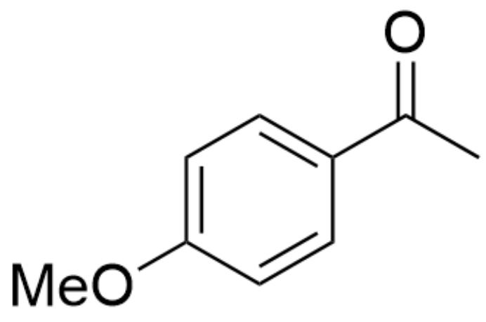

CC(C1=CC=C(OC)C=C1)=O,Product A

Product A

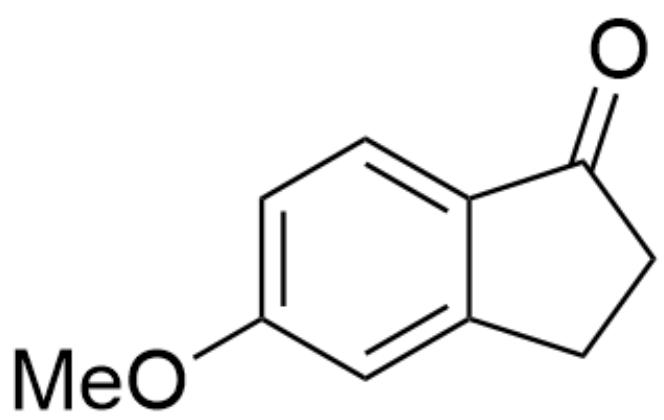

O=C1C2=CC=C(OC)C=C2CC1,Product B

Product B

D.

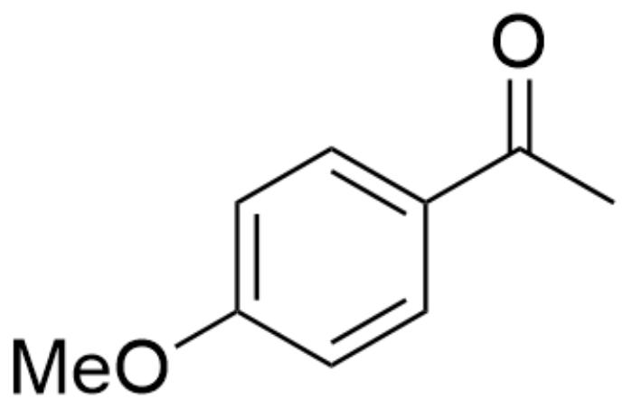

CC(C1=CC=C(OC)C=C1)=O,Product A

Product A

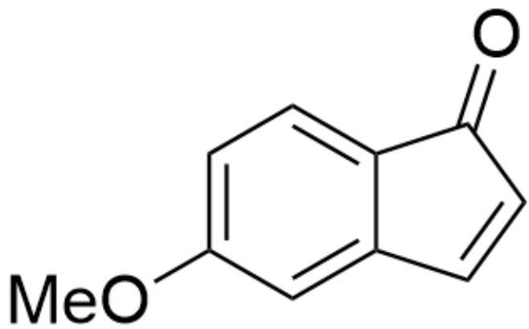

O=C1C2=CC=C(OC)C=C2C=C1,Product B

Product B

E.

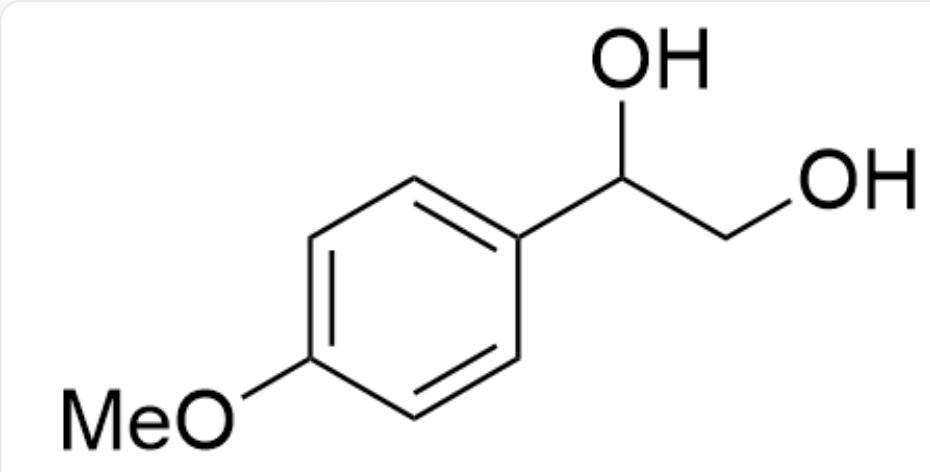

OC(CO)C1=CC=C(OC)C=C1,Product A

Product A

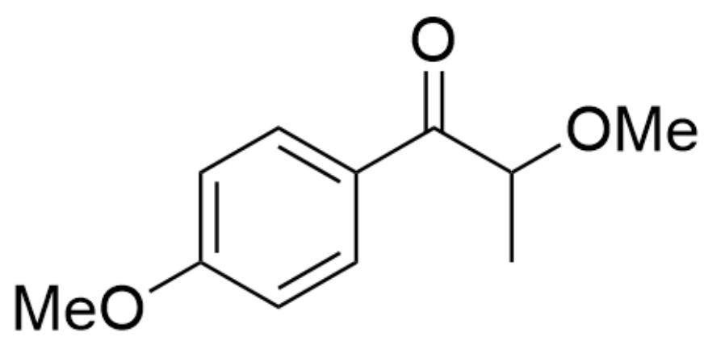

$\mathrm{O = C(C(OC)C)C1 = CC = C(OC)C = C1,ProductB}$

Product B

F.

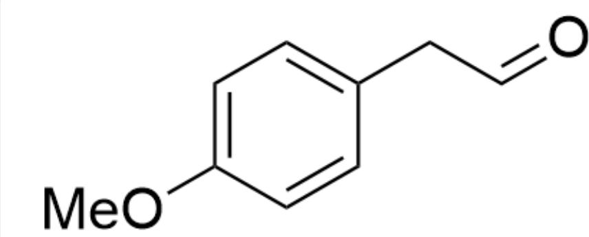

$\mathrm{O = CCC1 = CC = C(OC)C = C1,ProductA}$

Product A

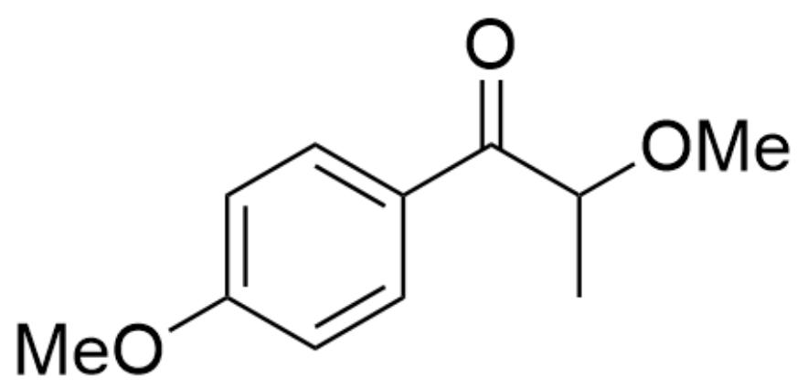

$\mathrm{O = C(C(OC)C)C1 = CC = C(OC)C = C1,ProductB}$

Product B

G.

O=CCC1=CC=C(OC)C=C1, Product A

Product A

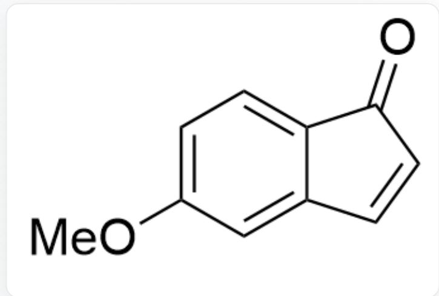

O=C1C2=CC=C(OC)C=C2C=C1, Product B

Product B

H.

CC(C1=CC=C(OC)C=C1)=O,Product A

Product A

CC(C(OC)=O)C1=CC=C(OC)C=C1,Product B

Product B

# Answer

Correct Answer: A

# Detailed Explanation

For Reaction 1, the substrate first reacts with PIDA to generate an intermediate

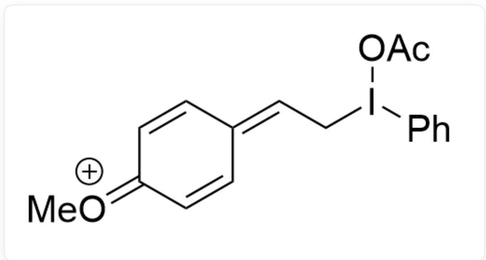  
[ \mathrm{C}[\mathrm{O} + ] = \mathrm{C}(\mathrm{C} = \mathrm{C} / 1)\mathrm{C} = \mathrm{CC}1 = \mathrm{C}\backslash \mathrm{Cl}(\mathrm{C}2 = \mathrm{CC} = \mathrm{CC} = \mathrm{C}2)\mathrm{OC}(\mathrm{C}) = \mathrm{O} ]

<table><tr><td colspan="9">CHECKPOINT</td><td>1 PTS</td></tr><tr><td colspan="10">The substrate first reacts with PIDA to generate the intermediate C[O+]=C(C=C/1)C=CC1=C\CI(C2=CC=CC=C2)OC(C)=O</td></tr></table>

Subsequently, it may further react with methanol to form the intermediate

$\mathrm{COC1 = CC = C(C(OC)Cl(C2 = CC = CC = C2)OC(C) = O)C = C1}$

# CHECKPOINT

1 PTS

Further

reaction

with

methanol

forms

the

intermediate

$$
\mathrm {C O C 1} = \mathrm {C C} = \mathrm {C} (\mathrm {C} (\mathrm {O C}) \mathrm {C I} (\mathrm {C 2} = \mathrm {C C} = \mathrm {C C} = \mathrm {C 2}) \mathrm {O C} (\mathrm {C}) = \mathrm {O}) \mathrm {C} = \mathrm {C 1}
$$

The electron-rich benzene ring preferentially migrates over hydrogen

# CHECKPOINT

1 PTS

The electron-rich benzene ring preferentially migrates over hydrogen

to yield the intermediate

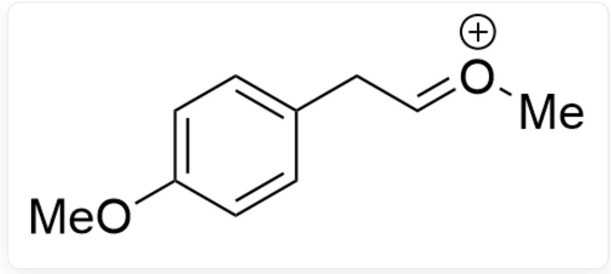  
COC1=CC=C(C/C=[O+]/C)C=C1

# CHECKPOINT

1 PTS

Benzene ring migration yields the intermediate  $\mathrm{COC1 = CC = C(C / C = [O + ] / C)C = C1}$

The resulting intermediate undergoes hydrolysis to give the final aldehyde product

  
$\mathrm{O = CCC1 = CC = C(OC)C = C1}$

# CHECKPOINT

2 PTS

The intermediate undergoes hydrolysis to yield product A,  $\mathrm{O} = \mathrm{CC} \mathrm{C}1 = \mathrm{CC} = \mathrm{C}(\mathrm{OC})\mathrm{C} = \mathrm{C}1$

For Reaction 2, the first possible intermediate is

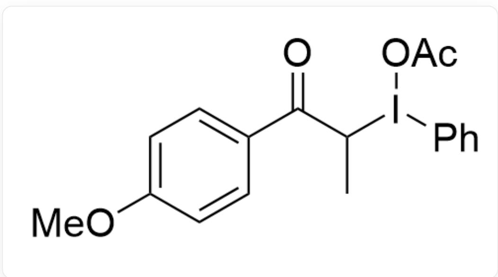

$$
O = C (C (I (O C (C) = O) C 1 = C C = C C = C 1) C) C 2 = C C = C (O C) C = C 2
$$

# CHECKPOINT

1 PTS

The intermediate

$$
\mathrm {O} = \mathrm {C} (\mathrm {C} (\mathrm {I} (\mathrm {O C} (\mathrm {C}) = \mathrm {O}) \mathrm {C} 1 = \mathrm {C C} = \mathrm {C C} = \mathrm {C} 1) \mathrm {C}) \mathrm {C} 2 = \mathrm {C C} = \mathrm {C} (\mathrm {O C}) \mathrm {C} = \mathrm {C} 2
$$

Subsequently, it undergoes further esterification to give the intermediate

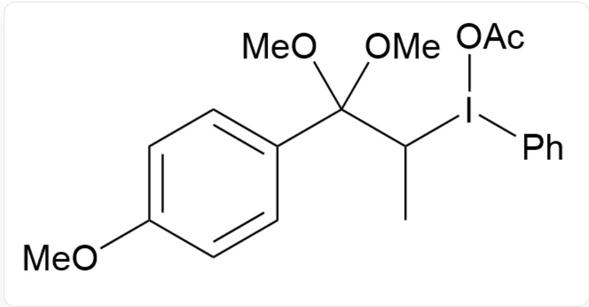  
CC(I(OC(C)=O)C1=CC=CC=C1)C(OC)(OC)C2=CC=C(OC)C=C2

# CHECKPOINT

1 PTS

Further esterification yields the intermediate CC(I(OC(C)=O)C1=CC=CC=C1)C(OC)

(OC)C2=CC=C(OC)C=C2

Finally, the benzene ring migrates, and hydrolysis gives the final product

# CHECKPOINT

1 PTS

Benzene ring migration and hydrolysis yield the final product  $\mathbf{B}$

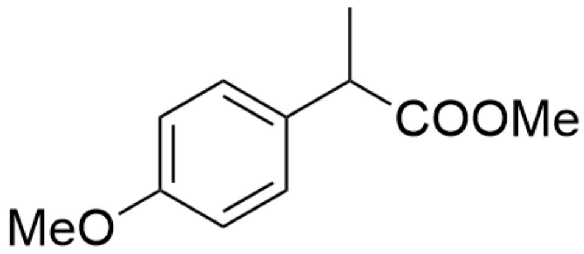

CC(C(OC)=O)C1=CC=C(OC)C=C1, product B

# CHECKPOINT

2 PTS

Product B is  $\mathrm{CC}(\mathrm{C}(\mathrm{OC}) = \mathrm{O})\mathrm{C}1 = \mathrm{CC} = \mathrm{C}(\mathrm{OC})\mathrm{C} = \mathrm{C}1$

Thus, none of the options match the structure, and option A is correct.