# 题目

PIDA是常见的相对温和的氧化剂。

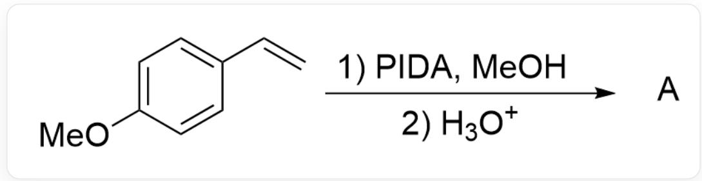  
$\mathrm{C = CC1 = CC = C(OC)C = C1 > PIDA.MeOH > H_3O^+ > [A], A}$  是反应产物

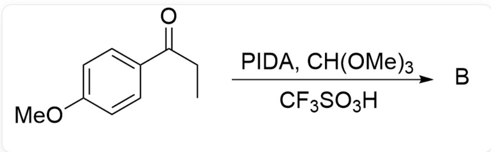  
$\mathrm{O = C(CC)C1 = CC = C(OC)C = C1 > PIDA.CH(OMe)_3.CF_3SO_3H > [B],B}$  是反应产物

请尝试预测以上两个反应的主产物

A. 其他选项均不正确  
B.

CC(C1=CC=C(OC)C=C1)=O,产物A

产物A

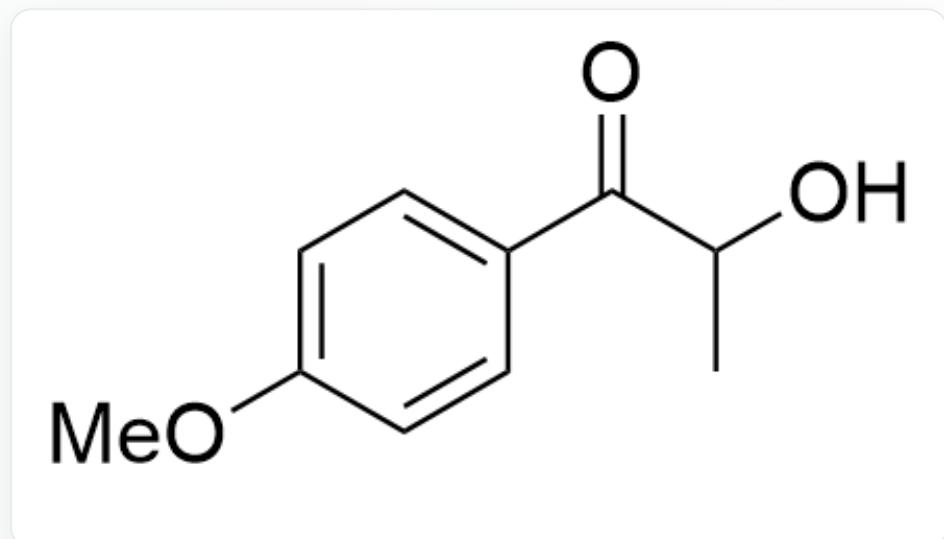

$\mathrm{O = C(C(O)C)C1 = CC = C(OC)C = C1}$  ，产物B

产物B

C.

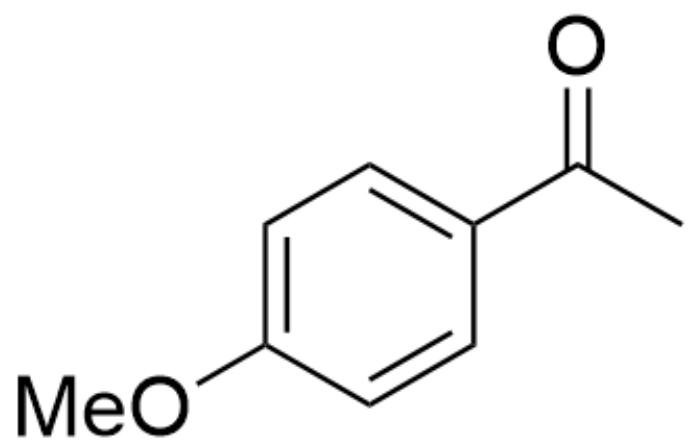

CC(C1=CC=C(OC)C=C1)=O,产物A

产物A

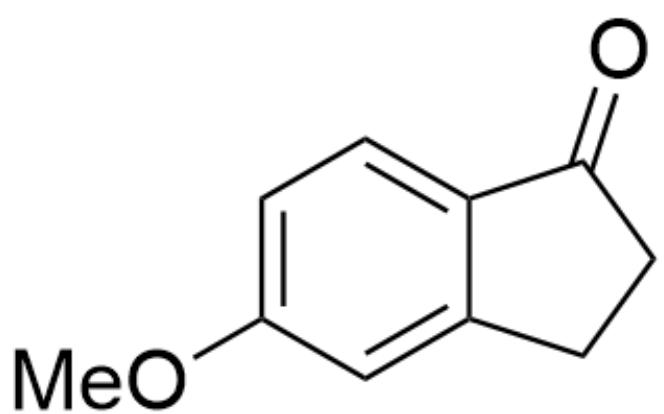

$O = C1C2 = CC = C(OC)C = C2CC1$  ，产物B

产物B

D.

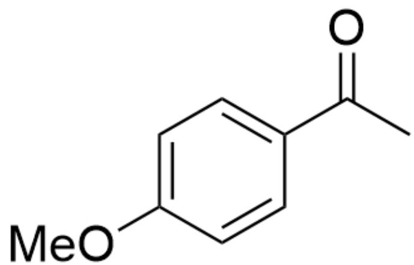

CC(C1=CC=C(OC)C=C1)=O,产物A

产物A

$\mathrm{O = C1C2 = CC = C(OC)C = C2C = C1}$  ，产物B

产物B

E.

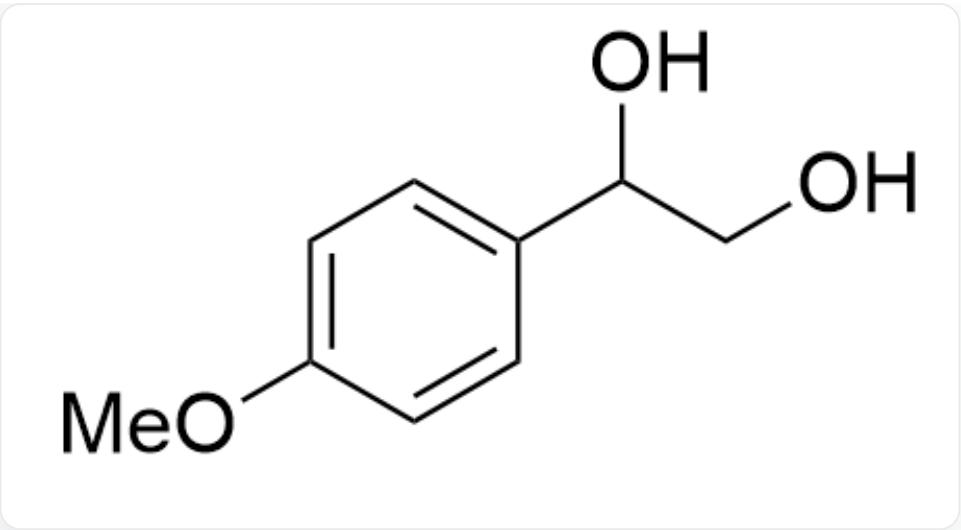

OC(CO)C1=CC=C(OC)C=C1,产物A

产物A

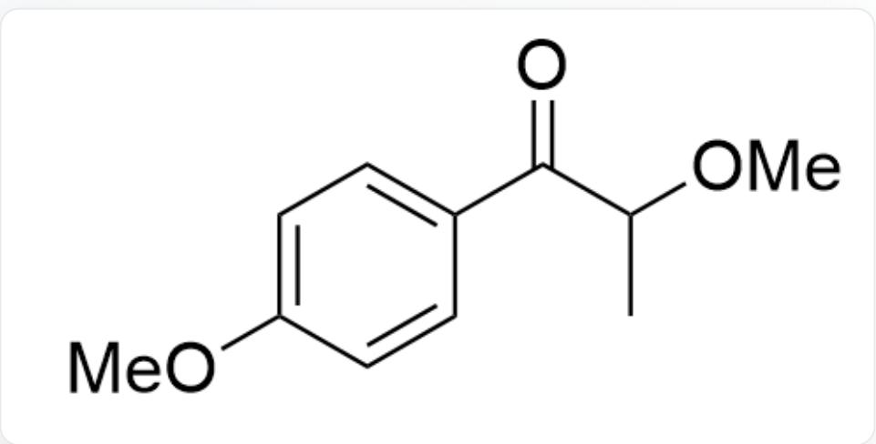

$\mathrm{O = C(C(OC)C)C1 = CC = C(OC)C = C1}$  ，产物B

产物B

F.

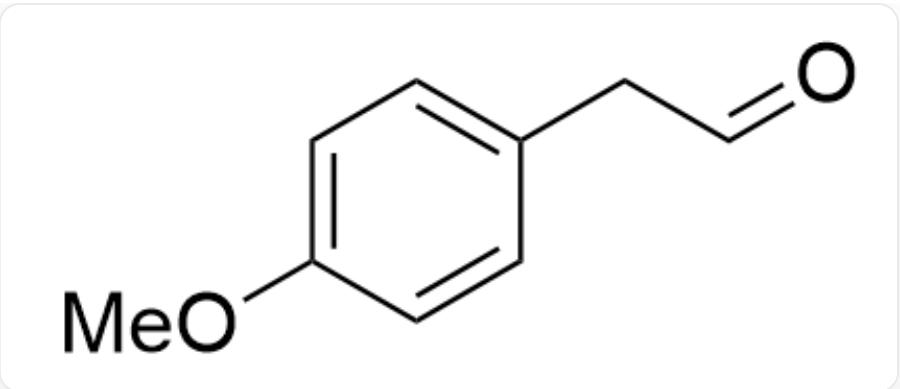  
$\mathrm{O = CCC1 = CC = C(OC)C = C1}$  ，产物A

产物A

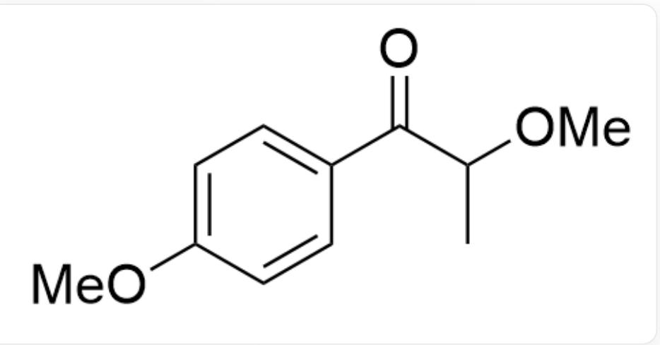  
$O = C(C(OC)C)C1 = CC = C(OC)C = C1$  ，产物B

产物B

G.

  
$\mathrm{O = CCC1 = CC = C(OC)C = C1}$  ，产物A

产物A

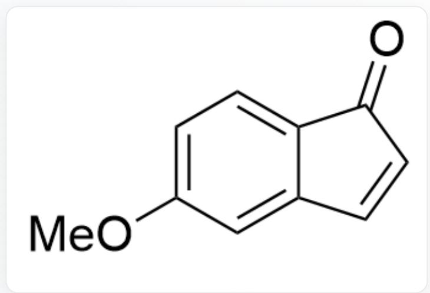  
$\mathrm{O = C1C2 = CC = C(OC)C = C2C = C1}$  ，产物B

产物B

H.

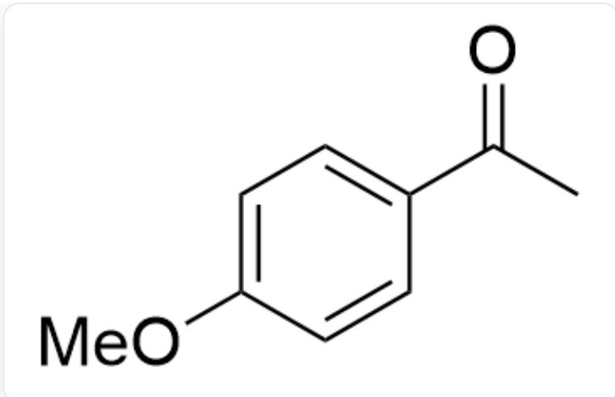

CC(C1=CC=C(OC)C=C1)=O,产物A

产物A

CC(C(OC)=O)C1=CC=C(OC)C=C1,产物B

产物B

# 答案

正确答案: A

# 详细解析

对于反应1来说，底物首先与PIDA反应生成中间体

  
[ \mathrm{C}[\mathrm{O} + ] = \mathrm{C}(\mathrm{C} = \mathrm{C} / 1)\mathrm{C} = \mathrm{CC}1 = \mathrm{C}\backslash \mathrm{Cl}(\mathrm{C}2 = \mathrm{CC} = \mathrm{CC} = \mathrm{C}2)\mathrm{OC}(\mathrm{C}) = \mathrm{O} ]

# CHECKPOINT

1 PTS

底物首先与PIDA反应生成中间体  $\mathrm{C}[\mathrm{O} + ] = \mathrm{C}(\mathrm{C} = \mathrm{C} / 1)\mathrm{C} = \mathrm{CC}1 = \mathrm{C}\backslash \mathrm{CI}(\mathrm{C}2 = \mathrm{CC} = \mathrm{CC} = \mathrm{C}2)\mathrm{OC}(\mathrm{C}) = 0$

接着可能与甲醇继续反应形成中间体

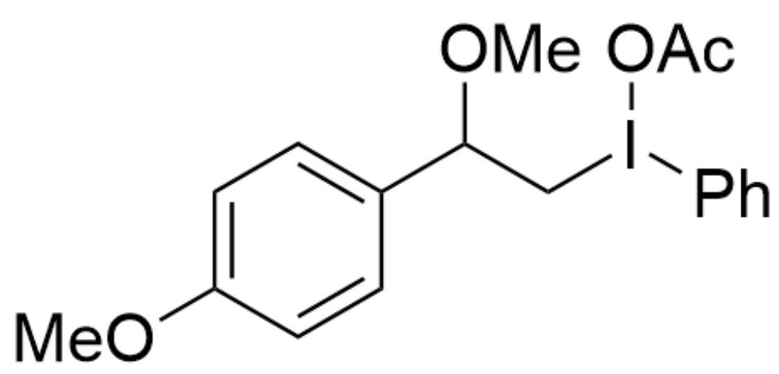

$\mathrm{COC1 = CC = C(C(OC)Cl(C2 = CC = CC = C2)OC(C) = O)C = C1}$

# CHECKPOINT

1 PTS

与甲醇继续反应形成中间体  $\mathrm{COC1 = CC = C(C(OC)Cl(C2 = CC = CC = C2)OC(C) = O)C = C1}$

富电子的苯环优先于氢进行迁移

# CHECKPOINT

1 PTS

富电子的苯环优先于氢进行迁移

得到中间体

  
COC1=CC=C(C/C=[O+]/C)C=C1

# CHECKPOINT

1 PTS

苯环迁移得到中间体  $\mathrm{COC1 = CC = C(C / C = [O + ] / C)C = C1}$

所得中间体进行水解，得到最终的醛类产物

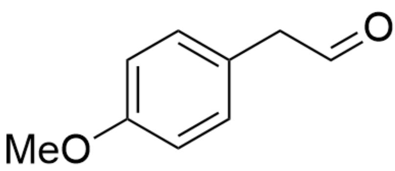  
$\mathrm{O = CCC1 = CC = C(OC)C = C1}$

# CHECKPOINT

2 PTS

中间体进行水解得到产物A，O=CCC1=CC=C(OC)C=C1

对于反应2，首先可能得到中间体

$$
O = C (C (I (O C (C) = O) C 1 = C C = C C = C 1) C) C 2 = C C = C (O C) C = C 2
$$

# CHECKPOINT

1 PTS

中间体

$$
\mathrm {O} = \mathrm {C} (\mathrm {C} (\mathrm {I} (\mathrm {O C} (\mathrm {C}) = \mathrm {O})) \mathrm {C} 1 = \mathrm {C C} = \mathrm {C C} = \mathrm {C} 1) \mathrm {C}) \mathrm {C} 2 = \mathrm {C C} = \mathrm {C} (\mathrm {O C}) \mathrm {C} = \mathrm {C} 2
$$

随后进一步被酯化，得到中间体

  
CC(I(OC(C)=O)C1=CC=CC=C1)C(OC)(OC)C2=CC=C(OC)C=C2

# CHECKPOINT

1 PTS

进一步酯化得到中间体CC(I(OC(C)=O)C1=CC=CC=C1)C(OC)(OC)C2=CC=C(OC)C=C2

最后发生苯环的迁移，经水解得到最终产物

# CHECKPOINT

1 PTS

苯环迁移，水解得到最终产物B

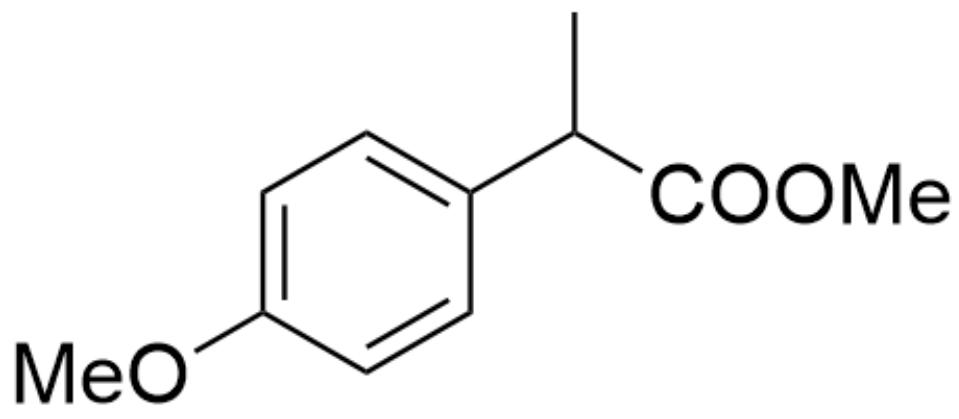

CC(C(OC)=O)C1=CC=C(OC)C=C1,产物B

# CHECKPOINT

2 PTS

产物B为CC(C(OC)=O)C1=CC=C(OC)C=C1

从而没有选项匹配结构，选项A正确。