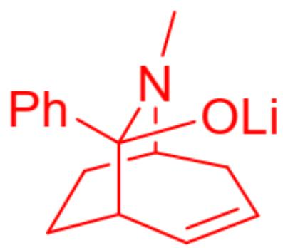
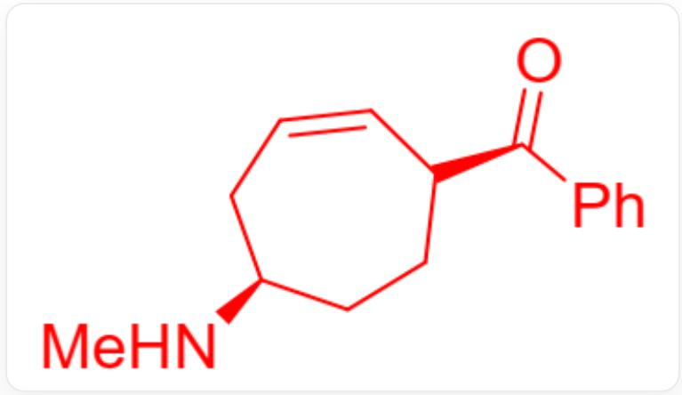

# 题目

推断图1有机反应的机理和经过的中间体。

Fig. 1, 图中反应以SMILES表示:  
  
CN1C2CC=CC(CC2)C1=O>CN1[C@@H]2CC[C@H]1CC[C@H]2C(C3=CC=CC=C3)=O，反应条件为先苯基锂、四氢呋喃，然后氢氧化钠水溶液

有以下几种说法：

1. 苯基锂碱性较强，在该反应中作为碱起到给反应物去质子化的功能  
2. 反应中发生了碳负离子介导的消除反应  
3. 加入  $\mathrm{NaOH}$  后反应中发生了碳负离子的亲核进攻反应  
4. 若将反应物氮原子上的甲基换成氢原子，该反应可能不再能发生

选出包含有最多正确说法编号的选项。

A. 其他选项均不正确  
B. 1  
C. 2  
D. 3

E. 4  
F. 1,2  
G. 1,3  
H. 1,4  
1. 2,3  
J. 2,4  
K. 3,4  
L. 1,2,3  
M. 1,2,4  
N. 1,3,4  
0. 1,2,3,4

# 答案

正确答案: E

# 详细解析

苯基锂可能作为碱或者作为亲核试剂参与反应。反应物中只有羰基β位碳上的氢原子具有一定酸性，但是该碳原子为桥头碳原子，去质子化形成双键会导致桥环张力太大，反应不易发生，因此苯基锂最可能作为亲核试剂进攻羰基碳，产生中间体如图2。说法1错误。若将反应物氮原子上的甲基换成氢原子，则苯基锂可能与氨基发生去质子化反应，生成带负电的共轭酰胺-烯醇，导致下一步苯基锂对羰基亲核进攻更困难，说法4正确。

  
Fig. 2, 图中分子以SMILES表示为: CN1[C@@H]2CC[C@H]([C@@]1(C3=CC=CC=C3)O[Li])C=CC2

# CHECKPOINT

1 PTS

苯基锂作为亲核试剂进攻酰胺羰基，形成中间体以SMILES表示为：CN1[C@@H]2CC[C@H]([C@@]1(C3=CC=CC=C3)O[Li])C=CC2

烯醇负离子下一步发生消除反应，可能类似逆Michael加成反应生成碳负离子，但是该碳负离子不稳定。也可能消除形成氨基负离子，该过程相当于酰胺水解。因此第二个中间体如图3。

  
Fig. 3, 图中分子以SMILES描述为: CN[C@H]1CC=CC(C(C2=CC=CC=C2)=O)CC1

# CHECKPOINT

1 PTS

氧负离子消除使氨基离去，形成中间体以SMILES表示为：CN[C@H]1CC=CC(C(C2=CC=CC=C2)=O)CC1

在碱性下，羰基  $\beta$  碳去质子化发生双键移位，形成稳定的  $\beta$  不饱和酮。分子内活性二级氨基可以进一步发生分子内Michael加成，生成题目中的产物。

综合以上反应机理，反应中未发生碳负离子介导的消除反应，加入  $\mathrm{NaOH}$  后也并没有发生碳负离子的亲核进攻反应，说法2、3错误。

# CHECKPOINT

1 PTS

二级氨基发生分子内Michael加成，生成产物