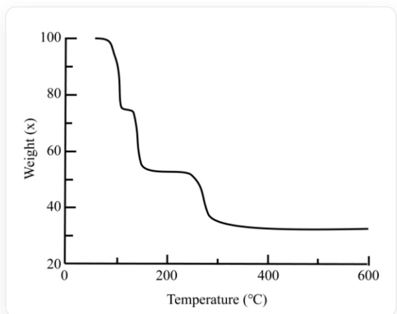

# Question

A preparation method of a common metal complex is as follows:  $1.8\mathrm{g}$ $\mathbf{M}_2\mathbf{O}$ ,  $50\mathrm{mL}$ $\mathrm{CH}_2\mathrm{Cl}_2$ ,  $3\mathrm{mL}$  3-hexyne (approximately  $26.3\mathrm{mmol}$ ),  $1.1\mathrm{g}$  oxalic acid, stirred for several hours, and the product was obtained by recrystallization with  $\mathrm{CH}_2\mathrm{Cl}_2$  at low temperature. It is known that the metal is a dinuclear complex, does not contain metal-metal bonds, and the metal content is  $33.50\%$ .

Thermogravimetric analysis of the complex was performed under inert conditions, and the results are shown in the figure below. Which of the following statements is incorrect?

This is a line graph. The abscissa is "Temperature  $(^{\circ}C)$ ", the scale division is 200, and the range is 0-600; the ordinate is "Weight(X)", the scale division is 40, and the range is 20-100. There is only one broken line in the figure, and there are the following inflection points (including the starting point): (70,100)(80,100) (100,75)(120,75)(130,55)(250,55)(280,30)(600,30)

A. All other options are incorrect  
B. The product has the molecular formula  $\mathrm{M}_{2} \mathrm{C}_{14} \mathrm{H}_{20} \mathrm{O}_{4}$  
C. The product contains two five-membered rings.

D. The common salt solution of  $\mathbf{M}$  is blue.  
E. The final product of thermogravimetry is the element  $\mathbf{M}$ .  
F. The first two thermogravimetric losses involve the same molecule.

# Answer

Correct Answer: A

# Detailed Explanation

According to the description in the question stem, "the metal is a dinuclear complex, does not contain metal-metal bonds, and the metal content is  $33.50\%$ ," it is not difficult to guess that oxalate is a bridging ligand, coordinating with two  $\mathbf{M}$ . According to the preparation process, it can be seen that 3-hexyne participates in the reaction. It may be assumed that one  $\mathbf{M}$  coordinates with one 3-hexyne. Therefore, the chemical formula of the product can be described as  $\mathbf{M}_2(\mathrm{C}_2\mathrm{O}_4)(\mathrm{C}_6\mathrm{H}_{10})_2$ . The molecular formula of the product is  $\mathbf{M}_2\mathrm{C}_{14}\mathrm{H}_{20}\mathrm{O}_4$ , B is correct.

# CHECKPOINT

1 PTS

The chemical formula of the product can be described as  $\mathbf{M}_2(\mathrm{C}_2\mathrm{O}_4)(\mathrm{C}_6\mathrm{H}_{10})_2$

In the product, the oxalate radical acts as a tetradentate ligand, coordinating with two Cu respectively, and two 3-hexynes coordinate with Cu, forming two five-membered rings, C is correct.

# CHECKPOINT

1 PTS

In the product, the oxalate radical acts as a tetradentate ligand, coordinating with two Cu respectively, and two 3-hexynes coordinate with Cu

According to the metal content, it can be judged that the metal is Cu, and the molecular weight of the product is  $379.42 \mathrm{~g} / \mathrm{mol}$ . The common salt solution of M is blue, D is correct.

# CHECKPOINT

1 PTS

The metal is Cu

The thermogravimetric image is discussed below. The first weight loss is about  $25\%$ , corresponding to about  $95\mathrm{g / mol}$ , corresponding to one 3-hexyne. Since it is reading the image, the actual weight loss is  $21\%$ . The second weight loss is about  $25\%$ , corresponding to about  $95\mathrm{g / mol}$ , corresponding to one 3-hexyne. The actual weight loss is  $21\%$ . The third weight loss is about  $20\%$ , corresponding to about  $76\mathrm{g / mol}$ , corresponding to 2  $\mathrm{CO}_{2}$ , and the actual weight loss is  $23\%$ . It should be pointed out that the molecular weights of one 3-hexyne and two  $\mathrm{CO}_{2}$  are relatively close. The judgment of the three weight losses takes into account the thermal stability of the coordination:  $\pi$  ligands are easier to leave than  $\sigma$  ligands. Therefore, E and F are both correct. Choose A.

# CHECKPOINT

1 PTS

The first weight loss corresponds to 3-hexyne, the second weight loss corresponds to 3-hexyne, the third weight loss corresponds to  $2\mathrm{CO}_{2}$ , and the final residue is  $\mathrm{Cu}$