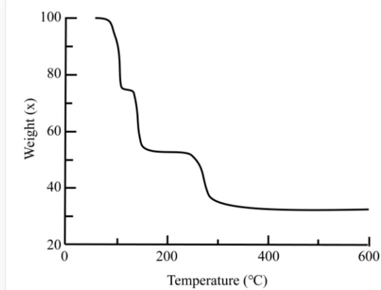

# 题目

某常见金属的配合物制备方法如下，  $1.8\mathrm{g}\mathrm{M}_2\mathrm{O}$  ，  $50~\mathrm{mL}$ $\mathrm{CH_2Cl_2}$  ，3mL3-己炔(约26.3mmol)， $1.1\mathrm{g}$  草酸，搅拌数小时后，用  $\mathrm{CH_2Cl_2}$  在低温下重结晶得到产物。已知该金属为双核配合物，不含有金属-金属键且金属含量为  $33.50\%$  。

在惰性条件下对该配合物进行热重分析，结果如下图所示。下列说法中错误的是

这是一张折线图。横坐标为“Temperature(°C)”，刻度的分度值为200，范围为0-600；纵坐标为“Weight(X)”，刻度的分度值为40，范围为20-100。图中仅有一条折线，存在以下拐点（包含起始点）：(70,100)(80,100)(100,75)(120,75)(130,55)(250,55)(280,30)(600,30)

A. 其他选项均不正确  
B. 产物的分子式为  $\mathrm{M}_{2} \mathrm{C}_{14} \mathrm{H}_{20} \mathrm{O}_{4}$  
C. 产物中含有两个五元环  
D. M 的常见盐溶液呈蓝色

E. 热重的最终产物为  $\mathrm{M}$  单质  
F. 前两次热重失去的分子相同

# 答案

正确答案: A

# 详细解析

根据题干描述“该金属为双核配合物，不含有金属-金属键且金属含量为  $33.50\%$ ”，不难猜测草酸为桥连配体，和两个  $\mathbf{M}$  配位。根据制备过程，可以看出3-己炔参与了反应，不妨假设一个  $\mathbf{M}$  与一个3-己炔配位。因此，产物的化学式可以描述为  $\mathrm{M}_2(\mathrm{C}_2\mathrm{O}_4)(\mathrm{C}_6\mathrm{H}_{10})_2$  。产物的分子式为  $\mathrm{M}_2\mathrm{C}_{14}\mathrm{H}_{20}\mathrm{O}_4$  ，B正确。

# CHECKPOINT

1 PTS

产物的化学式可以描述为  $\mathbf{M}_2(\mathrm{C}_2\mathrm{O}_4)(\mathrm{C}_6\mathrm{H}_{10})_2$

产物中草酸根作四齿配体，分别和两个  $\mathrm{Cu}$  配位，两个3-己炔和  $\mathrm{Cu}$  配位，存在两个五元环，C正确。

# CHECKPOINT

1 PTS

产物中草酸根作四齿配体，分别和两个  $\mathrm{Cu}$  配位，两个3-己炔和  $\mathrm{Cu}$  配位

依据金属含量，可以判断金属为  $\mathrm{Cu}$ ，产物的分子量为  $379.42\mathrm{g / mol}$ 。M 的常见盐溶液呈蓝色，D 正确。

# CHECKPOINT

1 PTS

金属为Cu

下讨论热重图像。第一次失重约  $25\%$  ，对应约  $95 \mathrm{~g} / \mathrm{mol}$  ，对应一个3-己炔，由于是读图，实际失重为  $21 \%$  。第二次失重约  $25\%$  ，对应约  $95 \mathrm{~g} / \mathrm{mol}$  ，对应一个3-己炔，实际失重为  $21 \%$  。第二次失重约  $20\%$  ，对应约  $76 \mathrm{~g} / \mathrm{mol}$  ，对应2个  $\mathrm{CO}_{2}$  ，实际失重为  $23 \%$  。需要指出的是，一个3-己炔和2个  $\mathrm{CO}_{2}$  分子量较接近，三次失重的前后判断考虑了配位的热稳定性：  $\pi$  配体相比  $\sigma$  配体更易离去。因此，E、F均正确。选择A。

# CHECKPOINT

1 PTS

第一次失重对应3-己炔，第二次失重对应3-己炔第三次失重对应2个  $\mathrm{CO}_{2}$ ，最终剩余  $\mathrm{Cu}$