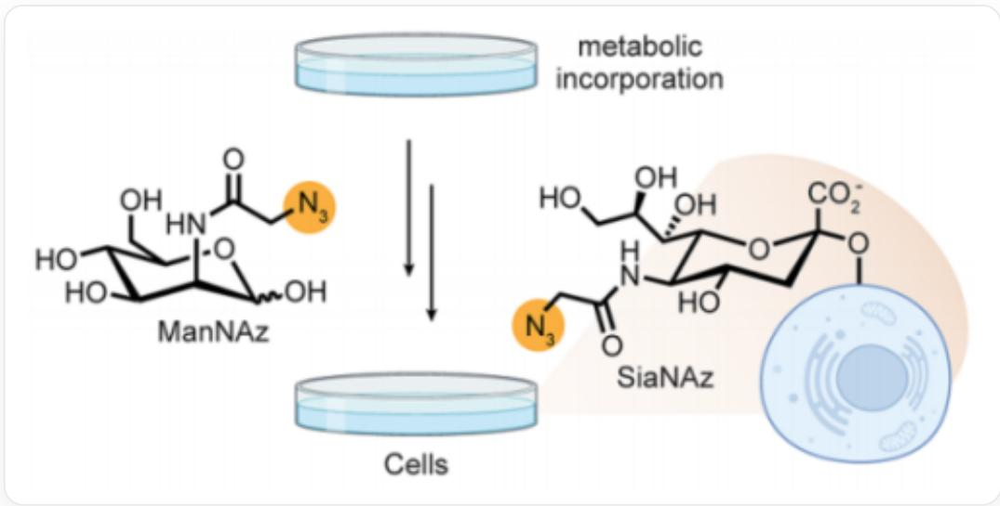
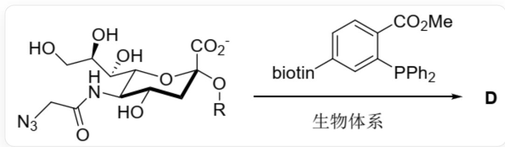
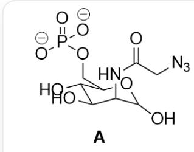
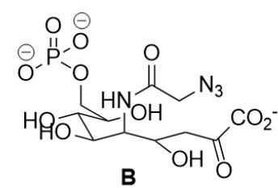
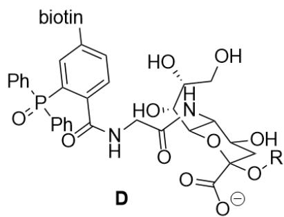

# 题目

乙酰甘露糖胺的非天然衍生物 ManNAz 可以通过代谢转化为细胞表面的非天然唾液酸 SiaNAz，从而向细胞表面引入生物正交反应中非常重要的叠氮基团(如下图所示)。

  
`O[C@H]1[C@H](O)[C@H](NC(CN=[N+]=[N-])=O)C(O)O[C@@H]1CO`加入细胞培养体系中，经代谢标记可在细胞表面产生结构为`O[C@@H]1[C@H]([C@@H](O[C@](O[*])(C1)C([O-])=O)[C@@H]([C@@H] (CO)O)NC(CN=[N+]=[N-])=O`（[*]表示与细胞表面成键）的修饰

研究表明，这一代谢过程可以分为以下几步：

1. 在1分子 ATP 的作用下，ManNAz 的6号位羟基发生磷酸化反应得到中间体 A，伴随1分子 ADP 的生成。  
2. 中间体 A 异构为其链状结构，随后与PEP(磷酸烯醇式丙酮酸， $\mathrm{C} = \mathrm{C}(\mathrm{C}([\mathrm{O}-]) = \mathrm{O}) \mathrm{OP}([\mathrm{O}-])([\mathrm{O}-]) = \mathrm{O}^{\prime}$  反应得到中间体 B，伴随1分子磷酸的生成。  
3. 中间体B发生分子内亲核加成，随后磷酸基团水解，得到中间体C。  
4. 中间体 C 的异头碳羟基与CTP发生反应, 随后被细胞表面的羟基捕获, 转化为细胞表面的非天然唾液酸 SiaNAz。

有以下说法：

1. A中有5个手性碳原子  
2.在生理条件下，B带两个负电荷  
3.B中有6个手性碳原子  
4. 在细胞表面引入叠氮基团后，SiaNAz可以发生如下后修饰反应(其中细胞结构用R基团代替，biotin指生物素基团，可认为不参与反应)。

  
`O[C@@H]1[C@@H](NC(CN=[N+]=[N-])=O)[C@H]([C@H](O)[C@H](O)CO)O[C@](C(O)=O)(O[R])C1`在生物体系中与`[biotin]C1=CC=C(C(OC)=O)C(P(C2=CC=CC=C2)C3=CC=CC=C3)=C1`反应得到D

则D含有两个氮原子和11个氧原子（不考虑生物素基团和R基团）

选出下列选项中含有全部正确说法的一项：

A. 所有说法均不正确  
B. 1  
C. 2  
D. 3

E. 4  
F. 1,2  
G. 1,3  
H. 1,4  
1. 2,3  
J. 2,4  
K. 3,4  
L. 1,2,3  
M. 1,2,4  
N. 1,3,4  
O. 2,3,4  
P. 1,2,3,4

# 答案

正确答案: H

# 详细解析

ManNAz 的六号位羟基磷酸化得到 A：`O[C@H]1[C@H](O)[C@H](NC(CN=[N+]=[N-])=O)C(O)O[C@@H]1COP([O-])([O-])=O`

# CHECKPOINT

1 PTS

A的结构为`O[C@H]1[C@H](O)[C@H](NC(CN=[N+]=[N-])=O)C(O)O[C@@H]1COP([O-])([O-])=O`，其中有5个手性碳原子，说法1正确

随后A异构为醛，被烯醇式PEP加成，离去磷酸根得到B：`OC(COP([O-])([O-]=O)C(O)C(O)C(NC(CN=[N+]=[N-])=O)C(CC(C([O-]=O)=O)O`

# CHECKPOINT

1 PTS

B 的结构为`OC(COP([O-])([O-])=O)C(O)C(O)C(NC(CN=[N+]=[N-])=O)C(CC(C([O-])=O)=O)O`，其中有5个手性碳原子，说法3错误

在生理pH约为7.4的条件下，磷酸根的两个氢和羧基氢均会电离，B带3个负电荷。

# CHECKPOINT

1 PTS

生理条件下磷酸根的两个氢和羧基氢均会电离，B带3个负电荷，说法2错误

随后发生分子内亲核加成，游离羟基进攻羰基形成吡喃六元环，磷酸根水解得到C： $\mathrm{O}[\mathrm{C}@\mathrm{]}1(\mathrm{C}([\mathrm{O} - ]) = \mathrm{O})\mathrm{C}[\mathrm{C}@\mathrm{H}](\mathrm{O})[\mathrm{C}@\mathrm{@}\mathrm{H}](\mathrm{NC}(\mathrm{CN} = [\mathrm{N} + ] = [\mathrm{N} - ]) = \mathrm{O})(\mathrm{C}@\mathrm{H}]([\mathrm{C}@\mathrm{H}](\mathrm{O})[\mathrm{C}@\mathrm{H}](\mathrm{O})\mathrm{CO})\mathrm{O}1$

# CHECKPOINT

1 PTS

C的结构为`O[C@]1(C([O-])=O)C[C@H](O)[C@@H](NC(CN=[N+]=[N-])=O)[C@H]([C@H](O)[C@H](O)CO)O1`

生成D的反应中，首先三价磷与叠氮基团发生Staudinger反应，自身被氧化到五价的同时还原其为氨基；随后氨基进攻空间上临近的酯基，离去甲醇产生酰胺，得到D：[biotin]C1=CC=C(C(NCC(N[C@H]2[C@H][[C@H](O)[C@H](O)CO)O[C@](C([O-]=O)(O[R])C[C@@H]2O)=O)=O)C(P(C3=CC=CC=C3)(C4=CC=CC=C4)=O)=C1

# CHECKPOINT

1 PTS

D的结构为`[biotin]C1=CC=C(C(NCC(N[C@H]2[C@H]([C@H](O)[C@H](O)CO)O[C@](C([O-])=O)(O[R])C[C@@H]2O)=O)=O)C(P(C3=CC=CC=C3)(C4=CC=CC=C4)=O)=C1`，有两个氮原子和11个氧原子（不考虑生物素基团和R基团)，说法4正确

说法1，4正确，选H

A: `O[C@H]1[C@H](O)[C@H](NC(CN=[N+]=[N-])=O)C(O)O[C@@H]1COP([O-])([O-])=O`; B: `OC(COP([O-])

$([\mathrm{O - }]) = \mathrm{O})\mathrm{C}(\mathrm{O})\mathrm{C}(\mathrm{O})\mathrm{C}(\mathrm{NC}(\mathrm{CN} = [\mathrm{N + }] = [\mathrm{N - }]) = \mathrm{O})\mathrm{C}(\mathrm{CC}(\mathrm{C}([\mathrm{O - }]) = \mathrm{O}) = \mathrm{O})\mathrm{O}$  ；C: \`O[C@]1(C([O-])=O)C[C@H](O)

[C@@H](NC(CN=[N+]=[N-])=O)[C@H]([C@H](O)[C@H](O)CO)O1`; D:

`[biotin]C1=CC=C(C(NCC(N[C@H]2[C@H][[C@H](O)[C@H](O)CO)O[C@])(C([O-])=O)

$(O[R])C[C@@H]2O) = O) = O)C(P(C3 = CC = CC = C3)(C4 = CC = CC = C4) = O) = C1$