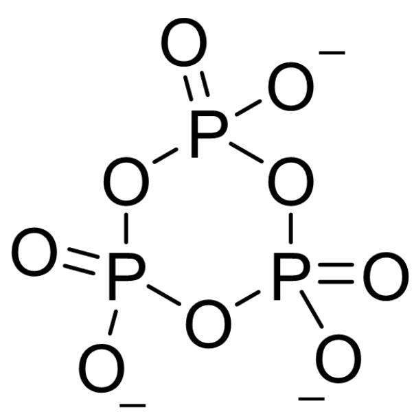

# Question

A quantitative mixture of  $\mathrm{MnO}_2$ ,  $\mathrm{NH}_4\mathrm{H}_2\mathrm{PO}_4$ , and  $\mathrm{H}_3\mathrm{PO}_4$  is heated together to  $300^{\circ}\mathrm{C}$  (Reaction 1). After washing with water and drying, a purple powder A is obtained, which contains no water of crystallization and has a molecular weight of 246.9. If it is dissolved in dilute sulfuric acid, the solution color does not change significantly, but a precipitate is formed (Reaction 2), while dissolving it in concentrated sulfuric acid yields a clear red solution.

Researchers performed thermogravimetric analysis on A, and the intermediate products exhibited a variety of colors (the weight loss ratios here are all theoretical values): A is heated to  $340^{\circ}\mathrm{C}$  in an inert atmosphere, with a weight loss of  $3.65\%$ , yielding a blue substance (Reaction 3); continuing to heat to  $460^{\circ}\mathrm{C}$ , it loses another  $10.14\%$  of its weight, yielding a white substance B (Reaction 4); subsequently, heating to  $800^{\circ}\mathrm{C}$  does not result in any noticeable weight loss, B melts and completely transforms into a pink liquid C. The formula weight of C is 1.5 times that of B.

The following statements exist:

1. The sum of the coefficients on the right side of the chemical equation for Reaction 1 is 15.  
2. The sum of the coefficients on the left side of the chemical equation for Reaction 2 is less than 8.  
3. The sum of all the atoms in the chemical formula of the blue product obtained in Reaction 3 is 27.  
4. The sum of the coefficients on both sides of the chemical equation for Reaction 4 is less than or equal to 12.  
5. The ideal point group of the anion of  $\mathbf{C}$  is  $\mathrm{C}_{3\mathrm{v}}$

The option containing all the correct statements is:

A. All other options are incorrect  
B. 2  
C. 5

D. 4  
E. 1,2,3,4  
F. 2,3,5  
G. 1,2,4  
H. 2,4,5  
1,3,5  
J. 2,5  
K. 1,3  
L. 3,4,5  
M. 1,2,4,5  
N. 2,3  
0. 1,5  
P. 4,5  
Q. 3,5

R. 1  
S. 1,2,3,5

# Answer

Correct Answer: I

# Detailed Explanation

A should contain at least  $1\mathrm{Mn}$ ,  $1\mathrm{NH}_4^+$  and  $1\mathrm{PO}_4^{3-}$ . Subtracting these from the molecular weight of A, 246.9, leaves approximately 79, which is  $\mathrm{P} + 3\mathrm{O}$ . Therefore, A is  $\mathrm{NH}_4\mathrm{MnP}_2\mathrm{O}_7$ .

# CHECKPOINT

1 PTS

A is  $\mathrm{NH}_4\mathrm{MnP}_2\mathrm{O}_7$

Reaction 1: Mn is reduced, and the only element that can be oxidized is O, producing  $\mathrm{O}_2$ . The equation is:  $4\mathrm{MnO}_2 + 4\mathrm{NH}_4\mathrm{H}_2\mathrm{PO}_4 + 4\mathrm{H}_3\mathrm{PO}_4 \rightarrow 4\mathrm{NH}_4\mathrm{MnP}_2\mathrm{O}_7 + 10\mathrm{H}_2\mathrm{O} + \mathrm{O}_2$ . The sum of the coefficients on the right side is 15, so statement 1 is correct.

# CHECKPOINT

1 PTS

Reaction 1 equation is:  $4\mathrm{MnO}_2 + 4\mathrm{NH}_4\mathrm{H}_2\mathrm{PO}_4 + 4\mathrm{H}_3\mathrm{PO}_4 \rightarrow 4\mathrm{NH}_4\mathrm{MnP}_2\mathrm{O}_7 + 10\mathrm{H}_2\mathrm{O} + \mathrm{O}_2$

Reaction 2: Dissolving in dilute sulfuric acid produces a precipitate, corresponding to the disproportionation of trivalent  $\mathrm{Mn}$  to produce  $\mathrm{Mn}^{2+}$  and  $\mathrm{MnO}_2$ . The equation is:  $2\mathrm{NH}_4\mathrm{MnP}_2\mathrm{O}_7 + 2\mathrm{H}_2\mathrm{SO}_4 + 4\mathrm{H}_2\mathrm{O} \rightarrow (\mathrm{NH}_4)_2\mathrm{SO}_4 + \mathrm{MnSO}_4 + \mathrm{MnO}_2 + 4\mathrm{H}_3\mathrm{PO}_4$ . Statement 2 is incorrect.

# CHECKPOINT

1 PTS

Reaction

2

equation

is:

$$
2 \mathrm {N H} _ {4} \mathrm {M n P} _ {2} \mathrm {O} _ {7} + 2 \mathrm {H} _ {2} \mathrm {S O} _ {4} + 4 \mathrm {H} _ {2} \mathrm {O} \rightarrow (\mathrm {N H} _ {4}) _ {2} \mathrm {S O} _ {4} + \mathrm {M n S O} _ {4} + \mathrm {M n O} _ {2} + 4 \mathrm {H} _ {3} \mathrm {P O} _ {4}
$$

First step weight loss:  $\mathrm{M}_1 = \mathrm{w}_1 \times \mathrm{M} = 3.65 \times 10^{-2} \times 246.922\mathrm{g} \cdot \mathrm{mol}^{-1} = 9.01\mathrm{g} \cdot \mathrm{mol}^{-1}$ , corresponding to  $0.5\mathrm{H}_2\mathrm{O}$  molecules.

# CHECKPOINT

2 PTS

First step weight loss corresponds to  $0.5\mathrm{H}_2\mathrm{O}$  molecules

Second step weight loss:  $\mathrm{M}_2 = \mathrm{w}_2 \times \mathrm{M} = 10.14 \times 10^{-2} \times 246.922\mathrm{g} \cdot \mathrm{mol}^{-1} = 25.04\mathrm{g} \cdot \mathrm{mol}^{-1}$ , corresponding to  $\mathrm{N} + 3\mathrm{H} + 0.5\mathrm{O}$  (what is lost may be  $\mathrm{N}_2$ ,  $\mathrm{H}_2\mathrm{O}$ ,  $\mathrm{NH}_3$ ).

# CHECKPOINT

2 PTS

Second step weight loss corresponds to  $\mathrm{N} + 3\mathrm{H} + 0.5\mathrm{O}$ , what is lost may be  $\mathrm{N}_2$ ,  $\mathrm{H}_2\mathrm{O}$ ,  $\mathrm{NH}_3$

Therefore, in the two steps of weight loss, 1 molecule of  $\mathrm{NH_4MnP_2O_7}$  loses  $1\mathrm{N},4\mathrm{H}$ , and  $1\mathrm{O}$ , corresponding to the simplest formulas of  $\mathbf{B}$  and  $\mathbf{C}$  being  $\mathrm{MnP_2O_6}$ .

# CHECKPOINT

2 PTS

B and C simplest formulas are  $\mathrm{MnP}_2\mathrm{O}_6$

Since the formula weight of  $\mathbf{C}$  is 1.5 times that of  $\mathbf{B}$ , we can deduce from the simplest case that  $\mathbf{B}$ :

$\mathrm{Mn}_2\mathrm{P}_4\mathrm{O}_{12}$ , C:  $\mathrm{Mn}_3\mathrm{P}_6\mathrm{O}_{18}$

# CHECKPOINT

1 PTS

B:  $\mathrm{Mn}_2\mathrm{P}_4\mathrm{O}_{12}$ , C:  $\mathrm{Mn}_3\mathrm{P}_6\mathrm{O}_{18}$

Reaction 3: Two molecules of A produce one molecule of  $\mathrm{H}_2\mathrm{O}$ , and also produce  $\mathrm{Mn}_2(\mathrm{NH}_3)_2\mathrm{P}_4\mathrm{O}_{13}$ . The equation is:  $2\mathrm{NH}_4\mathrm{MnP}_2\mathrm{O}_7 \rightarrow \mathrm{Mn}_2(\mathrm{NH}_3)_2\mathrm{P}_4\mathrm{O}_{13} + \mathrm{H}_2\mathrm{O}$ . Statement 3 is correct.

# CHECKPOINT

1 PTS

Reaction 3 equation is:  $2\mathrm{NH}_4\mathrm{MnP}_2\mathrm{O}_7 \rightarrow \mathrm{Mn}_2(\mathrm{NH}_3)_2\mathrm{P}_4\mathrm{O}_{13} + \mathrm{H}_2\mathrm{O}$

Reaction 4:  $\mathrm{Mn}_2(\mathrm{NH}_3)_2\mathrm{P}_4\mathrm{O}_{13}$  is converted to  $\mathrm{Mn}_2\mathrm{P}_4\mathrm{O}_{12}$ , losing  $\mathrm{NH}_3$ ,  $\mathrm{N}_2$  and  $\mathrm{H}_2\mathrm{O}$ . The equation is:  $3\mathrm{Mn}_2(\mathrm{NH}_3)_2\mathrm{P}_4\mathrm{O}_{13} \rightarrow 3\mathrm{Mn}_2\mathrm{P}_4\mathrm{O}_{12} + 4\mathrm{NH}_3 + \mathrm{N}_2 + 3\mathrm{H}_2\mathrm{O}$ . Statement 4 is incorrect.

# CHECKPOINT

1 PTS

Reaction 4 equation is:  $3\mathrm{Mn}_2(\mathrm{NH}_3)_2\mathrm{P}_4\mathrm{O}_{13} \rightarrow 3\mathrm{Mn}_2\mathrm{P}_4\mathrm{O}_{12} + 4\mathrm{NH}_3 + \mathrm{N}_2 + 3\mathrm{H}_2\mathrm{O}$

The anion of  $\mathbf{C}$  is  $\mathrm{P}_3\mathrm{O}_{9}^{3-}$ , and its structure is  $\mathrm{O} = \mathrm{P}(\mathrm{OP}(\mathrm{O}1)([\mathrm{O}-]) = \mathrm{O})([\mathrm{O}-])\mathrm{OP}1([\mathrm{O}-]) = \mathrm{O}$ , the ideal point group is  $\mathrm{C}_{3\mathrm{v}}$ . Statement 5 is correct.

# CHECKPOINT

1 PTS

C anion is  $\mathrm{P}_3\mathrm{O}_{9}^{3-}$ , ideal point group is  $\mathrm{C}_{3\mathrm{v}}$

  
C anion structure is  $O = P(OP(O1)([O - ]) = O)([O - ])OP1([O - ]) = O$

Statements 1, 3, and 5 are correct, choose I