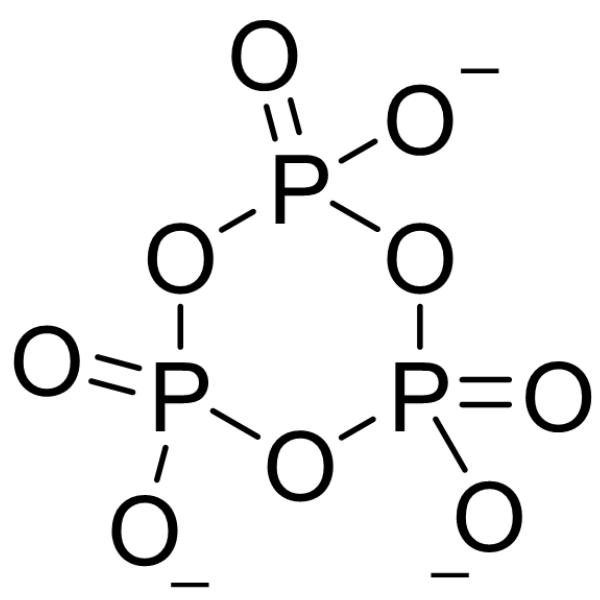

# 题目

将定量的  $\mathrm{MnO}_{2} 、 \mathrm{NH}_{4} \mathrm{H}_{2} \mathrm{PO}_{4}$  与  $\mathrm{H}_{3} \mathrm{PO}_{4}$  混合共热至  $300^{\circ} \mathrm{C}$  （反应1)，经水洗、干燥可以得到一种紫色粉末A，其不含结晶水，分子量为246.9。若将其溶于稀硫酸，溶液颜色无显著变化但有沉淀生成（反应2)，而将其溶于浓硫酸则会得到澄清的红色溶液。

研究人员对A进行了热重分析，其中间产物具有多种多样的颜色（这里的失重比例均为理论值）：A于惰性气氛中加热至  $340^{\circ}\mathrm{C}$ ，失重  $3.65\%$  ，得到蓝色物质（反应3)；继续加热至  $460^{\circ}\mathrm{C}$ ，又失重 $10.14\%$  ，得到白色物质B（反应4)；随后加热至  $800^{\circ}\mathrm{C}$ ，未观察到明显失重，B发生熔化并完全转化为粉色液体C。C的式量为B的1.5倍。

存在下列说法：

1. 反应1的化学方程式右侧系数和为15  
2. 反应2的化学方程式左侧系数和小于8  
3. 反应3得到的蓝色产物, 其化学式中所有原子数目之和为27  
4. 反应4的化学方程式左右两侧系数之和小于等于12  
5. C的阴离子的理想点群为  $\mathrm{C}_{3\mathrm{v}}$

包含所有正确说法的选项是:

A. 其他选项均不正确  
B. 2  
C. 5  
D. 4  
E. 1,2,3,4

F. 2,3,5  
G. 1,2,4  
H. 2,4,5  
1,3,5  
J. 2,5  
K. 1,3  
L. 3,4,5  
M. 1,2,4,5  
N. 2,3  
0. 1,5  
P. 4,5  
Q. 3,5  
R. 1  
S. 1,2,3,5

# 答案

正确答案: I

# 详细解析

A 中应该至少含1个Mn、1个  $\mathrm{NH}_{4}^{+}$  和1个  $\mathrm{PO}_{4}^{3-}$ , A 的分子量246.9减去这些还剩下约79, 即  $\mathrm{P} + 3 \mathrm{O}$ , 故  $\mathrm{A}$  为  $\mathrm{NH}_{4} \mathrm{MnP}_{2} \mathrm{O}_{7}$

# CHECKPOINT

1 PTS

A 为  $\mathrm{NH}_{4} \mathrm{MnP}_{2} \mathrm{O}_{7}$

反应1：Mn被还原了，被氧化的元素只能是O，产生  $\mathrm{O}_2$  。方程式为： $4\mathrm{MnO}_2 + 4\mathrm{NH}_4\mathrm{H}_2\mathrm{PO}_4 + 4\mathrm{H}_3\mathrm{PO}_4 \rightarrow 4\mathrm{NH}_4\mathrm{MnP}_2\mathrm{O}_7 + 10\mathrm{H}_2\mathrm{O} + \mathrm{O}_2$  ，右侧系数和为15，说法1正确

# CHECKPOINT

1 PTS

反应1方程式为:  $4 \mathrm{MnO}_{2} + 4 \mathrm{NH}_{4} \mathrm{H}_{2} \mathrm{PO}_{4} + 4 \mathrm{H}_{3} \mathrm{PO}_{4} \rightarrow 4 \mathrm{NH}_{4} \mathrm{MnP}_{2} \mathrm{O}_{7} + 10 \mathrm{H}_{2} \mathrm{O} + \mathrm{O}_{2}$

反应2：溶解在稀硫酸产生沉淀，对应于三价Mn发生歧化产生  $\mathrm{Mn}^{2+}$  和  $\mathrm{MnO}_2$  。方程式为： $2\mathrm{NH}_4\mathrm{MnP}_2\mathrm{O}_7 + 2\mathrm{H}_2\mathrm{SO}_4 + 4\mathrm{H}_2\mathrm{O} \rightarrow (\mathrm{NH}_4)_2\mathrm{SO}_4 + \mathrm{MnSO}_4 + \mathrm{MnO}_2 + 4\mathrm{H}_3\mathrm{PO}_4$  ，说法2错误

# CHECKPOINT

1 PTS

反应2方程式为：  $2\mathrm{NH}_4\mathrm{MnP}_2\mathrm{O}_7 + 2\mathrm{H}_2\mathrm{SO}_4 + 4\mathrm{H}_2\mathrm{O}\rightarrow (\mathrm{NH}_4)_2\mathrm{SO}_4 + \mathrm{MnSO}_4 + \mathrm{MnO}_2 + 4\mathrm{H}_3\mathrm{PO}_4$

第一步失重： $\mathrm{M}_1 = \mathrm{w}_1 \times \mathrm{M} = 3.65 \times 10^{-2} \times 246.922 \, \mathrm{g} \cdot \mathrm{mol}^{-1} = 9.01 \, \mathrm{g} \cdot \mathrm{mol}^{-1}$ ，对应0.5个H₂O分子

# CHECKPOINT

2 PTS

第一步失重对应0.5个  $\mathrm{H}_2\mathrm{O}$  分子

第二步失重： $\mathrm{M}_2 = \mathrm{w}_2 \times \mathrm{M} = 10.14 \times 10^{-2} \times 246.922 \, \mathrm{g} \cdot \mathrm{mol}^{-1} = 25.04 \, \mathrm{g} \cdot \mathrm{mol}^{-1}$ ，对应  $\mathrm{N} + 3\mathrm{H} + 0.5\mathrm{O}$  （失去的可能是  $\mathrm{N}_2$ 、 $\mathrm{H}_2\mathrm{O}$ 、 $\mathrm{NH}_3$ ）

# CHECKPOINT

2 PTS

第二步失重对应  $\mathrm{N} + 3\mathrm{H} + 0.5\mathrm{O}$ ，失去的可能是  $\mathrm{N}_2$ 、 $\mathrm{H}_2\mathrm{O}$ 、 $\mathrm{NH}_3$

因此两步失重中1分子  $\mathrm{NH}_{4} \mathrm{MnP}_{2} \mathrm{O}_{7}$  失去1个N、4个H、1个O，对应B、C最简式均为  $\mathrm{MnP}_{2} \mathrm{O}_{6}$

# CHECKPOINT

2 PTS

B、C最简式均为  $\mathrm{MnP}_{2} \mathrm{O}_{6}$

由于C的式量为B的1.5倍，由最简单情况可推知B：

$\mathrm{Mn}_2\mathrm{P}_4\mathrm{O}_{12}$ ,  $\mathbf{C}$ :  $\mathrm{Mn}_3\mathrm{P}_6\mathrm{O}_{18}$

# CHECKPOINT

1 PTS

B:  $\mathrm{Mn}_{2} \mathrm{P}_{4} \mathrm{O}_{12}$ , C:  $\mathrm{Mn}_{3} \mathrm{P}_{6} \mathrm{O}_{18}$

反应3：两分子的A产生一分子的  $\mathrm{H}_2\mathrm{O}$  ，还产生了  $\mathrm{Mn_2(NH_3)_2P_4O_{13}}$  ，方程式为： $2\mathrm{NH}_{4}\mathrm{MnP}_{2}\mathrm{O}_{7}\rightarrow \mathrm{Mn}_{2}(\mathrm{NH}_{3})_{2}\mathrm{P}_{4}\mathrm{O}_{13} + \mathrm{H}_{2}\mathrm{O}$  ，说法3正确

# CHECKPOINT

1 PTS

反应3方程式为:  $2 \mathrm{NH}_{4} \mathrm{MnP}_{2} \mathrm{O}_{7} \rightarrow \mathrm{Mn}_{2}(\mathrm{NH}_{3})_{2} \mathrm{P}_{4} \mathrm{O}_{13} + \mathrm{H}_{2} \mathrm{O}$

反应4：  $\mathrm{Mn_2(NH_3)_2P_4O_{13}}$  转变为  $\mathrm{Mn_2P_4O_{12}}$  ，失去了  $\mathrm{NH}_3$  、  $\mathrm{N}_2$  和  $\mathrm{H}_2\mathrm{O}$  ，方程式为： $3\mathrm{Mn}_{2}(\mathrm{NH}_{3})_{2}\mathrm{P}_{4}\mathrm{O}_{13}\rightarrow 3\mathrm{Mn}_{2}\mathrm{P}_{4}\mathrm{O}_{12} + 4\mathrm{NH}_{3} + \mathrm{N}_{2} + 3\mathrm{H}_{2}\mathrm{O}$  ，说法4错误

# CHECKPOINT

1 PTS

反应4方程式为：  $3\mathrm{Mn}_{2}(\mathrm{NH}_{3})_{2}\mathrm{P}_{4}\mathrm{O}_{13}\rightarrow 3\mathrm{Mn}_{2}\mathrm{P}_{4}\mathrm{O}_{12} + 4\mathrm{NH}_{3} + \mathrm{N}_{2} + 3\mathrm{H}_{2}\mathrm{O}$

C的阴离子为  $\mathrm{P}_3\mathrm{O}_{9}^{3-}$ ，其结构为  $\mathrm{O} = \mathrm{P}(\mathrm{OP}(\mathrm{O}1)([\mathrm{O}-]) = \mathrm{O})([\mathrm{O}-])\mathrm{OP}1([\mathrm{O}-]) = \mathrm{O}$ ，理想点群为  $\mathrm{C}_{3\mathrm{v}}$ ，说法5正确

# CHECKPOINT

1 PTS

C 的阴离子为  $\mathrm{P}_{3} \mathrm{O}_{9}^{3-}$ , 理想点群为  $\mathrm{C}_{3 \mathrm{v}}$

  
C的阴离子结构为O=P(OP(O1)([O-]=-O)([O-])OP1([O-]=-O

说法1、3、5正确，选I