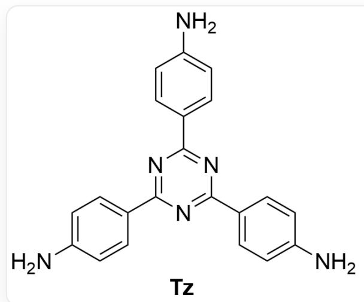
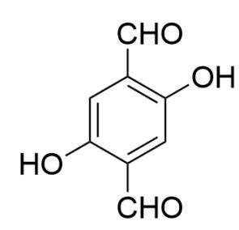

# Question

The two-dimensional organic covalent framework material  $\mathrm{TzDa} - \mathrm{COF}$  can be synthesized by the condensation of  $\mathbf{Tz}$  and  $\mathbf{Da}$  (structures shown below), and it exhibits selective adsorption capabilities for acidic solutions containing  $\mathrm{AuCl}_4^-$ .

  
Da

The structural formula of  $^{**}Tz^{**}$  is

$$
C 1 = C (C = C C (= C 1) N) C 2 = N C (= N C (= N 2) C 3 = C C = C (C = C 3) N) C 4 = C C = C (C = C 4) N, \text {a n d}
$$

$$
o f ^ {\star \star} D a ^ {\star \star} i s C 1 = C (C (= C C (= C 1 C = O) O) C = O) O).
$$

The following options provide possible explanations based on experimental characterization results. Select the correct and reasonable statement(s).

A. Ideally, the stoichiometric ratio of  $\mathbf{Tz}$  to  $\mathbf{Da}$  required for the reaction is  $3:2$ .  
B. After the binding of  $\mathrm{AuCl}_4^-$  to  $\mathrm{TzDa} - \mathrm{COF}$ , the 1s X-ray photoelectron spectroscopy of N did not show any peak corresponding to the binding energy of the N-Au bond. Only two peaks were observed: one corresponding to imine N and the other to the N-H bond.

The absence of the  $\mathrm{N}-\mathrm{Au}$  bond indicates that  $\mathrm{TzDa}-\mathrm{COF}$  and  $\mathrm{AuCl}_4^-$  cannot combine through coordination interactions.

C. After adsorption is completed, Zeta potential measurements indicate that the COF material framework carries a negative charge. This result supports that the binding between  $\mathrm{TzDa} - \mathrm{COF}$  and  $\mathrm{AuCl}_4^-$  is primarily driven by electrostatic interactions.  
D. Infrared spectroscopy indicates that as the adsorption process proceeds, a new stretching vibration peak appears at  $1668 \mathrm{~cm}^{-1}$ , and the peak area gradually increases. This stretching vibration peak corresponds to the carbonyl stretching vibration peak.  
E. Under the condition of  $\mathrm{pH} > 1$ , the adsorption capacity of  $\mathrm{TzDa} - \mathrm{COF}$  material for  $\mathrm{AuCl}_4^-$  decreases with decreasing acidity. This result supports that the interaction between  $\mathrm{TzDa} - \mathrm{COF}$  and  $\mathrm{AuCl}_4^-$  is primarily dominated by electrostatic forces.  
F. As the concentration of  $\mathrm{AuCl}_4^-$  in the solution increases, the adsorption capacity first rises and then tends to stabilize. This result may be attributed to the saturation of bonding sites on the COF surface, supporting that the interaction between  $\mathrm{TzDa} - \mathrm{COF}$  and  $\mathrm{AuCl}_4^-$  is primarily coordination-based.  
G. The 4f X-ray photoelectron spectrum of Au indicates that after reacting the  $\mathrm{AuCl}_4^-$  -containing solution with  $\mathrm{TzDa} - \mathrm{COF}$  for  $120\mathrm{min}$ , the binding energy of 4f electrons of Au decreases compared to the initial state. If the reaction proceeds for  $24\mathrm{h}$ , the binding energy increases compared to that at  $120\mathrm{min}$ . The changes in binding energy suggest that the oxidation state of Au during the reaction may be  $+3, +1$ , or  $+2$ .  
H. In the presence of 100 equivalents (large excess) of anions such as  $\mathrm{NO}_3^-$ ,  $\mathrm{SO}_4^{2-}$ ,  $\mathrm{Cl}^-$ ,  $\mathrm{PO}_4^{3-}$ ,  $\mathrm{TzDa}-\mathrm{COF}$  exhibits extremely high adsorption selectivity for  $\mathrm{AuCl}_4^-$ , indicating that the binding between  $\mathrm{TzDa}-\mathrm{COF}$  and  $\mathrm{AuCl}_4^-$  is primarily electrostatic in nature.  
In the presence of ions such as  $\mathrm{Cu}^{2+}$  and  $\mathrm{Ni}^{2+}$ ,  $\mathrm{TzDa} - \mathrm{COF}$  also exhibits extremely high adsorption selectivity for  $\mathrm{AuCl}_4^-$ , indicating that the interaction between  $\mathrm{TzDa} - \mathrm{COF}$  and  $\mathrm{AuCl}_4^-$  is primarily based on coordination bonding.  
J. None of the above options is correct.

# Answer

Correct Answer: D

# Detailed Explanation

During the preparation of TzDa - COF, the primary reaction is the condensation between the amino group of Tz and the aldehyde group of Da. Since Tz has a functionality of 3 and Da has a functionality of 2, the ideal stoichiometric ratio between them is 2:3, making option A incorrect.

# CHECKPOINT

1 PTS

Under ideal conditions, the stoichiometric ratio of  $\mathbf{Tz}$  to  $\mathbf{Da}$  is 2:3

For option B, X-ray photoelectron spectroscopy results only indicate that Au does not coordinate with N. However, the TzDa - COF structure also contains O atoms capable of coordination, so the coordination mechanism cannot be ruled out. Thus, option B is incorrect.

# CHECKPOINT

1 PTS

O atoms may participate in coordination, so the coordination mechanism cannot be excluded

For option C, Zeta potential reflects the intrinsic charge of the material's framework. Under acidic conditions, the N atoms in the TzDa - COF framework are protonated, giving the system a positive charge. Therefore, if the interaction between TzDa - COF and  $\mathrm{AuCl}_4^-$  is primarily electrostatic, the Zeta potential cannot be negative, making option C incorrect.

# CHECKPOINT

1 PTS

The N atoms in the TzDa - COF framework are protonated, giving the system a positive charge

# CHECKPOINT

1 PTS

If the interaction between  $\mathrm{TzDa} - \mathrm{COF}$  and  $\mathrm{AuCl}_4^-$  is primarily electrostatic, the Zeta potential cannot be negative

For option D, the new infrared absorption peak cannot originate from imine groups. At this wavenumber, only the formation of carbonyl groups (i.e.,  $\mathrm{Au(III)}$  undergoes redox with the hydroquinone segments in the material to yield a quinoid structure) can be considered, making option D correct.

# CHECKPOINT

1 PTS

$\mathrm{Au(III)}$  undergoes redox with the hydroquinone segments in the material to yield a quinoid structure

# CHECKPOINT

1 PTS

The infrared spectrum indicates the formation of carbonyl groups

For option E, as acidity increases, the degree of protonation of N atoms in the  $\mathrm{TzDa - COF}$  framework decreases, which is unfavorable for electrostatic interaction with the negatively charged  $\mathrm{AuCl}_4^-$ . Additionally, higher acidity increases the hydrolysis of  $\mathrm{AuCl}_4^-$ , further reducing adsorption. Thus, the exact mechanism cannot be determined, making option E incorrect.

# CHECKPOINT

1 PTS

As acidity increases, the protonation degree of N atoms in the TzDa - COF framework decreases, weakening electrostatic interaction

# CHECKPOINT

1 PTS

As acidity increases, the hydrolysis of  $\mathrm{AuCl}_4^-$  intensifies, also reducing adsorption

Option F is consistent with both electrostatic and coordination mechanisms, as both would exhibit adsorption saturation. Therefore, the mechanism cannot be determined, making option F incorrect.

# CHECKPOINT

1 PTS

Both electrostatic and coordination mechanisms would exhibit adsorption saturation

For option G, lower binding energy corresponds to a higher oxidation state of Au. However,  $+2$  is not a stable oxidation state for Au; the plausible states are  $+3$ , 0, and  $+1$ , making option G incorrect.

# CHECKPOINT

1 PTS

The oxidation states of Au during the reaction should be  $+3$ , 0, and  $+1$

For option H, the high adsorption selectivity for  $\mathrm{AuCl}_4^-$  in the presence of other abundant anions without competition suggests that the interaction between TzDa - COF and  $\mathrm{AuCl}_4^-$  is not electrostatic, making option H incorrect.

# CHECKPOINT

1 PTS

No competition from other anions indicates the interaction between  $\mathrm{TzDa} - \mathrm{COF}$  and  $\mathrm{AuCl}_4^-$  is not electrostatic

For option I, the high adsorption selectivity in the presence of other metal cations (e.g.,  $\mathrm{Cu}^{2+}, \mathrm{Ni}^{2+}$ ) does not exclude the electrostatic mechanism. Since  $\mathrm{AuCl}_4^-$  is negatively charged while  $\mathrm{Cu}^{2+}, \mathrm{Ni}^{2+}$  are positively charged, electrostatic repulsion between the cations and the framework could prevent their adsorption, making option I incorrect.

# CHECKPOINT

1 PTS

In the presence of  $\mathrm{Cu}^{2+}, \mathrm{Ni}^{2+}$ , electrostatic repulsion may prevent their adsorption, so the electrostatic mechanism cannot be excluded

Thus, option D is correct.