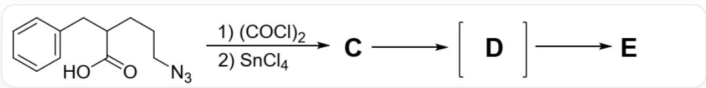
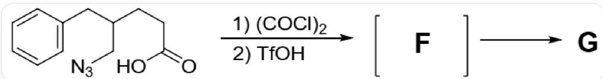
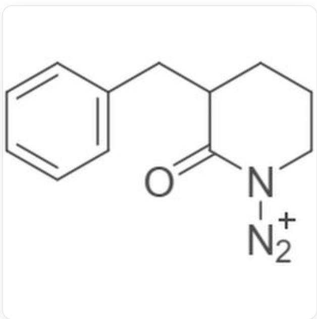
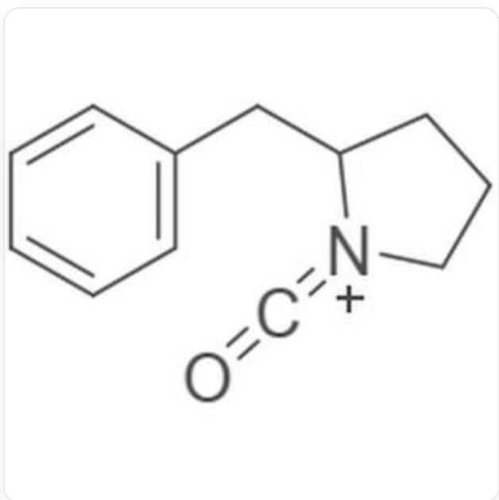
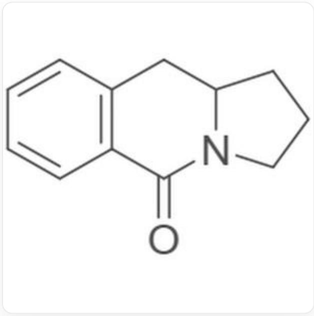
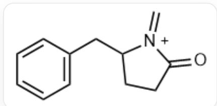
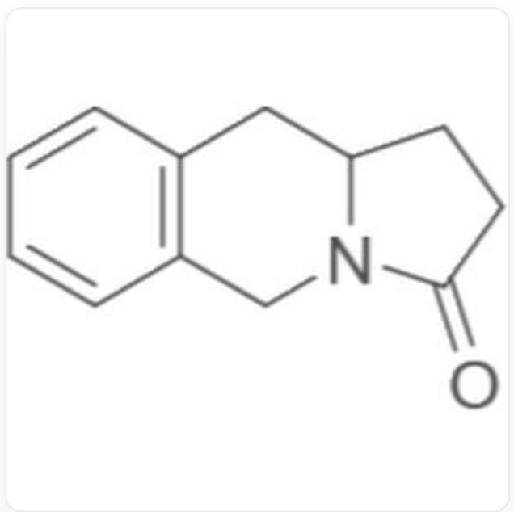

# Question

In situ activation of  $\omega$ -azidocarboxylic acids can induce some interesting reactions. 5-Azido-2-benzylpentanoic acid reacts with oxalyl chloride and tin(IV) chloride to form intermediate C, which subsequently undergoes two-step reactions to yield intermediate D and product E.

The image shows a multistep reaction:  $\mathrm{O} = \mathrm{C}(\mathrm{O})\mathrm{C}(\mathrm{CCCN} = [\mathrm{N} + ] =$

$\left[\mathrm{N}-\right]\mathrm{CC}1=\mathrm{CC}=\mathrm{CC}=\mathrm{C}1>\mathrm{ClC}(\mathrm{C}(\mathrm{Cl})=\mathrm{O})=\mathrm{O}. \mathrm{Cl}[\mathrm{Sn}](\mathrm{Cl})(\mathrm{Cl}) \mathrm{Cl}>^{**} \mathrm{C}^{**},^{**} \mathrm{C}^{**}]>^{**} \mathrm{D}^{**},^{**} \mathrm{D}^{**}]>^{**} \mathrm{E}^{**}$  5-Azido-2-benzylpentanoic acid reacts with oxalyl chloride and tin(IV) chloride to form intermediate C, which subsequently undergoes two-step reactions to yield intermediate D and product E

A slight structural modification of the substrate yields 5-azido-4-benzylpentanoic acid. This compound reacts with oxalyl chloride and trifluoromethanesulfonic acid to form the final intermediate  $\mathbf{F}$ , which then undergoes one more reaction to produce product  $\mathbf{G}$ , distinct from  $\mathbf{E}$ .

The image shows a multistep reaction:  $\mathrm{O} = \mathrm{C}(\mathrm{O})\mathrm{CCC}(\mathrm{CN} = [\mathrm{N} + ] =$

$\left[\mathrm{N}-\right]\mathrm{CC} 1=\mathrm{CC}=\mathrm{CC}=\mathrm{C} 1>\mathrm{ClC}(\mathrm{C}(\mathrm{Cl})=\mathrm{O})=\mathrm{O}. \mathrm{O}=\mathrm{S}(\mathrm{C}(\mathrm{F})(\mathrm{F}) \mathrm{F})(\mathrm{O})=\mathrm{O} >\left[{}^{**} \mathrm{F}^{**}\right],\left[{}^{**} \mathrm{F}^{**}\right]>\left[{}^{**} \mathrm{G}^{**}\right] 5-\mathrm{Azido}-4-$  benzylpentanoic acid reacts with oxalyl chloride and trifluoromethanesulfonic acid to form the final intermediate F, which then undergoes one more reaction to produce product G

None of the intermediates contain C1. The following statements are correct:

A. The intermediate C contains a carboxyl group

B. The intermediate  $\mathbf{D}$  is a rearrangement product containing two six-membered rings.  
C. The product  $\mathbf{E}$  is a secondary amine.  
D. The intermediate  $\mathbf{F}$  has an isocyanate structure.  
E. The product  $\mathbf{G}$  contains three rings, with the carbonyl group located on the five-membered ring.  
F. The second reaction can form two different rearrangement intermediates, among which the isocyanate cation intermediate reacts with the benzene ring to yield a more stable product.  
G. None of the above options are correct

# Answer

Correct Answer: E

# Detailed Explanation

In the first reaction, the azide and carboxylic acid undergo intramolecular cyclization to yield intermediate C,

# CHECKPOINT

1 PTS

The azido group and carboxylic acid undergo intramolecular cyclization to yield intermediate C, A is incorrect

The structural formula of intermediate  $\mathbf{C}$  is  $O = C1N([N + ]\# N)CCCC1CC2 = CC = CC = C2$

$\mathrm{O = C1N([N + ]\#N)CCCC1CC2 = CC = CC = C2}$

Intermediate  $\mathbf{C}$  undergoes rearrangement to form intermediate  $\mathbf{D}$ , which has an isocyanate structure containing a five-membered ring,

# CHECKPOINT

1 PTS

Intermediate  $\mathbf{D}$  has an isocyanate structure containing a five-membered ring, B is incorrect

The structural formula of intermediate  $\mathbf{D}$  is  $O = C = [N + ]1$  CCCC1CC2=CC=CC=C2,

  
$\mathrm{O = C = [N + ]1CCCCC1CC2 = CC = CC = C2}$

The benzene ring reacts with the isocyanate, undergoing intramolecular cyclization to yield product  $\mathbf{E}$ . Since water is not mentioned in the reaction conditions, hydrolysis to produce carbon dioxide and a secondary amine does not occur,

# CHECKPOINT

1 PTS

The benzene ring reacts with the isocyanate to yield product  $\mathbf{E}$ . Since water is not mentioned in the reaction conditions, a secondary amine is not obtained, C is incorrect

The structure of product  $\mathbf{E}$  is  $C1 = C C2 = C(C = C1)C N3C(C C C3 = O)C2C1 = C C2 = C(C = C1)C(= O)N3C C C C3C2$

  
C1=CC2=C(C=C1)C(=O)N3CCCCC3C2

In the second reaction, the azide and carboxylic acid react and undergo rearrangement to form the imine intermediate  $\mathbf{F}$ ,

# CHECKPOINT

1 PTS

Intermediate  $\mathbf{F}$  has an imine structure, D is incorrect

The difference between product  $\mathbf{E}$  and product  $\mathbf{G}$  lies in the preferential migration of the more substituted carbon atom during the rearrangement,

# CHECKPOINT

1 PTS

The difference between product  $\mathbf{E}$  and product  $\mathbf{G}$  lies in the preferential migration of the more substituted carbon atom during the rearrangement

Since nitrogen gas is released in this reaction, the reaction is irreversible, and G is incorrect,

# CHECKPOINT

1 PTS

Since nitrogen gas is released in this reaction, the reaction is irreversible

Option F is incorrect.

The structure of intermediate  $\mathbf{F}$  is  $C = C1CCC([N + ]1 = C)CC2 = CC = CC = C2$

  
$\mathrm{O = C1CCC([N + ]1 = C)CC2 = CC = CC = C2}$

The benzene ring reacts with the imine, undergoing intramolecular cyclization to ultimately yield product  $\mathbf{G}$ . Product  $\mathbf{G}$  has three rings, and the carbonyl group is located on the five-membered ring,

# CHECKPOINT

1 PTS

Product  $\mathbf{G}$  has three rings, and the carbonyl group is located on the five-membered ring, so E is correct.

The structure of product  $\mathbf{G}$  is  $O = C1CCC([N + ]1 = C)CC2 = CC = CC = C2$

C1=CC2=C(C=C1)CN3C(CCC3=O)C2