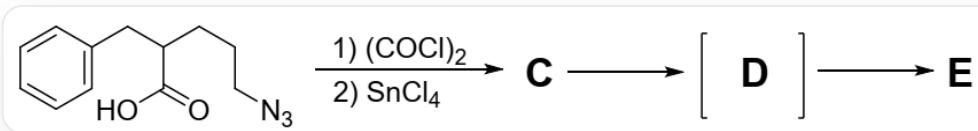
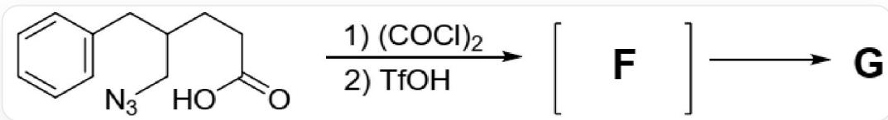
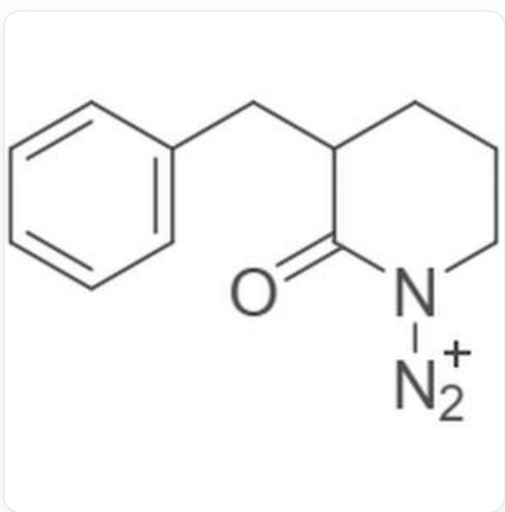
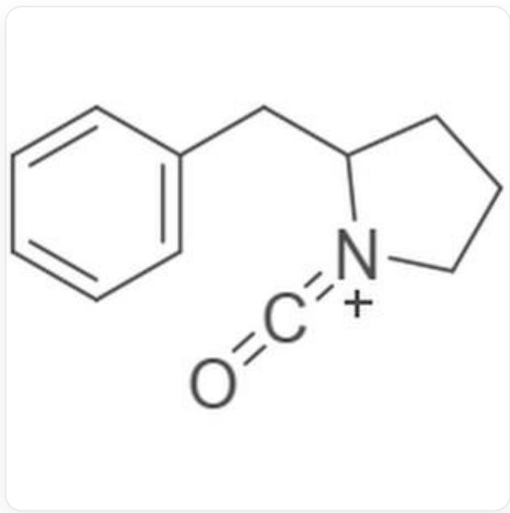
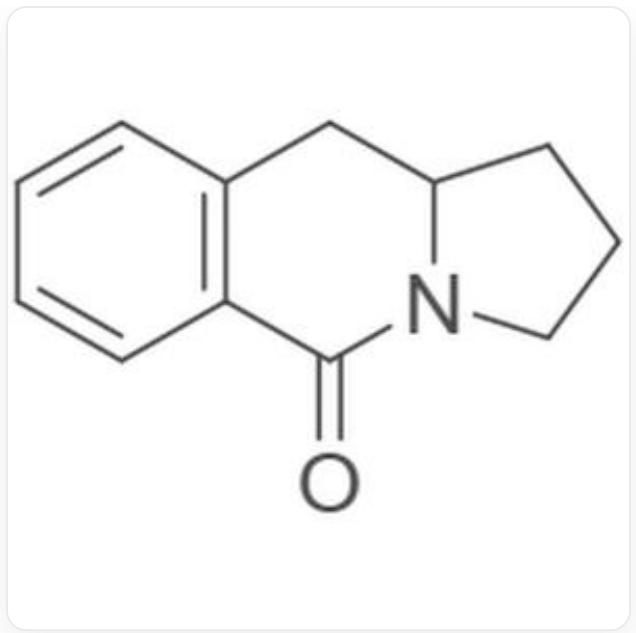
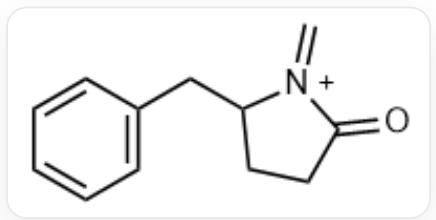
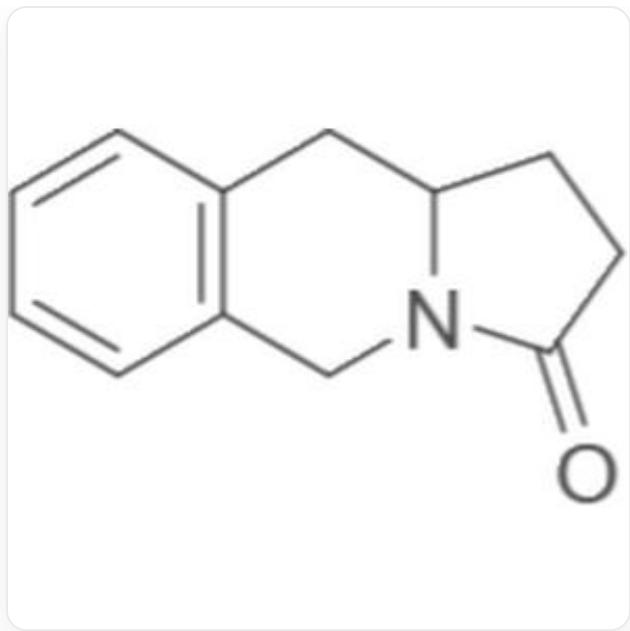

# 题目

对  $\omega$ -叠氮羧酸进行原位活化能够引起一些有趣的反应。5-叠氮基-2-苄基戊酸在草酰氯和四氯化锡的条件下反应得到中间体 C，之后又经过经过两步反应得到中间体 D 和产物 E

  
图片中为多步反应：O=C(O)C(CCCN=[N+]=[N-])CC1=CC=CC=C1>ClC(C(Cl)=O)=O.CI[Sn](Cl)(Cl)Cl>  $[\text{**} C^{**}],[\text{**} C^{**}] > [\text{**} D^{**}],[\text{**} D^{**}] > [\text{**} E^{**}]5\text{-叠氮基-2-苄基戊酸在草酰氯和四氯化锡的条件下反应得到中间体}$  C，之后又经过经过两步反应得到中间体D和产物E

对底物的结构稍作调整可以得到5-叠氮基-4-苄基戊酸，该反应物在草酰氯和三氟甲磺酸的条件下反应得到最后一个中间体F，再经过一步反应得到产物G，产物G与E不同

  
图片中为多步反应：O=C(O)CCC(CN=[N+]=[N-])CC1=CC=CC=C1>ClC(C(Cl)=O)=O.O=S(C(F)(F)F) (O)=O>[\*\*F**],[\*\*F**]>[\*\*G**]5-叠氮基-4-苄基戊酸在草酰氯和三氟甲磺酸的条件下反应得到最后一个中间体F，在经过一步反应得到产物G

所有的中间体都不含 C1, 以下说法正确的是

A. 中间体C含有羧基  
B. 中间体  $\mathrm{D}$  是重排产物, 含有两个六元环  
C. 产物  $\mathrm{E}$  为仲胺

D. 中间体  $\mathrm{F}$  具有异氰酸酯结构  
E. 产物  $\mathrm{G}$  含有三个环, 其中羰基在五元环上  
F. 第二个反应可以形成两种不同的重排中间体, 其中异氰酸酯正离子中间体和苯环反应可以得到更稳定的产物  
G. 以上选项均不正确

# 答案

正确答案: E

# 详细解析

在第一个反应中，叠氮和羧酸反应发生分子内环化，得到中间体C，

CHECKPOINT

1 PTS

叠氮基团和羧酸反应发生分子内环化，得到中间体C，A错误

中间体C的结构式为  $O = C1N([N + ]\# N)CCCC1CC2 = CC = CC = C2,$

$\mathrm{O = C1N([N + ]\#N)CCCC1CC2 = CC = CC = C2}$

中间体C发生重排得到中间体D，该中间体具有异氰酸酯结构，含有五元环，

# CHECKPOINT

1 PTS

中间体D具有异氰酸酯结构，含有五元环，B错误

中间体  $\mathbf{D}$  的结构式为  $O = C = [N + ]1\mathrm{CCCC}1\mathrm{CC}2 = \mathrm{CC} = \mathrm{CC} = \mathrm{C}2$

  
$\mathrm{O = C = [N + ]1CCCCC1CC2 = CC = CC = C2}$

苯环和异氰酸酯发生反应，分子内环化，得到产物  $\mathbf{E}$ ，在该反应条件中没有提到水，不会水解产生二氧化碳和仲氨

# CHECKPOINT

1 PTS

苯环和异氰酸酯发生反应，得到产物E，在该反应条件中没有提到水，不会得到仲氨，C错误

产物  $\mathbf{E}$  的结构为  $C1 = C C2 = C(C = C1)C N3C(C C C3 = O)C2C1 = C C2 = C(C = C1)C(=O)N3CCCC3C2,$

C1=CC2=C(C=C1)C(=O)N3CCCCC3C2

在第二个反应中，叠氮和羧酸发生反应后进行重排，得到亚胺中间体  $\mathbf{F}$  ，

# CHECKPOINT

1 PTS

中间体  $\mathbf{F}$  具有亚胺结构，D错误

产物  $\mathbf{E}$  和产物  $\mathbf{G}$  不同的原因在于发生重排时，优先迁移多取代的碳原子

# CHECKPOINT

1 PTS

产物  $\mathbf{E}$  和产物  $\mathbf{G}$  不同的原因在于发生重排时, 优先迁移多取代的碳原子

由于该反应离去氮气，因此该反应不可逆，G错误

# CHECKPOINT

1 PTS

由于该反应离去氮气，因此该反应不可逆

# F选项错误

中间体  $\mathbf{F}$  的结构为  $C = C1CC(C[N + 1] = C)CC2 = CC = CC = C2$

  
$\mathrm{O = C1CCC([N + ]1 = C)CC2 = CC = CC = C2}$

苯环和亚胺发生反应，分子内成环，最终得到产物  $\mathrm{G}$ ，产物  $\mathrm{G}$  具有三个环，并且羰基在五元环上

# CHECKPOINT

1 PTS

产物  $\mathbf{G}$  具有三个环, 并且羰基在五元环上, 所以E正确

产物  $\mathbf{G}$  的结构为  $O = C1CC([N + ]1 = C)CC2 = CC = CC = C2$

C1=CC2=C(C=C1)CN3C(CCC3=O)C2