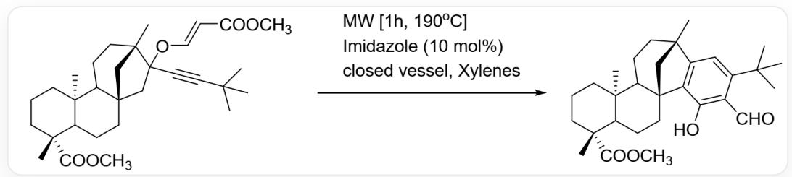
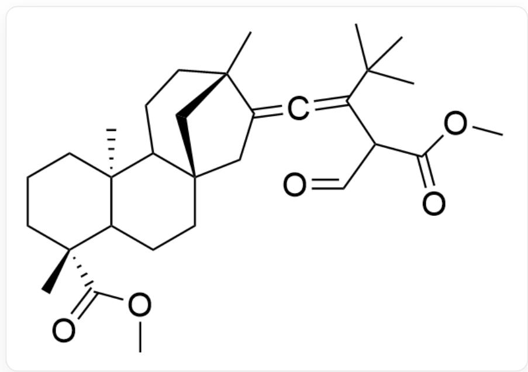
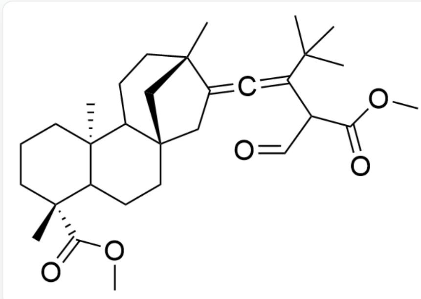
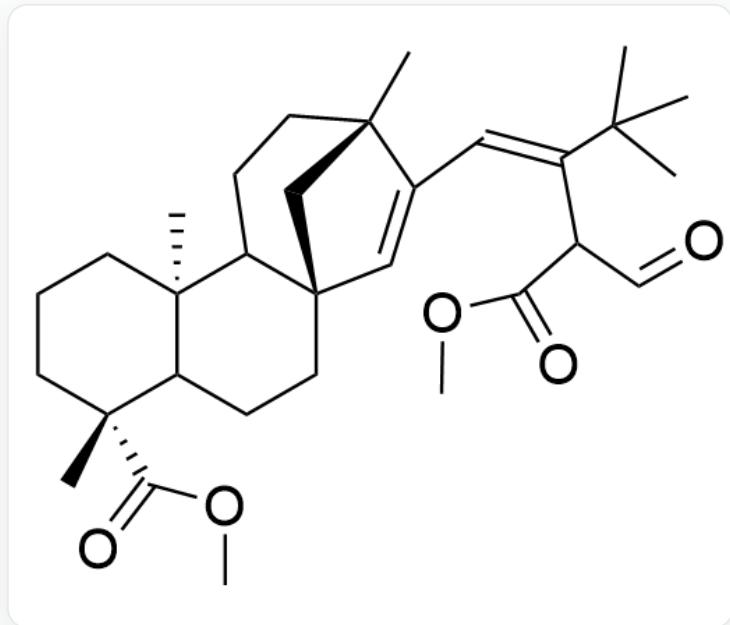
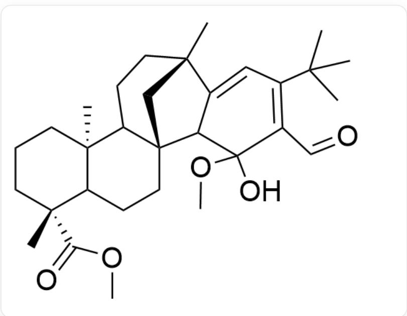
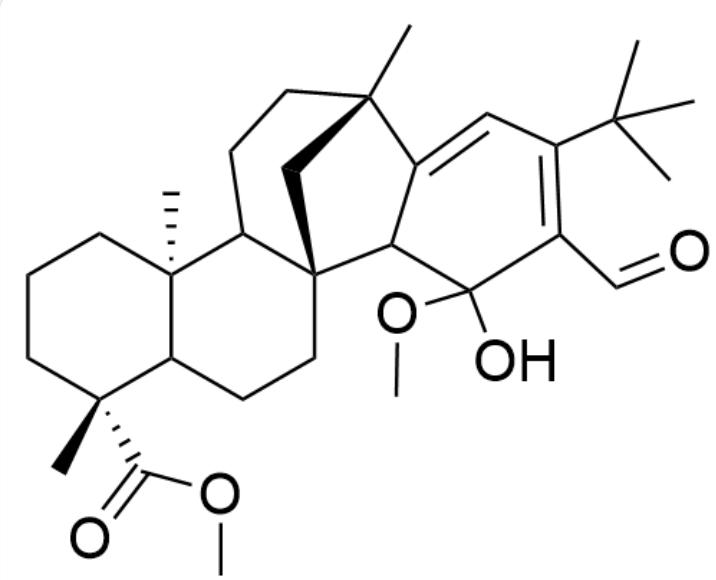

# Question

Under microwave (MW) promotion and imidazole (Imidazole) catalysis, the following compound reacts in a closed vessel and xylenes to obtain a product containing a benzene ring, as shown in Figure 1:

Fig. 1, the reaction in the figure is described by SMILES as: CC(C)  
  
(C#CC1(O/C=C/C(OC)=O)C[C@]23CCC4[C@@](CCC[C@@]4(C)C(OC)=O)  
(C2CC[C@]1(C3)C)C>>C[C@@]5(CCC[C@@]6(C)C(OC)=O)C6CC[C@@]78C(C(O)=C(C=O)C(C(C  
(C)C)=C9)=C9[C@](C)(C8)CCC57, where the reaction conditions are microwave [1h,  $190^{\circ}\mathrm{C}]$ , imidazole (10 mol%), closed vessel, xylenes

Please deduce the reaction mechanism and the structure of key intermediates in the reaction process. The following statements are available:

1. An intramolecular nucleophilic addition reaction occurs in one step during the reaction.  
2. The number of carbon-carbon single bond cleavages in the entire reaction process is one.  
3. The number of carbon-carbon single bond formations in the entire reaction process is two.  
4. A concerted carbon-oxygen single bond cleavage and carbon-carbon single bond formation occur in one step.

Based on your deduced reaction mechanism and the structure of key intermediates, the following options in which all statements are correct and the number of correct statements is the largest are:

A. All other options are incorrect

B. 1  
C. 2  
D. 3  
E. 4  
F. 1,2  
G. 1,3  
H. 1,4  
1. 2,3  
J. 2,4  
K. 3,4  
L. 1,2,3  
M. 1,2,4  
N. 1,3,4  
O. 2,3,4

P. 1,2,3,4

# Answer

Correct Answer: K

# Detailed Explanation

Observing the reaction in the figure, the reaction condition is high temperature, and the structural change of the product mainly occurs on the rightmost side, with a large change in the position of the carbon-carbon bond. It is very likely that a rearrangement reaction with a pericyclic mechanism has occurred. Comparing the structures of the reactants and products, it can be found that one or both carbon-oxygen bonds of the ether oxygen atom are partially or completely broken during the reaction. The two hydrogen atoms of the methylene group adjacent to the carbon-oxygen bond on the seven-membered ring disappear in the product, and the methylene group does not have an adjacent carbonyl group or other obvious reactivity. According to the above characteristics, it can be found that a carbon-oxygen bond can undergo a [3, 3] sigma migration under heating to obtain the intermediate in Figure 2:

  
Fig. 2, the molecule in the figure is described by SMILES as: CC(C)

$$
(\mathrm {C} (\mathrm {C} (\mathrm {C} = \mathrm {O}) \mathrm {C} (\mathrm {O C}) = \mathrm {O}) = \mathrm {C} = \mathrm {C} 1 \mathrm {C} [ \mathrm {C} @ ] 2 3 \mathrm {C C C} 4 [ \mathrm {C} @ @ ] (\mathrm {C C C} [ \mathrm {C} @ @ ] 4 (\mathrm {C}) \mathrm {C} (\mathrm {O C}) = \mathrm {O}) (\mathrm {C} 2 \mathrm {C C} [ \mathrm {C} @ ] 1 (\mathrm {C} 3) \mathrm {C}) \mathrm {C})
$$

# CHECKPOINT

1 PTS

Occurring [3, 3]sigma migration to obtain the intermediate in Figure 2:

Fig. 2, the molecule in the figure is described by SMILES as: CC(C)  
  
(C(C(C=O)C(OC)=O)=C=C1C[C@]23CCC4[C@@](CCC[C@@]4(C)C(OC)=O)(C2CC[C@]1(C3)C)C

This intermediate has an unstable connected carbon-carbon double bond, which can be quickly rearranged into a stable conjugated double bond to obtain the intermediate in Figure 3:

  
Fig. 3, the molecule in the figure is described by SMILES as: CC(C)

$$
(/ C (C (C = O) C (O C) = O) = C / C 1 = C [ C @ ] 2 3 C C C 4 [ C @ @ ] (C C C [ C @ @ ] 4 (C) C (O C) = O) (C 2 C C [ C @ ] 1 (C 3) C) C
$$

# CHECKPOINT

1 PTS

Unstable connected carbon-carbon double bond rearranged into a stable conjugated double bond to obtain the intermediate in Figure 3:

  
Fig. 3, the molecule in the figure is described by SMILES as: CC(C)

$$
(/ C (C (C = O) C (O C) = O) = C / C 1 = C [ C @ ] 2 3 C C C 4 [ C @ @ ] (C C C [ C @ @ ] 4 (C) C (O C) = O) (C 2 C C [ C @ ] 1 (C 3) C) C
$$

In order to construct the benzene ring in the product, a carbon-carbon bond also needs to be formed on the double bond carbon of the seven-membered ring. Observing the structure of the intermediate in Figure 3, it can be found that two of the three carbon-carbon double bonds of the benzene ring structure already exist. In fact, the ester group can undergo enolization to provide the third carbon-carbon double bond, as shown in Figure 4:

  
Fig. 4, the molecule in the figure is described by SMILES as: CC(C)

$$
(C / C (C = O) = C (O) \backslash O C) = C / C 1 = C [ C @ ] 2 3 C C C 4 [ C @ @ ] (C C C [ C @ @ ] 4 (C) C (O C) = O) (C 2 C C [ C @ ] 1 (C 3) C) C
$$

In fact, it is already obvious that there are three conjugated carbon-carbon double bonds in the molecule, which can undergo a step of electrocyclic reaction to obtain the benzene ring skeleton, as shown in Figure 5:

  
Fig. 5, the molecule in the figure is described by SMILES as: CC(C)(C(C=C1[C@](C)(C2)CCC3[C@](C)

$$
\left(\mathrm {C C C} [ \mathrm {C @ @} ] 4 (\mathrm {C}) \mathrm {C} (\mathrm {O C}) = \mathrm {O}\right) \mathrm {C 4 C C} [ \mathrm {C @ @} ] 3 2 \mathrm {C 1 C} (\mathrm {O}) 5 \mathrm {O C}) = \mathrm {C 5 C} = \mathrm {O}) \mathrm {C}
$$

# CHECKPOINT

1 PTS

Ester group enolization to obtain a conjugated triene, electrocyclic reaction to obtain the intermediate in

  
Figure 5:  
Fig. 5, the molecule in the figure is described by SMILES as: CC(C)(C(C=C1[C@](C)(C2)CCC3[C@](C) (CCC[C@@]4(C)C(OC)=O)C4CC[C@@]32C1C(O)5OC)=C5C=O)C

The hemiacetal structure loses one molecule of methanol, and the resulting carbonyl group undergoes a step of enol isomerization, that is, aromatization to obtain the final product structure.

# CHECKPOINT

1 PTS

Removal of methanol, carbonyl isomerization completes aromatization to obtain the final product

No nucleophilic addition reaction occurred in the reaction, so statement 1 is incorrect. No carbon-carbon single bond cleavage occurred, so statement 2 is incorrect. Carbon-carbon single bonds are formed once in the first step of [3, 3] sigma migration and once in the electrocyclization, so statement 3 is correct. During the [3, 3] sigma

migration, a concerted cleavage of a carbon-oxygen single bond and formation of a carbon-carbon single bond occurred, so statement 4 is correct.