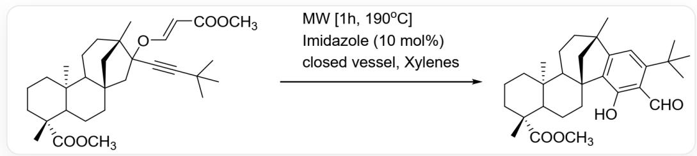
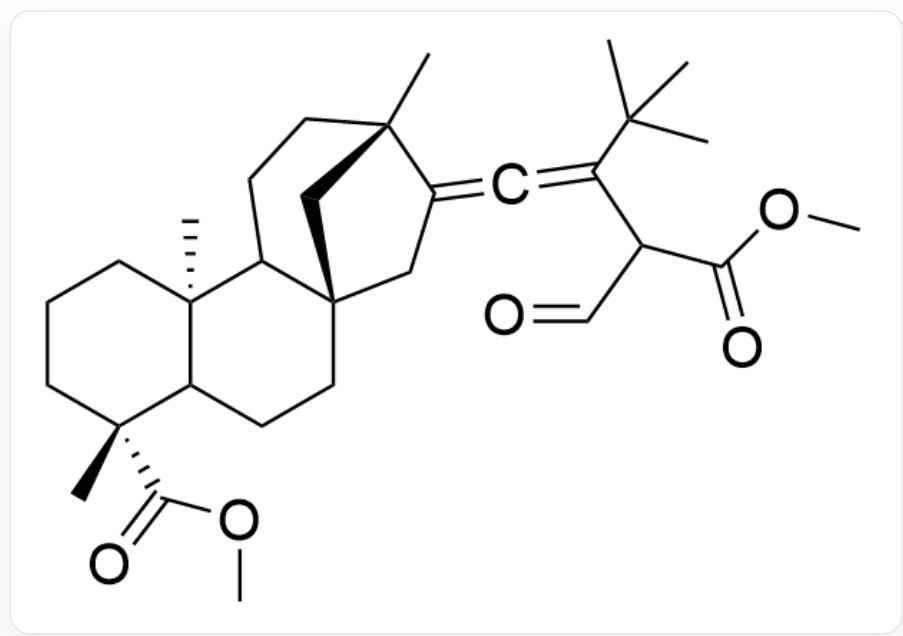
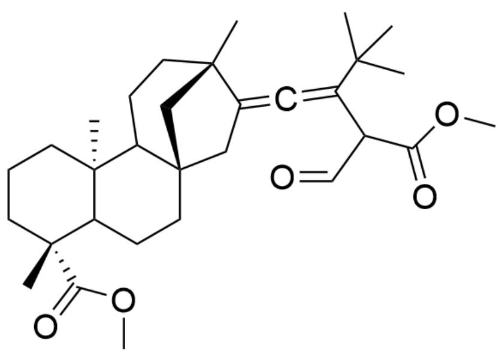
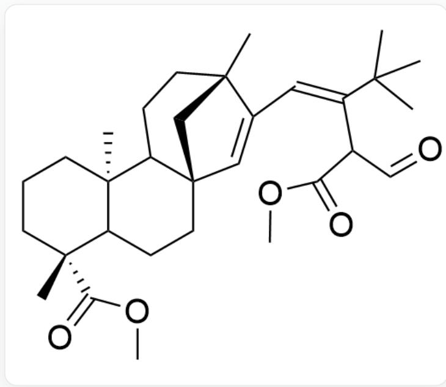
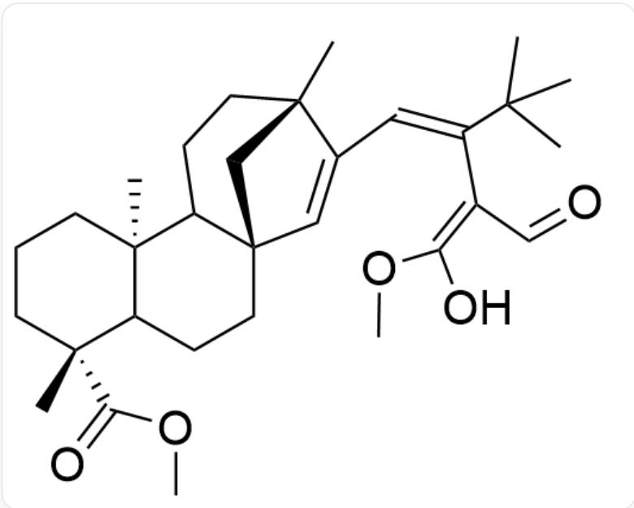
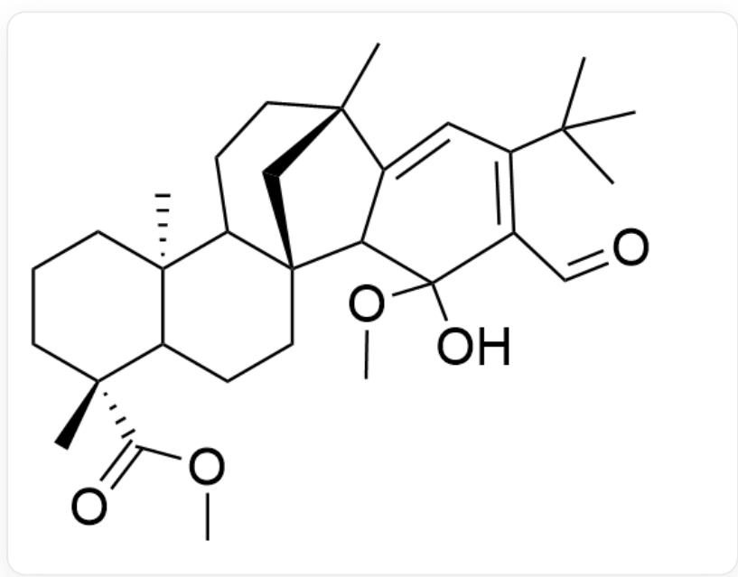
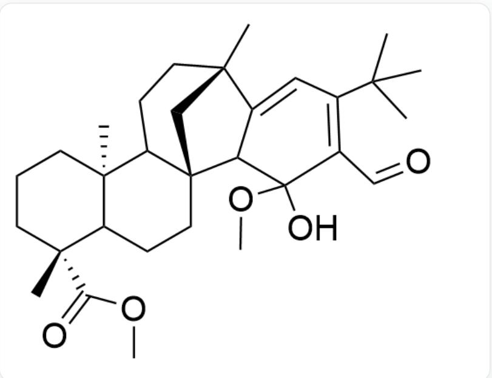

# 题目

在微波(MW)促进、咪唑(Imidazole)催化下,以下化合物在封管(closed vessel)、二甲苯(Xylenes)中反应,得到含苯环的产物，如图1:

  
Fig. 1, 图中反应以SMILES描述为: CC(C)(C#CC1(O/C=C/C(OC)=O)C[C@]23CCC4[C@@]

$$
\left(\mathrm {C C C} [ \mathrm {C @ @} ] 4 (\mathrm {C}) \mathrm {C} (\mathrm {O C}) = \mathrm {O}\right)
$$

$$
\begin{array}{l} (C 2 C C [ C @ ] 1 (C 3) C) C > > C [ C @ @ ] 5 (C C C [ C @ @ ] 6 (C) C (O C = O) C 6 C C [ C @ @ ] 7 8 C (C (O) = C (C = O) C (C (C \\ (\mathrm {C}) \mathrm {C}) = \mathrm {C} 9) = \mathrm {C} 9 [ \mathrm {C} @ ] (\mathrm {C}) (\mathrm {C} 8) \mathrm {C C C} 5 7, \text {其中反应条件为微波} [ 1 \mathrm {h}, 1 9 0 ^ {\circ} \mathrm {C} ] \text {、咪唑 (1 0 mol)} \\ \end{array}
$$

请推测反应机理和反应过程中的关键中间体结构。现有以下说法：

1. 反应过程中发生了一步分子内亲核加成反应  
2. 整个反应过程中碳碳单键断裂次数为一次  
3. 整个反应过程中碳碳单键形成次数为两次  
4. 发生了一步协同的碳氧单键断裂和碳碳单键形成

请结合你推测的反应机理与关键中间产物结构，以下选项中说法全部正确且正确说法数量最多的为：

A. 其他选项均不正确  
B. 1  
C. 2

D. 3  
E. 4  
F. 1,2  
G. 1,3  
H. 1,4  
1. 2,3  
J. 2,4  
K. 3,4  
L. 1,2,3  
M. 1,2,4  
N. 1,3,4  
O. 2,3,4  
P. 1,2,3,4

# 答案

正确答案: K

# 详细解析

观察图中反应，反应条件为高温，且产物结构变化主要发生在最右侧，碳碳键位置变化较大，很有可能发生了周环反应机理的重排反应。对比反应物和产物结构，可以发现醚氧原子的两根碳氧键反应中发生部分或全部断裂，七元环上与碳氧键相邻的亚甲基两个氢原子在产物中均消失，而该亚甲基没有邻位羰基等明显反应性。根据以上特征，可以发现一根碳氧键恰好可以在加热下发生[3,3]sigma迁移，得到图2中间体：

  
Fig. 2, 图中分子以SMILES描述为: CC(C)(C(C=C=O)C(OC)=O)=C=C1C[C@]23CCC4[C@@] (CCC[C@@]4(C)C(OC)=O)(C2CC[C@]1(C3)C)C

# CHECKPOINT

1 PTS

发生[3, 3]sigma迁移，得到图2中间体：

  
Fig. 2，图中分子以SMILES描述为：CC(C)(C(C(C=O)C(OC)=O)=C=C1C[C@]23CCC4[C@@] (CCC[C@@]4(C)C(OC)=O)(C2CC[C@]1(C3)C)C

该中间体有一个不稳定的相连碳碳双键，可以快速重排成稳定的共轭双键，得到图3中间体：

  
Fig.3，图中分子以SMILES描述为：CC(C)/(C(C  $\mathbf{C} = \mathbf{O})\mathbf{C}(\mathbf{O}\mathbf{C}) = \mathbf{O}) = \mathbf{C} / \mathbf{C}1 = \mathbf{C}[\mathbf{C}@\mathbf{\alpha}]23$  CCC4[C@@] (CCC[C@@]4(C)C(OC)=O)(C2CC[C@]1(C3)C)C

# CHECKPOINT

1 PTS

不稳定的相连碳碳双键重排成稳定的共轭双键，得到图3中间体：

  
Fig.3，图中分子以SMILES描述为：CC(C)/(C(C  $\mathbf{C} = \mathbf{O})\mathbf{C}(\mathbf{O}\mathbf{C}) = \mathbf{O}) = \mathbf{C} / \mathbf{C}1 = \mathbf{C}[\mathbf{C}@\mathbf{\alpha}]23$  CCC4[C@@] (CCC[C@@]4(C)C(OC)=O)(C2CC[C@]1(C3)C)C

为了构建产物中的苯环，还需要在七元环双键碳上形成一根碳碳键。观察图3中间体结构可以发现，苯环结构的三根碳碳双键已经有了两根，实际上酯基可以发生烯醇化提供第三根碳碳双键，如图4：

  
Fig. 4，图中分子以SMILES描述为：CC(C)(C(/C(C=O)=C(O)\OC)=C/C1=C[C@]23CCC4[C@@] (CCC[C@@]4(C)C(OC)=O)(C2CC[C@]1(C3)C)C

其实已经很明显，分子内存在三根共轭的碳碳双键，可以发生一步  $6\pi$  电关环反应得到苯环骨架，如图5：

  
Fig. 5, 图中分子以SMILES描述为: CC(C)(C(C=C1[C@])(C)(C2)CCC3[C@])(C) (CCC[C@@]4(C)C(OC)=O)C4CC[C@@]32C1C(O)5OC)=C5C=O)C

# CHECKPOINT

1 PTS

酯基烯醇化，得到共轭三烯， $6\pi$  电关环得到图5中间体：

Fig. 5, 图中分子以SMILES描述为: CC(C)(C(C=C1[C@])(C)(C2)CCC3[C@])(C)  
  
(CCC[C@@]4(C)C(OC)=O)C4CC[C@@]32C1C(O)5OC)=C5C=O)C

半缩醛结构脱去一份子甲醇，得到的羰基发生一步烯醇异构化即芳构化得到最终产物结构。

# CHECKPOINT

1 PTS

脱去甲醇，羰基异构化完成芳构化，得到最终产物

反应中没有发生亲核加成反应，说法1错误。没有发生碳碳单键断裂，说法2错误。碳碳单键分别在第一步[3, 3]sigma迁移形成一次，在电环化形成一次，说法3正确。[3, 3]sigma迁移时发生了一步协同的碳氧单键的断裂和碳碳单键形成，说法4正确。