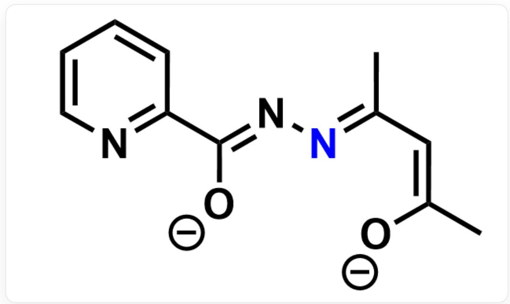

# Question

Equal molar amounts of pyridine-2-carbohydrazide and gadolinium acetylacetonate dihydrate (denoted as  $Gd(acac)_3 \cdot 2H_2O$ ) were mixed in a methanol-dichloromethane solution, stirred at room temperature for  $2\mathrm{h}$ , and reacted at  $70^{\circ}\mathrm{C}$  for  $48\mathrm{h}$ . After cooling, yellow crystals precipitated. X-ray diffraction revealed that the crystal is a binuclear gadolinium complex with the chemical formula  $[Gd_{2}(L)_{2}(acac)_{2}(CH_{3}OH)_{2}] \cdot nCH_{3}OH$ , where the coordination number of gadolinium is 8. Elemental analysis indicated the mass percentages of each element in the crystal as follows: C  $40.21\%$ , H  $4.97\%$ , N  $7.75\%$ . Upon heating to approximately  $300^{\circ}\mathrm{C}$ , the crystal exhibited a weight loss of about  $6.0\%$ , corresponding to the removal of all external methanol molecules. The crystal can be magnetized under an applied magnetic field, leading to the ordered alignment of its magnetic moments.

Based on calculation and reasoning, determine which of the following statements are correct. Select the option containing all correct statements.

1. In the reaction generating the yellow crystals, dichloromethane is one of the reactants.  
2. A single  $L^{2-}$  ligand contains 11 carbon atoms.  
3. The number of coordination bonds a single  $L^{2 - }$  ligand can form is 4.  
4. The  $L^{2-}$  ligand forms a five-membered ring when coordinating with the metal.  
5. The magnetization process of this crystal under an applied magnetic field is exothermic.

A. 1,2,3,4,5  
B. 1,2,4,5  
C. 2,3,4,5  
D. 1,3,4

E. 2,4,5  
F. 2,3,5  
G. 3,4,5  
H. 2,4  
1,3  
J. 4,5  
K. None of the above options are correct

# Answer

Correct Answer: E

# Detailed Explanation

Based on the substrate structure,  $acac^{-}$  condenses with at most 1 equivalent of pyridine-2-carbohydrazide, suggesting that  $L^{2 - }$  contains  $3N$  atoms.

# CHECKPOINT

0.5 PTS

The ligand  $L^{2-}$  contains  $3N$  atoms

The molecular weight of the complex is:  $14.01 \times 3 \times 2 \div 0.0775 = 1085$ .

The weight loss corresponds to a molecular weight of:  $1085 \times 0.060 = 65.1$ , which is equivalent to 2 methanol molecules, i.e.,  $n = 2$ .

# CHECKPOINT

1 PTS

$$
n = 2
$$

Assuming the ligand  $L^{2-}$  contains  $x$  carbon atoms, then  $1085 \times 0.4021 \div 12.01 = 36.4 \approx 36$ . Therefore:  $2x + 2 \times 5 + 2 \times 1 + 2 \times 1 = 36$ ,  $x = 11$ . If  $L^{2-}$  were formed by the reaction of 2 or more equivalents of pyridine-2-carbohydrazide, no reasonable integer solution would be obtained under the above procedure. Thus,  $x = 11$ , and statement 2 is correct. The product of the condensation between  $acac^{-}$  and 1 equivalent of pyridine-2-carbohydrazide contains 11 carbon atoms, so dichloromethane is not a reactant, and statement 1 is incorrect.

# CHECKPOINT

1 PTS

$L^{2-}$  ligand contains 11 carbon atoms, statement 2 is correct

# CHECKPOINT

0.5 PTS

Dichloromethane is not a reactant, statement 1 is incorrect

The structure of  $L^{2-}$  is as follows:

  
[ \text{[O-] / C(C1 = NC = CC = C1) = N \backslash N = C(C) \backslash C = C([O-]) \backslash C} ]

Analyzing its coordination mode:  $Gd$  is 8-coordinated, requiring a total of 16 coordination bonds.  $2acac^{-}$  and  $2CH_{3}OH$  provide  $2 \times 2 = 4$  and  $2 \times 1 = 2$  coordination bonds, respectively, so each  $L^{2-}$  provides  $(16 - 4 - 2) \div 2 = 5$  coordination bonds. Combining with the configuration of  $L^{2-}$ , it can be concluded that the pyridine nitrogen, two oxygen atoms, and the nitrogen marked in blue in the structure serve as coordination atoms, forming a total of 5 coordination bonds. The pyridine nitrogen and the oxygen atom from pyridine-2-carbohydrazide are in one chelating five-membered ring, the nitrogen marked in blue and the oxygen atom from

pyridine-2-carbohydrazide are in another chelating five-membered ring, and the nitrogen marked in blue and the oxygen atom from  $acac^{-}$ are in a chelating six-membered ring. Therefore, statement 3 is incorrect, and statement 4 is correct.

(Note: Here,  $acac^{-}$  is unlikely to act as a bidentate ligand while also coordinating to another metal center to form 3 coordination bonds. This point is not required to be written.)

# CHECKPOINT

1 PTS

Each  $L^{2-}$  provides 5 coordination bonds, statement 3 is incorrect.

# CHECKPOINT

1 PTS

The complex contains two chelating five-membered rings, statement 4 is correct

When the crystal is magnetized, the magnetic moments align in an ordered manner,  $\Delta S < 0$ ,  $-T\Delta S > 0$ , and since  $\Delta G = \Delta H - T\Delta S < 0$ , it follows that  $\Delta H < 0$ . Thus, the magnetization process is exothermic, and statement 5 is correct.

# CHECKPOINT

0.5 PTS

$\Delta S < 0$  during magnetization

# CHECKPOINT

0.5 PTS

The magnetization process is exothermic, statement 5 is correct