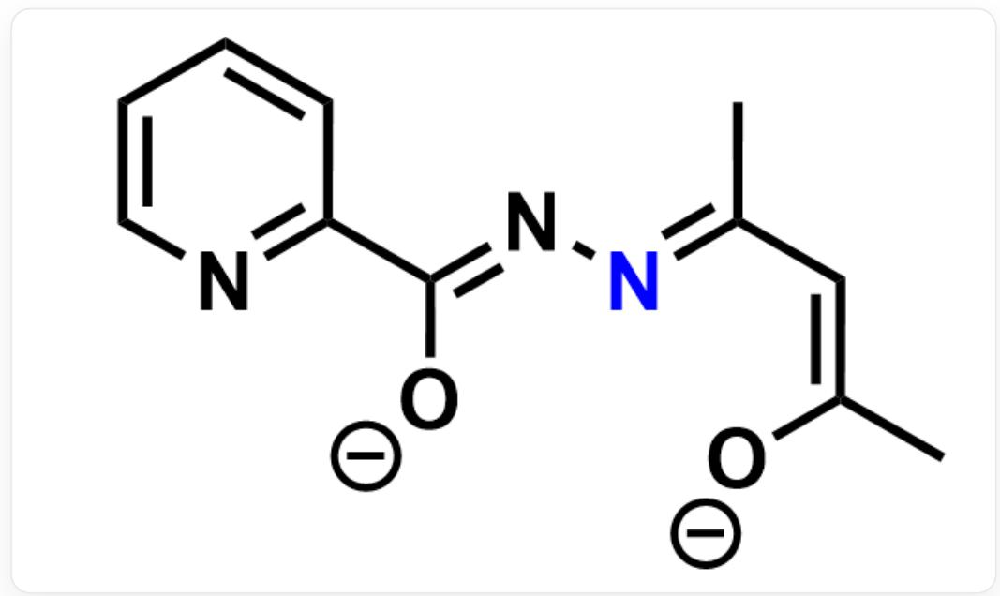

# 题目

将等摩尔的吡啶-2-甲酰肼和二水合乙酰丙酮钆(可记作  $Gd(acac)_3\cdot 2H_2O$  )于甲醇-二氯甲烷溶液中混合,室温搅拌2h,并在  $70^{\circ}\mathrm{C}$  下反应48h,降温,析出黄色晶体。晶体衍射表明该晶体为双核钆配合物,化学式为  $[Gd_{2}(L)_{2}(acac)_{2}(CH_{3}OH)_{2}] \cdot nCH_{3}OH$ ,钆的配位数为8;元素分析表明该晶体中各元素的含量分别为: C 40.21%, H 4.97%, N 7.75% (质量分数,%)；将该晶体加热至  $300^{\circ}\mathrm{C}$  左右,失重约6.0%,对应于失去所有外界甲醇分子。该晶体在外加磁场中可被磁化，使得其磁矩有序排列。

根据计算推理，判断以下说法正确的有哪些，选出包含所有正确说法的选项。

1.生成黄色晶体的反应中，反应物有二氯甲烷。  
2. 单个  $L^{2-}$  配体含有11个碳原子。  
3.单个  $L^{2 - }$  配体能形成的配位键数目是4。  
4.  $L^{2-}$  配体和金属配位时形成了五元环。  
5. 该晶体在外加磁场中被磁化的过程是放热的。

A. 1,2,3,4,5  
B. 1,2,4,5  
C. 2,3,4,5  
D. 1,3,4  
E. 2,4,5  
F. 2,3,5

G. 3,4,5  
H. 2,4  
1,3  
J. 4,5  
K. 以上选项均不对

# 答案

正确答案: E

# 详细解析

根据底物结构，  $acac^{-}$  最多和1当量吡啶-2-甲酰肼缩合，推测  $L^{2-}$  含有3个  $N$  。

# CHECKPOINT

0.5 PTS

配体  $L^{2-}$  中有3个  $N$

配合物式量为:  $14.01 \times 3 \times 2 \div 0.0775 = 1085$  。

失重所对应的式量为:  $1085 \times 0.060 = 65.1$ , 为 2 个甲醇分子, 即  $n = 2$  。

# CHECKPOINT

1 PTS

$$
n = 2
$$

设  $L^{2-}$  配体含碳原子数为  $x$ ，而  $1085 \times 0.4021 \div 12.01 = 36.4 \approx 36$ 。因此： $2x + 2 \times 5 + 2 \times 1 + 2 \times 1 = 36, x = 11$ 。若  $L^{2-}$  由2个及以上吡啶-2-甲酰肼反应得到，按上述流程无合理整数解。因此， $x = 11$ ，说法2正确。 $acac^{-}$ 和1当量吡啶-2-甲酰肼缩合的产物碳原子数为11，故二氯甲烷不是反应物，说法1错误。

# CHECKPOINT

1 PTS

$L^{2-}$  配体含碳原子数为11，说法2正确

# CHECKPOINT

0.5 PTS

二氯甲烷不是反应物，说法1错误

$L^{2 - }$  的结构如下：

  
[ \text{[O-]/C(C1=NC=CC=C1)=N\backslash N=C(C)\backslash C=C} ]

分析其配位模式： $Gd$  为8配位，则一共需要形成16个配位键。 $2acac^{-}$ 和 $2CH_{3}OH$ 分别提供 $2\times 2 = 4$ 和 $2\times 1 = 2$ 个配位键，所以每个 $L^{2 - }$ 提供 $(16 - 4 - 2)\div 2 = 5$ 个配位键。结合 $L^{2 - }$ 的构型，可知：吡啶氮、两个氧原子和结构式中标蓝的氮作为配位原子，共形成5个配位键；吡啶氮和来自吡啶-2-甲酰肼的氧原子在一个螯合五元环中，标蓝的氮和来自吡啶-2-甲酰肼的氧原子在另一个螯合五元环中，标蓝的氮和来自 $acac^{-}$ 的氧原子在一个螯合六元环中。所以说法3错误，说法4正确。

（注：  $acac^{-}$  在这里很难在作为二齿配体时再配位给另一个金属中心，不能形成3个配位键。这一点不要求写出）

# CHECKPOINT

1 PTS

每个  $L^{2-}$  提供5个配位键，说法3错误

# CHECKPOINT

1 PTS

配合物中存在两个螯合五元环，说法4正确

该晶体被磁化时磁矩有序排列， $\Delta S < 0$ ， $-T \Delta S > 0$ ，而  $\Delta G = \Delta H - T \Delta S < 0$ ，故  $\Delta H < 0$ ，磁化过程放热，说法5正确。

# CHECKPOINT

0.5 PTS

磁化过程  $\Delta S < 0$

# CHECKPOINT

0.5 PTS

磁化过程放热，说法5正确