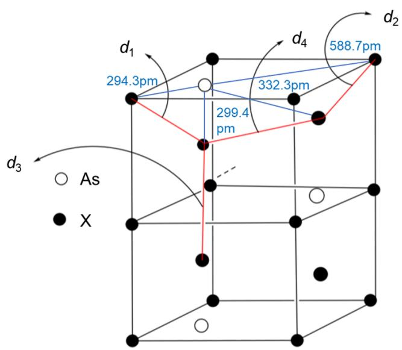

# Question

Arsenic can interact with most metals to form compounds with diverse compositions. The electronegativity of arsenic differs significantly from that of alkali and alkaline earth metals, resulting in intermetallic compounds between them exhibiting salt-like characteristics. The structure of the typical compound  $X_{3}As$  bears some resemblance to that of  $\alpha - Y_{3}Z$ .

The structure of  $\alpha - Y_{3}Z$  consists of alternating layers of  $Y_{2}Z$  planes and non-close-packed  $Y$  layers. In the  $Y_{2}Z$  planes, the  $Y$  atoms are arranged similarly to carbon in graphite layers, with  $Z$  located at the center of hexagonal rings. The  $Y$  atoms in the non-close-packed layers are linearly connected to the  $Z$  atoms in the adjacent layers above and below. In  $X_{3}As$ ,  $X$  and  $As$  form a hexagonal network structure resembling graphite, with the  $X$  atoms in the upper and lower layers overlapping, while the remaining  $X$  atoms are positioned on either side of the hexagonal pores.

In the known unit cell of  $X_{3}As$ , the shortest X-X distance is 308.8 pm, and the lattice parameters are  $a = b = 509.8$  pm. The parameter  $c$  is currently unknown but does not exceed 1000 pm. If the X-As distance along the c-axis direction is 299.4 pm, and assuming the three closest X atoms to As are present in quantities i, j, and k with distances r, s, and t, respectively, calculate  $(ir + js + kt) / (i + j + k)$ .

A. 303.1pm  
B.  $309.8 \mathrm{pm}$  
C.  $316.0 \mathrm{pm}$  
D.  $330.7 \mathrm{pm}$  
E.  $406.0 \mathrm{pm}$

# Answer

Correct Answer: C

# Detailed Explanation

The four relatively close X-X distances in the unit cell can be expressed as:

$$
d _ {1} = \sqrt {2 9 9 . 4 ^ {2} + (5 0 9 . 8 / \sqrt {3}) ^ {2}} = 4 1 9. 8 p m
$$

# CHECKPOINT

# 0.5 PTS

$$
d _ {1} = \sqrt {2 9 9 . 4 ^ {2} + (5 0 9 . 8 / \sqrt {3}) ^ {2}} = 4 1 9. 8 p m
$$

$$
d _ {2} = \sqrt {(c / 2 - 2 9 9 . 4) ^ {2} + (5 0 9 . 8 / \sqrt {3}) ^ {2}}
$$

# CHECKPOINT

0.5 PTS

$$
d _ {2} = \sqrt {(c / 2 - 2 9 9 . 4) ^ {2} + (5 0 9 . 8 / \sqrt {3}) ^ {2}}
$$

$$
d _ {3} = c - 2 * 2 9 9. 4
$$

# CHECKPOINT

0.5 PTS

$$
d _ {3} = c - 2 * 2 9 9. 4
$$

$$
d _ {4} = \sqrt {(2 9 9 . 4 * 2 - c / 2) ^ {2} + (5 0 9 . 8 / \sqrt {3}) ^ {2}}
$$

# CHECKPOINT

0.5 PTS

$$
d _ {4} = \sqrt {(2 9 9 . 4 * 2 - c / 2) ^ {2} + (5 0 9 . 8 / \sqrt {3}) ^ {2}}
$$

Solving  $c_{1} = 785.6pm$  from  $d_{2} = 308.8pm$  and substituting yields  $d_{3} = 186.8pm$ , which contradicts the shortest X-X distance of  $308.8pm$ .

Solving  $c_2 = 907.6pm$  from  $d_3 = 308.8pm$  and substituting gives  $d_2 = 332.4pm$  and  $d_4 = 328.1pm$ , both greater than  $308.8pm$ .

Solving  $d_4 = 308.8pm$  yields  $c_{3} = 1010.8pm$ , which exceeds  $1000pm$ .

Therefore, the unit cell parameter c is 907.6pm.

# CHECKPOINT

1 PTS

$$
c = 9 0 7. 6 p m
$$

The X atoms adjacent to As include three in-plane hexagonal neighbors at a distance of  $509.8pm/\sqrt{3} = 294.3pm$ ;

# CHECKPOINT

0.5 PTS

The nearest X atoms to As are 3, with a distance of  $509.8pm / \sqrt{3} = 294.3pm$

Two interlayer X atoms adjacent to As are at a distance of 299.4pm;

# CHECKPOINT

0.5 PTS

The second-nearest X atoms to As are 2, with a distance of  $299.4pm$

The third-nearest X atoms to As could be either the second-nearest in-plane X atoms or the interlayer X atoms not directly opposite, with distances of  $509.8pm/\sqrt{3} * 2 = 588.7pm$  and  $\sqrt{(509.8/\sqrt{3})^2 + (907.6/2 - 299.4)^2} = 332.3pm$ , respectively. Thus, the third-nearest X atoms are the interlayer non-opposite ones, totaling 6.

# CHECKPOINT

1 PTS

The third-nearest X atoms to As are 6, with a distance of  $332.3pm$

Calculating  $(\mathrm{ir} + \mathrm{js} + \mathrm{kt}) / (\mathrm{i} + \mathrm{j} + \mathrm{k})$  yields  $316.0pm$ .

# CHECKPOINT

1 PTS

$$
\left(i r + j s + k t\right) / \left(i + j + k\right) = 3 1 6. 0 p m
$$

The image shows the unit cell of  $X_{3}As$ , which is a hexagonal unit cell. The X coordinates are (0,0,0), (0,0,1/2), (1/3,2/3,1/3), (1/3,2/3,2/3), (2/3,1/3,1/6), (2/3,1/3,5/6); the As coordinates are (1/3,2/3,0), (2/3,1/3,1/2). The distance between X at (0,0,0) and (1/3,2/3,2/3) is  $d_{1}$ , between (0,0,0) and (2/3,1/3,5/6) is  $d_{2}$ , between (1/3,2/3,2/3) and (1/3,2/3,1/3) is  $d_{3}$ , and between (1/3,2/3,2/3) and (2/3,1/3,5/6) is  $d_{4}$ . The distance between X at (0,0,0) and As at (1/3,2/3,0) is 294.3pm, between X at (1/3,2/3,2/3) and As at (1/3,2/3,0) is 299.4pm, between X at (2/3,1/3,5/6) and As at (1/3,2/3,0) is 332.3pm, and the distance between As and the X atom diagonally opposite in the hexagon is 588.7pm.