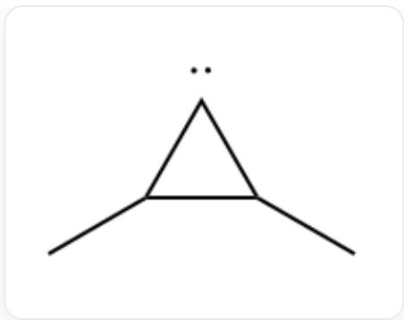
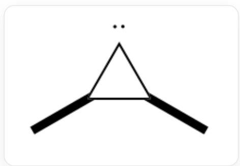
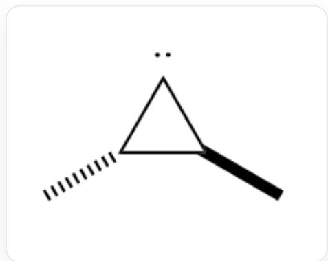
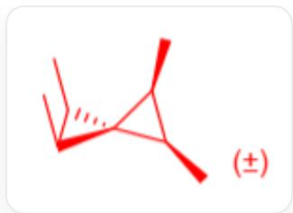
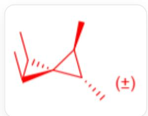
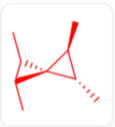
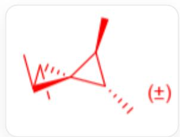

# Question

The ground-state atomic carbon can react with alkenes. When cis-2-butene is used, the reaction produces two different pairs of racemates, A and B, with a product ratio A : B close to 1 : 1. If trans-2-butene is used, two pairs of racemates, B and D, and one achiral product, C, are formed. The ratio of B : C is approximately 1 : 1, while the yield of D is relatively low. Indicate the symmetry of each product A, B, C, D.

A.  $\mathbf{A}: C_{2}, \mathbf{B}: C_{1}, \mathbf{C}: S_{4}, \mathbf{D}: D_{2}$  
B.  $\mathbf{A}: C_{1}, \mathbf{B}: D_{2}, \mathbf{C}: C_{2\mathrm{h}}, \mathbf{D}: C_{2}$ .  
C.  $\mathbf{A}: C_{2}, \mathbf{B}: C_{1}, \mathbf{C}: S_{4}, \mathbf{D}: D_{2}$ .  
D.  $\mathbf{A}: C_{2}, \mathbf{B}: D_{2}, \mathbf{C}: C_{2 \mathrm{v}}, \mathbf{D}: C_{1}$ .  
E.  $\mathbf{A}: D_{2}, \mathbf{B}: C_{1}, \mathbf{C}: C_{2\mathrm{v}}, \mathbf{D}: C_{2}$ .  
F.  $\mathbf{A}: D_{2}, \mathbf{B}: C_{2}, \mathbf{C}: C_{2\mathrm{h}}, \mathbf{D}: C_{1}$ .

# Answer

Correct Answer: C

# Detailed Explanation

The reaction of ground-state carbon atoms with alkenes yields products featuring a spiro[2.2]pentane skeleton.

# CHECKPOINT

1 PTS

Product has spiro[2.2]pentane skeleton

For cis-2-butene or trans-2-butene, the resulting product should incorporate four methyl groups on the non-spiro atoms of the spiro[2.2]pentane molecule.

# CHECKPOINT

1 PTS

Product has four methyl groups

Thus, ignoring stereoisomers, the product is:

CC1C(C)C12C(C)C2C

The spectroscopic term for the ground-state carbon atom is  $^3\mathrm{P}$ , and its reactivity resembles that of a triplet carbene.

# CHECKPOINT

1 PTS

Ground-state carbon atom resembles triplet carbene

Consequently, its reaction mechanism with the first molecule of cis-2-butene or trans-2-butene involves radical addition, forming a diradical intermediate, followed by spin inversion and cyclization to yield a cyclopropane carbene intermediate.

# CHECKPOINT

1 PTS

First step is radical addition

CC1[C..]C1C

The generated cyclopropane intermediate exists in both cis and trans configurations, with their abundance ratio close to  $1:1$ .

The  $cis$  intermediate is:

C[C@H]1[C..][C@@H]1C

The trans intermediate is:

C[C@H]1[C..][C@H]1C

and its enantiomer.

# CHECKPOINT

1 PTS

Intermediate exists in both cis and trans forms

The carbene intermediate, influenced by the high ring strain of the cyclopropane, adopts a singlet state, with the HOMO orbital lying within the plane of the cyclopropane ring and the LUMO orbital perpendicular to it.

# CHECKPOINT

1 PTS

Cyclopropane intermediate is a singlet

This singlet intermediate further undergoes a  $[1 + 2]$  cycloaddition reaction with the second molecule of cis-2-butene or trans-2-butene, yielding stereospecific products.

# CHECKPOINT

1 PTS

$[1 + 2]$  cycloaddition occurs

If cis-2-butene reacts with the cis intermediate, the product is:

C[C@@H]1[C@H](C)[C@@12[C@@H](C)[C@H]2C

This product contains one  $R$  and one  $S$  chiral carbon in each cyclopropane ring, along with a chiral axis ( $R$  or  $S$ ). It can only be formed from the reaction of ground-state carbon atoms with cis-2-butene, designated as  $\mathbf{A}$ , with a point group of  $C_2$ .

# CHECKPOINT

1 PTS

A has point group  $C_2$

If cis-2-butene reacts with the trans intermediate or trans-2-butene reacts with the cis intermediate, the product is:

C[C@@H]1[C@H](C)C12[C@@H](C)[C@@H]2C

This product lacks axial chirality but exhibits asymmetric chiral center distribution: one cyclopropane ring has one  $R$  and one  $S$  chiral carbon, while the other has two  $R$  or two  $S$  chiral carbons. This molecule can be formed from either cis-2-butene or trans-2-butene, designated as  $\mathbf{B}$ , with a point group of  $C_1$ .

# CHECKPOINT

1 PTS

B has point group  $C_1$

If trans-2-butene reacts with the trans intermediate, two outcomes are possible. Under lower steric hindrance, the product is:

  
C[C@H]1[C@H](C)C12[C@@H](C)[C@@H]2C

Here, one cyclopropane ring has two  $R$  chiral carbons, and the other has two  $S$  chiral carbons, resulting in an achiral molecule with an  $S_{4}$  point group, designated as  $\mathbf{C}$ .

# CHECKPOINT

1 PTS

C has point group  $S_4$

Under higher steric hindrance, the product is:

  
C[C@@H]1[C@@H](C)C12[C@@H](C)[C@@H]2C

Here, all four tertiary carbons are either  $R$  or  $S$ , and the molecule lacks axial chirality, with a point group of  $D_{2}$ , designated as  $\mathbf{D}$ .

# CHECKPOINT

1 PTS

D has point group  $D_{2}$

# CHECKPOINT

1 PTS

Yield difference between  $\mathbf{C}$  and  $\mathbf{D}$  arises from steric hindrance