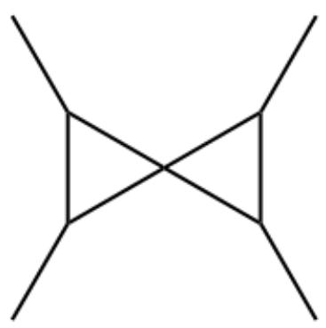
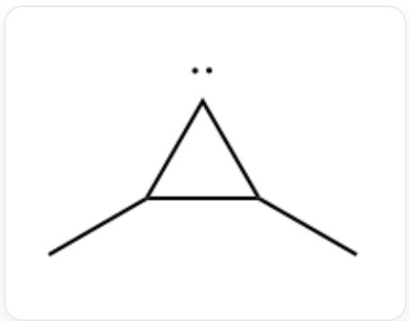
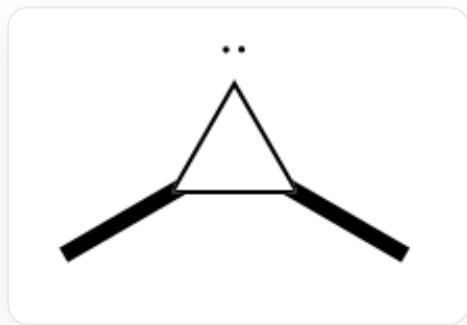
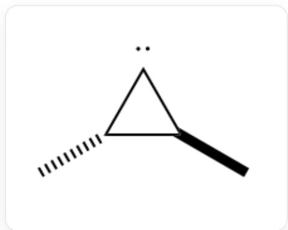
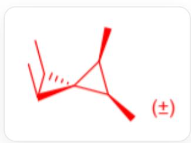
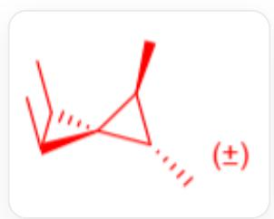
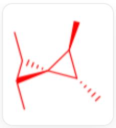
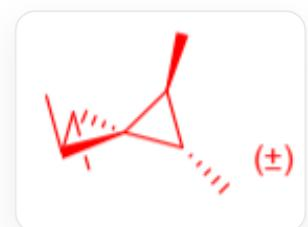

# 题目

基态原子态碳可与烯烃发生反应。若使用顺-2-丁烯，反应生成两对不同的外消旋体A,B，且产物比例A:B接近1:1，若使用反-2-丁烯，生成两对外消旋体B,D和一种非手性产物C，产物中B,C的比例接近1:1，而产物D则较少。指出产物A,B,C,D各自的对称性。

A.  $\mathbf{A}: C_{1}, \mathbf{B}: C_{2}, \mathbf{C}: S_{4}, \mathbf{D}: D_{2}$ .  
B.  $\mathbf{A}: C_{1}, \mathbf{B}: D_{2}, \mathbf{C}: C_{2\mathrm{h}}, \mathbf{D}: C_{2}$ .  
C.  $\mathbf{A}: C_{2}, \mathbf{B}: C_{1}, \mathbf{C}: S_{4}, \mathbf{D}: D_{2}$ .  
D.  $\mathbf{A}: C_{2}, \mathbf{B}: D_{2}, \mathbf{C}: C_{2\mathrm{v}}, \mathbf{D}: C_{1}$ .  
E.  $\mathbf{A}: D_{2}, \mathbf{B}: C_{1}, \mathbf{C}: C_{2\mathrm{v}}, \mathbf{D}: C_{2}$ .  
F.  $\mathbf{A}: D_{2}, \mathbf{B}: C_{2}, \mathbf{C}: C_{2\mathrm{h}}, \mathbf{D}: C_{1}$ .

# 答案

正确答案: C

# 详细解析

基态碳原子与烯烃反应，得到的产物具有螺戊烷形式的骨架。

# CHECKPOINT

1 PTS

产物有螺戊烷骨架

对于顺-2-丁烯或反-2-丁烯，得到的产物应当在螺戊烷分子中除螺原子之外的原子上加入4个甲基。

# CHECKPOINT

1 PTS

产物有4个甲基

因此，若忽略立体异构，产物为

CC1C(C)C12C(C)C2C

基态碳原子对应的光谱项为  $^3\mathrm{P}$  ，其反应性与三线态卡宾相近。

# CHECKPOINT

1 PTS

基态碳原子类似三线态卡宾

故其与第一分子的顺-2-丁烯或反-2-丁烯的反应机理为自由基加成，生成双自由基中间体，再经过自旋翻转和关环得到三元环卡宾中间体。

# CHECKPOINT

1 PTS

第一步反应为自由基加成

  
CC1[C..]C1C

生成的三元环中间体同时具有顺式和反式结构，两类中间体含量比接近  $1:1$  。

其中，顺式中间体为：

  
C[C@H]1[C..][C@@H]1C

反式中间体为：

  
C[C@H]1[C..][C@H]1C

及其对映体。

# CHECKPOINT

1 PTS

中间体即有顺式也有反式

生成的卡宾中间体受三元环的高张力影响，为单线态卡宾，HOMO轨道位于三元环平面内，LUMO轨道与该平面垂直。

# CHECKPOINT

1 PTS

三元环中间体为单线态

这一单线态中间体继续与第二分子的顺-2-丁烯或反-2-丁烯发生  $[1 + 2]$  环加成反应，产物具有立体专一性。

# CHECKPOINT

1 PTS

发生  $[1 + 2]$  环加成

若顺-2-丁烯与顺式中间体发生环加成，得到的产物为

C[C@@H]1[C@H](C)[C@]12[C@@H](C)[C@H]2C

该产物的两个三元环中各有一个  $R$  和一个  $S$  手性碳，且存在手性轴（ $R$  或  $S$ ），该产物只能由基态碳原子与顺-2-丁烯生成，故为  $\mathbf{A}$ ，其点群为  $C_2$ 。

# CHECKPOINT

1 PTS

A的点群为  $C_2$

若顺-2-丁烯与反式中间体环加成，或反-2-丁烯与顺式中间体环加成，得到的产物为

C[C@@H]1[C@H](C)C12[C@@H](C)[C@@H]2C

其没有轴手性，但手性中心分布不对称，其中一个三元环上有一个  $R$  和一个  $S$  手性碳，另一个三元环上有两个  $R$  或两个  $S$  手性碳。该分子既可由基态碳原子与顺-2-丁烯也由基态碳原子与反-2-丁烯生成，故为  $\mathbf{B}$ ，其点群为  $C_1$ 。

# CHECKPOINT

1 PTS

$\mathbf{B}$  的点群为  $C_1$

若反-2-丁烯与反式中间体发生环加成反应，则有两种可能，对于位阻较小的情形，产物为

C[C@H]1[C@H](C)C12[C@@H](C)[C@@H]2C

分子中一个三元环上有两个  $R$  手性碳，另一个三元环上有两个  $S$  手性碳，整体无手性，为  $S_{4}$  点群，故为  $\mathbf{C}$  。

CHECKPOINT

1 PTS

$\mathbf{C}$  的点群为  $S_{4}$

对于位阻较大的情形，产物为

C[C@@H]1[C@@H](C)C12[C@@H](C)[C@@H]2C

其中，4个三级碳的手性要么都是  $R$  ，要么都是  $S$  ，分子不含轴手性，分子点群为  $D_{2}$  。为  $\mathbf{D}$  。

CHECKPOINT

1 PTS

D的点群为  $D_{2}$

# CHECKPOINT

1 PTS

C与D的产率差异来自位阻