# Question

The following is the total synthesis route:

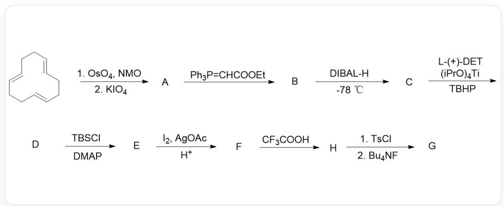

The starting compound C1/C=C/CC/C=C/CC/C=C/C1 is treated sequentially with  $OsO_4$ , NMO, and  $KIO_4$  to obtain compound A. Then, it reacts with  $Ph3P = CHCOOEt$  to obtain compound B Compound B is treated with  $DIBAL - H$  at  $-78^{\circ}C$  to obtain compound C Compound C is treated with  $L - (+) - DET$  (chiral auxiliary),  $(iPrO)_4Ti$ , and  $TBHP$  to obtain compound D Compound D reacts with  $TBSCl$  and  $DMAP$  to obtain compound E Compound E reacts with  $I_2$ ,  $AgOAc$ , and  $H^{+}$  to obtain compound F Compound F is treated with  $CF_3COOH$  to obtain compound H Compound H is treated sequentially with  $TsCl$  and  $BuN_4F$  to obtain compound G

Where, the molecular formula of compound  $\mathbf{A}$  is  $C_8H_{12}O_2$ , and compound  $\mathrm{G}$  contains a tetrahydrofuran structure.

Ignoring stereochemistry, please provide the structures of each compound and select the matching option.

A. All other options are incorrect.  
B. Compound A is

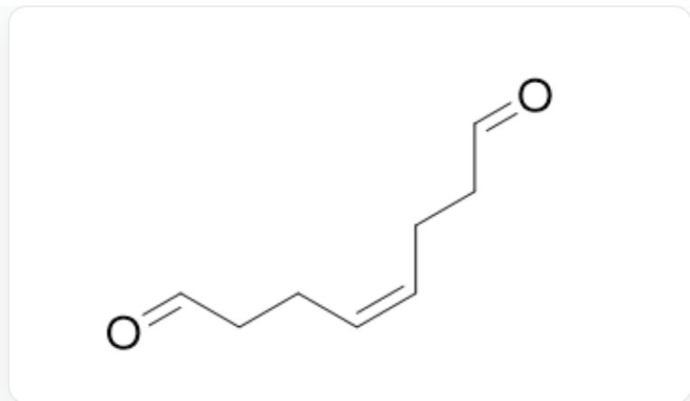  
$\mathrm{O = CCC / C = C\backslash CCC = O}$

# C. Compound B is

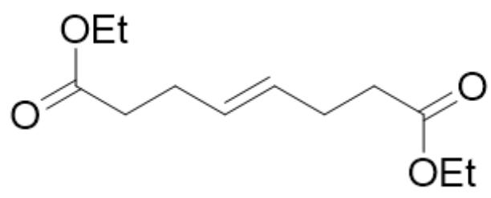  
$\mathrm{O = C(OCC)CC / C = C / CCC(OCC) = O}$

# D. Compound C is

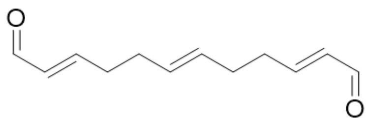

[ \mathrm{O} = \mathrm{C} / \mathrm{C} = \mathrm{C} / \mathrm{CC} / \mathrm{C} = \mathrm{C} / \mathrm{CC} / \mathrm{C} = \mathrm{C} / \mathrm{C} = \mathrm{O} ]

E. Compound  $\mathbf{D}$  is

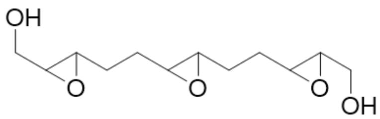

OCC1C(O1)CCC2C(O2)CCC(O3)C3CO

F. Compound  $\mathbf{E}$  is

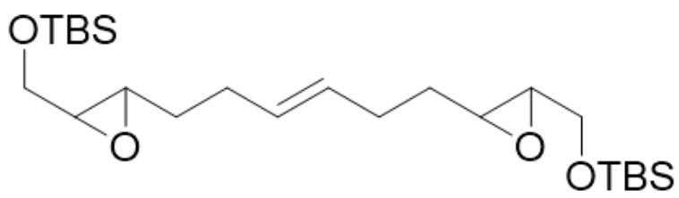

C[Si](OCC1C(O1)CC/C=C/CCC(O2)C2CO[Si](C)(C)C(C)(C)C)(C)C(C)(C)C

# G. Compound  $\mathbf{F}$  is

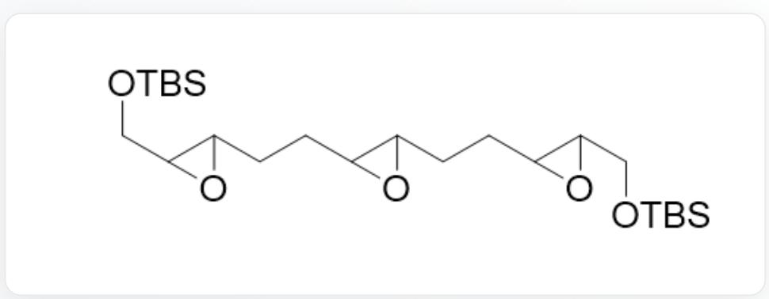  
C[Si](OCC1C(O1)CCC(O2)C2CCC(O3)C3CO[Si](C)(C)C(C)(C)C)(C)(C)C

# H. Compound H is

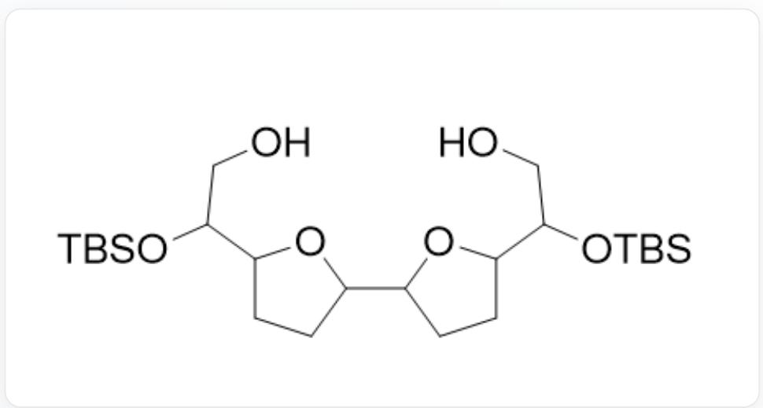  
OCC(O[Si](C)(C)(C)(C)C1CCC(C2CCC(C(O[Si](C)(C)C(C)(C)CO)O2)O1

# I. Compound  $\mathbf{G}$  is

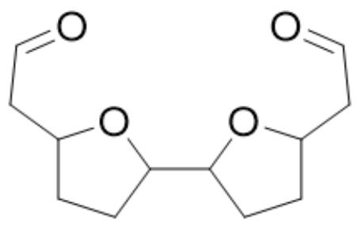

O=CCC1CCC(C2CCC(CC=O)O2)O1

# Answer

Correct Answer: F

# Detailed Explanation

The condition for generating compound  $\mathbf{A}$  is the cleavage of the double bond into two aldehyde groups. Combining the initial structure and the chemical formula of compound  $\mathbf{A}$ , it can be seen that compound  $\mathbf{A}$  is

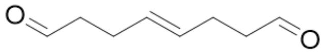  
$\mathrm{O = CCC / C = C / CCC = O}$

# CHECKPOINT

1 PTS

Structure of compound A is  $\mathrm{O} = \mathrm{CCC} / \mathrm{C} = \mathrm{C} / \mathrm{CCC} = \mathrm{O}$

The condition for generating compound  $\mathbf{B}$  is the transformation of the aldehyde group into the corresponding trans carbon-carbon double bond structure. Therefore, compound  $\mathbf{B}$  is

  
[ \mathrm{O} = \mathrm{C} / (\mathrm{C} = \mathrm{C} / \mathrm{CC} / \mathrm{C} = \mathrm{C} / \mathrm{CC} / \mathrm{C} = \mathrm{C} / \mathrm{C}(\mathrm{OCC}) = \mathrm{O})\mathrm{OCC} ]

# CHECKPOINT

1 PTS

Structure of compound B is  $\mathrm{O} = \mathrm{C} / \mathrm{C} = \mathrm{C} / \mathrm{CC} / \mathrm{C} = \mathrm{C} / \mathrm{CC} / \mathrm{C} = \mathrm{C} / \mathrm{C}(\mathrm{OCC}) = \mathrm{O})\mathrm{OCC}$

The condition for generating compound  $\mathbf{C}$  is the reduction of the ester group to a hydroxyl group. Therefore, it should be

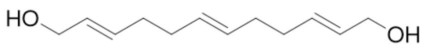  
OC/C=C/CC/C=C/CC/C=C/CO

# CHECKPOINT

1 PTS

Structure of compound C is OC/C=C/CC/C=C/CC/C=C/CO

The condition for generating compound  $\mathbf{D}$  is the epoxidation of the double bond. There are two chemically different double bonds in the system, and there are subsequent reactions targeting the double bond, indicating that there are remaining double bonds. Finally, a tetrahydrofuran structure is generated, so it can be concluded that the two double bonds on the side are epoxidized. Therefore, the structure of compound  $\mathbf{D}$  is

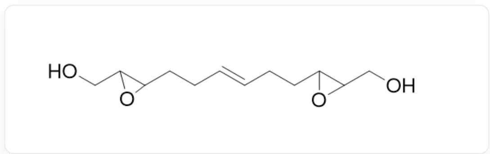  
OCC1C(O1)CC/C=C/CCC2C(O2)CO

# CHECKPOINT

2 PTS

Structure of compound D is OCC1C(O1)CC/C=C/CCC2C(O2)CO

The condition for generating compound  $\mathbf{E}$  is the protection of the hydroxyl group with a silyl group. Therefore, its structure is

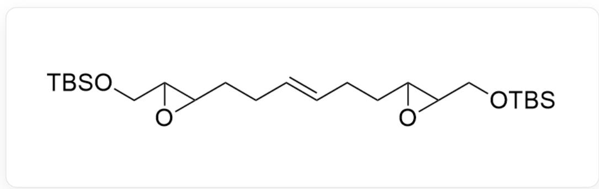  
C[Si](OCC(O1)C1CC/C=C/CCC2C(CO[Si](C)(C)C(C)(C)C02)(C)C(C)(C)C

# CHECKPOINT

0.5 PTS

Structure of compound E is C[Si](OCC(O1)C1CC/C=C/CCC2C(CO[Si](C)(C)C(C)(C)C)O2)(C)C(C)(C)C

The condition for generating compound  $\mathbf{F}$  is the oxidation of the double bond to generate two hydroxyl groups. Therefore, its structure is

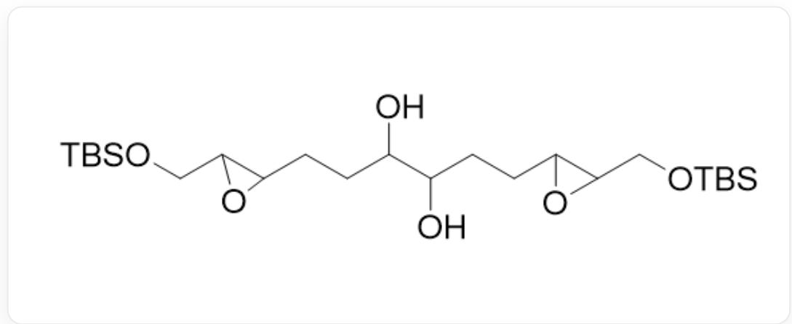  
OC(C(O)CCC(O1)C1CO[Si](C)(C)C(C)(C)C)CCC2C(O2)CO[Si](C)(C)C(C)(C)C

# CHECKPOINT

1 PTS

Structure of compound F is OC(C(O)CCC(O1)C1CO[Si](C)(C)C(C)(C)C)CCC2C(O2)CO[Si](C)(C)C(C) (C)C

The condition for generating compound  $\mathbf{H}$  is a rearrangement reaction under acidic conditions. Combining the condition that the final product has a tetrahydrofuran structure, its structure should be

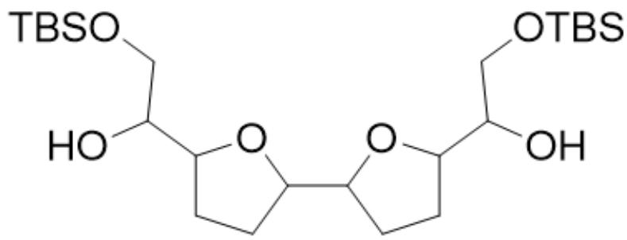

OC(CO[Si](C)(C)C(C)(C)C)C1CCC(C2CCC(C(CO[Si](C)(C)C(C)(C)C)O)O2)O1

# CHECKPOINT

1 PTS

Structure of compound H is OC(CO[Si](C)(C)C(C)(C)C)C1CCC(C2CCC(C(CO[Si](C)(C)C(C) (C)C)O)O2)O1

The conditions for the final generation of compound  $\mathbf{G}$  are two steps: first, the transformation of the hydroxyl group into a leaving group sulfonate ester group, and second, the hydrolysis of the silane group to generate an oxygen anion. Therefore, its structure should be

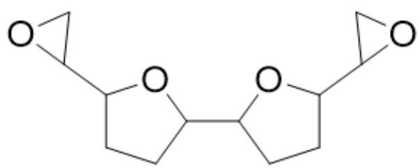

C1(C2CO2)CCC(C3CCC(C4CO4)O3)O1

# CHECKPOINT

2 PTS

Structure of compound G is C1(C2CO2)CCC(C3CCC(C4CO4)O3)O1