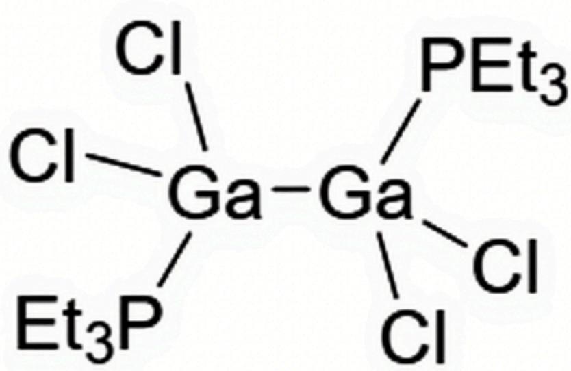

# Question

In nature, A often exists in trace amounts dispersed in ores such as bauxite and sphalerite. Bauxite is placed in an autoclave and treated with sodium hydroxide solution to transfer A into the solution;  $\mathrm{CO}_{2}$  is bubbled into it and filtered to remove a large amount of aluminum;  $\mathrm{CO}_{2}$  is continuously bubbled in until  $\mathrm{pH} < 9.7$ , precipitating compound B; B is placed under high temperature for dehydration, and then treated with thionyl chloride to obtain a white powder C; C is directly mixed with triethylsilane at low temperature to generate D, which is a liquid dimer at room temperature with a melting point of  $29^{\circ}\mathrm{C}$ ; D is heated to  $150^{\circ}\mathrm{C}$  for complete decomposition, with a weight loss of  $0.71\%$ , releasing flammable gas E and converting into colorless solid crystal F, which is a 1:1 type ionic compound. Triethylphosphine is added to an ether solution of D, cooled, and a precipitate G is precipitated, which is a 1:1 type Lewis acid-base adduct. Triethylphosphine is slowly added to a toluene solution of F at  $-78^{\circ}\mathrm{C}$ , the solution turns red; it is raised to room temperature and cooled again, the red color fades, and a colorless solid H is formed, which contains A  $26.9\%$ , and phosphorus has only one chemical environment.

A. All other options are incorrect.  
B.  $\mathbf{B}$  and  $\mathbf{F}$  contain the same number of elements.  
C. D and H molecules possess similar structures.  
D. Compound C contains A  $20.2\%$ .  
E. The most stable conformation of the  $\mathbf{H}$  molecule contains only one center of symmetry.  
F.  $\mathbf{F}$  contains only one valence state of  $\mathbf{A}$ .

# Answer

Correct Answer: A

# Detailed Explanation

A is present in trace amounts dispersed in bauxite (mainly containing Al) and sphalerite (mainly containing Zn). Since the coexistence of elements in the same group in ore crystals is very common in nature, it can be inferred that it is an element in the same group as Al or Zn.

By treating bauxite with sodium hydroxide and  $\mathrm{CO}_{2}$ , A enters the solution and forms compound B. It can be seen that A has similar properties to Al, that is, it can be dissolved in alkaline solutions. It is speculated that it may be a group IIIA element. Since In and Tl are not particularly close to Al in chemical properties, it is especially likely to be Ga.

# CHECKPOINT

1 PTS

So element  $\mathbf{A}$  may be Ga.

Therefore, carbon dioxide is passed into the solution dissolved in sodium hydroxide to adjust the  $\mathbf{pH}$ . Since the hydroxides of Al and Ga are both amphoteric, and the  $\mathbf{pH}$  at which the two precipitate are different,  $\mathrm{Ga(OH)_3}$  can be separated out.

# CHECKPOINT

1 PTS

So  $\mathbf{B}$  is  $\mathrm{Ga(OH)_3}$ .

Dehydrating B at high temperature yields its oxide  $\mathrm{Ga}_2\mathrm{O}_3$

Treatment with thionyl chloride is a one-step chlorination reaction, producing C:

$$
\mathrm {G a} _ {2} \mathrm {O} _ {3} + 3 \mathrm {S O C l} _ {2} \rightarrow 2 \mathrm {G a C l} _ {3} + 3 \mathrm {S O} _ {2}
$$

# CHECKPOINT

1 PTS

So  $\mathbf{C}$  is  $\mathrm{GaCl}_3$ .

C  $\mathrm{GaCl}_3$  reacts with triethylsilane, and the result is to replace Cl in  $\mathrm{GaCl}_3$  with H to generate D.

Furthermore, based on the small decomposition weight loss of  $\mathbf{D}$  and the flammability of the generated gas, it is speculated that  $\mathbf{H}$  in  $\mathbf{D}$  may leave in the form of hydrogen gas. Using data for calculation, it can be obtained that:  $\mathbf{D}$  is  $\mathrm{GaHCl}_2$ , and  $\mathbf{F}$  is  $\mathrm{GaCl}_2$ . So the generated gas  $\mathbf{E}$  is  $\mathrm{H}_2$ .

Then, substitute the data given in the question for verification:

$$
\frac{1.008}{1.008 + 69.72 + 35.45\times 2} = 0.7117\% , \text{which is consistent with the meaning of the question, verifying the assumption}.
$$

# CHECKPOINT

3 PTS

D is  $\mathrm{GaHCl}_2$  , F is  $\mathrm{GaCl}_2$  , E is  $\mathrm{H}_{2}$

C to D in one step:

$$
2 \mathrm {G a C l} _ {3} + 2 \left(\mathrm {C} _ {2} \mathrm {H} _ {5}\right) _ {3} \mathrm {S i H} \rightarrow \left(\mathrm {G a H C l} _ {2}\right) _ {2} + 2 \left(\mathrm {C} _ {2} \mathrm {H} _ {5}\right) _ {3} \mathrm {S i C l}
$$

D decomposition in one step:

$\mathbf{F}$  is a  $1:1$  ionic compound. Since Ga mainly exists in monovalent or trivalent forms, Ga in  $\mathbf{F}$  exists in monovalent and trivalent forms in a  $1:1$  ratio, that is, this step of the reaction is:

$$
\left(\mathrm {G a H C l} _ {2}\right) _ {2} \rightarrow \left[ \mathrm {G a} \right]\left[ \mathrm {G a C l} _ {4} \right] + \mathrm {H} _ {2}
$$

$\mathbf{D}$  reacts with triethylphosphine to generate the Lewis adduct  $\mathbf{G}$ . Triethylphosphine is a Lewis base, so it should be that the monomer after dissociation of  $\mathbf{D}$  undergoes addition as a Lewis acid.

# CHECKPOINT

1 PTS

So  $\mathbf{G}$  is  $\mathrm{HCl}_2\mathrm{Ga} - \mathrm{PET}_3$

$\mathbf{F}$  reacts with triethylphosphine, presumably triethylphosphine first coordinates with monovalent Ga, and after raising the temperature,  $\mathbf{H}$  is generated. Therefore, it is speculated that  $\mathbf{H}$  should contain triethylphosphine, Ga, and Cl.

Calculate according to the given data:

Suppose one Ga is coordinated with  $x$  triethylphosphines and  $y$  Cls, then there is the equation:

$$
\frac{69.72}{69.72 + x\times 118.15 + y\times 35.45} = 26.9\%
$$

Solving for:  $x = 1$ ,  $y = 2$ .

The simplest formula for  $\mathbf{H}$  is  $\mathrm{GaCl}_2\mathrm{PET}_3$

Since there is only one chemical environment for phosphorus, it is speculated to be a polymer. The Ga in this compound also exhibits a  $+2$  valence and has a single electron, so it may take a dimeric form.

# CHECKPOINT

1 PTS

H is  $(\mathrm{GaCl}_2\mathrm{PEt}_3)_2$

B is  $\mathrm{Ga(OH)_3}$ , containing 3 kinds of elements, F is  $\mathrm{Ga_2Cl_4}$ , containing 2 kinds of elements, which are different.

# CHECKPOINT

1 PTS

B is incorrect.

D is a dimer of  $\mathrm{GaHCl_2}$ , and its structure is similar to that of aluminum trichloride, that is, chlorine atoms act as bridges.

The  $\mathbf{H}$  molecule is due to the fact that  $+2$  valent Ga has a single electron, and the dimer contains a Ga - Ga bond. The overall bonding mode is similar to that of ethane. There are no bridging ligands, and the two are different.

# CHECKPOINT

1 PTS

$\mathbf{C}$  is incorrect.

The compound  $\mathbf{C}$  is calculated to contain A :

$$
\frac{69.72}{69.72 + 3\times 35.45} = 39.6\% .
$$

# CHECKPOINT

1 PTS

$\mathbf{D}$  is incorrect.

The most stable conformation of the  $\mathbf{H}$  molecule is staggered, containing a center of symmetry and a  $\mathbf{C}_2$  symmetry axis, as shown in the figure:

  
分子SMILES表达式：Cl[Ga-]([P+](CC)(CC)CC)(Cl)[Ga-](Cl)(Cl)[P+](CC)(CC)CC

# CHECKPOINT

1 PTS

$\mathbf{E}$  is incorrect.

It can be seen from the above reasoning that  $\mathbf{F}$  contains 2 kinds of valence states of  $\mathbf{A}$ .

# CHECKPOINT

1 PTS

$\mathbf{F}$  is incorrect.

All other answers are incorrect.

# CHECKPOINT

1 PTS

A is correct.