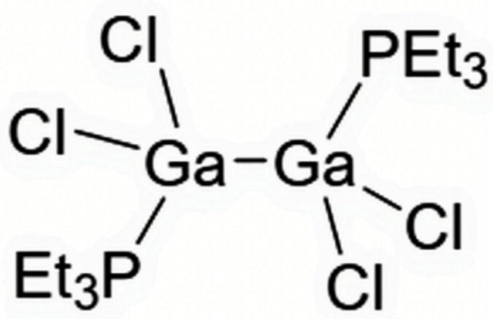

# 题目

自然界中，A 常以微量分散于铝土矿、闪锌矿等矿石中。将铝土矿置于高压釜中，用氢氧化钠溶液处理使A转移到溶液中；向其中通入  $\mathrm{CO}_{2}$  并过滤以除去大量的铝；继续通入  $\mathrm{CO}_{2}$  至  $\mathrm{pH} < 9.7$  ，析出化合物B；将B置于高温下脱水，然后用亚硫酰氯处理，可制得白色粉末C；将C与三乙基甲硅烷在低温下直接混合，生成D，D在室温下为液态二聚体，熔点  $29^{\circ}\mathrm{C}$  ；将D加热至  $150^{\circ}\mathrm{C}$  完全分解，失重  $0.71\%$  ，放出可燃气体E并转化为无色固体结晶F，F为1：1型离子化合物。将三乙基麟加入到D的乙醚溶液中，冷却，析出沉淀G，G为1：1型Lewis酸碱加合物。在  $-78^{\circ}\mathrm{C}$  下将三乙基膦缓慢加入到F的甲苯溶液中，溶液变红;升高至室温并再次冷却，红色褪去，生成无色固体H，H中含A  $26.9\%$  ，磷只有一种化学环境。

A. 其他选项均不正确  
B. B 和 F 所含元素种数相同。  
C. D 和 H 分子具有相似的结构。  
D. 化合物 C 中含 A  $20.2\%$ .  
E. H 分子的最稳定构象中仅含有一个对称中心。  
F. F 中仅含有一种价态的 A。

# 答案

正确答案: A

# 详细解析

A 微量分散于铝土矿（主要含 Al）和闪锌矿（主要含 Zn）中。由于在自然界中，同族元素在矿石晶体中共生非常常见，可推测为 Al 或 Zn 的同族元素。

通过氢氧化钠和  $\mathrm{CO}_{2}$  处理铝土矿，A 进入溶液并形成化合物 B。可见 A 具有与 A1 相似的性质，即可溶解在碱溶液中，推测其可能为第三主族元素，由于 In 和 Tl 在化学性质上与 Al 不算特别接近，故尤其可能是 Ga。

# CHECKPOINT

1 PTS

所以元素A有可能是Ga。

故向溶解于氢氧化钠的溶液中通入二氧化碳调节  $\mathbf{pH}$ , 由于 Al 和 Ga 的氢氧化物均具有两性, 二者沉淀  $\mathbf{pH}$  不同, 即可分离出  $\mathrm{Ga(OH)}_{3}$  。

# CHECKPOINT

1 PTS

所以  $\mathbf{B}$  为  $\mathrm{Ga(OH)_3}$

将 B 在高温下脱水, 即可得到其氧化物  $\mathrm{Ga}_{2} \mathrm{O}_{3}$  。

使用亚硫酰氯处理，是一步氯化反应，生成C：

$$
\mathrm {G a} _ {2} \mathrm {O} _ {3} + 3 \mathrm {S O C l} _ {2} \rightarrow 2 \mathrm {G a C l} _ {3} + 3 \mathrm {S O} _ {2}
$$

# CHECKPOINT

1 PTS

所以  $\mathbf{C}$  为  $\mathrm{GaCl}_3$  。

C  $\mathrm{GaCl}_{3}$  与三乙基甲硅烷反应, 从结果上是将  $\mathrm{GaCl}_{3}$  中的  $\mathrm{Cl}$  替换为  $\mathrm{H}$  生成  $\mathrm{D}$  。

再由D的分解失重较少且生成气体可燃，推测可能是D中H以氢气的形式离去，使用数据进行计算可得：D为  $\mathrm{GaHCl}_2$  ，F为  $\mathrm{GaCl}_2$  。所以生成的气体E为  $\mathrm{H}_2$  。

再代入题目中所给数据，进行验证：

$\frac{1.008}{1.008 + 69.72 + 35.45 \times 2} = 0.7117\%$  ，与题意符合，验证假设。

# CHECKPOINT

3 PTS

D 为  $\mathrm{GaHCl}_{2}, \mathrm{~F}$  为  $\mathrm{GaCl}_{2}, \mathrm{E}$  为  $\mathrm{H}_{2}$  。

C 到 D 一步:

$$
2 \mathrm {G a C l} _ {3} + 2 \left(\mathrm {C} _ {2} \mathrm {H} _ {5}\right) _ {3} \mathrm {S i H} \rightarrow \left(\mathrm {G a H C l} _ {2}\right) _ {2} + 2 \left(\mathrm {C} _ {2} \mathrm {H} _ {5}\right) _ {3} \mathrm {S i C l}
$$

D分解一步：

$\mathbf{F}$  为  $1:1$  离子化合物，由于 Ga 基本以一价或三价存在，故  $\mathbf{F}$  中的 Ga 以一价和三价  $1:1$  的形式存在，即此步反应为：

$$
\left(\mathrm {G a H C l} _ {2}\right) _ {2} \rightarrow \left[ \mathrm {G a} \right]\left[ \mathrm {G a C l} _ {4} \right] + \mathrm {H} _ {2}
$$

D 与三乙基膦反应生成 Lewis 加合物 G，三乙基膦为 Lewis 碱，故应该是 D 解离后单体作为 Lewis 酸进行加和。

# CHECKPOINT

1 PTS

故  $\mathbf{G}$  为  $\mathrm{HCl}_2\mathrm{Ga} - \mathrm{PET}_3$

$\mathbf{F}$  与三乙基膦反应, 应该是三乙基膦先与一价  $\mathrm{Ga}$  配位, 升高温度后生成  $\mathrm{H}$ , 故推测  $\mathrm{H}$  中应该含有三乙基膦、  $\mathrm{Ga}$  和  $\mathrm{Cl}$  。

根据给出数据计算：

设一个Ga与  $x$  个三乙基膦配位，与  $y$  个Cl配位，有方程：

$$
\frac{69.72}{69.72 + x\times 118.15 + y\times 35.45} = 26.9\%
$$

解得：  $x = 1$  ，  $y = 2$  。

H最简式为  $\mathrm{GaCl}_2\mathrm{PET}_3$

由于磷只有一种化学环境，推测为多聚体，该化合物中的Ga同样表现为  $+2$  价，有一个单电子，故可能采取二聚的形式。

# CHECKPOINT

1 PTS

$\mathbf{H}$  为  $(\mathrm{GaCl}_2\mathrm{PEt}_3)_2$  。

B 为  $\mathrm{Ga(OH)}_{3}$ , 所含元素种数为 3, F 为  $\mathrm{Ga}_{2} \mathrm{Cl}_{4}$  所含元素种数为 2 , 不同。

# CHECKPOINT

1 PTS

B 错误。

D 为  $\mathrm{GaHCl}_{2}$  二聚体, 其结构与三氯化铝类似, 即氯原子作为桥连。

H分子则是由于  $+2$  价的Ga具有单电子，二聚体含有  $\mathrm{Ga} - \mathrm{Ga}$  键，总体成键模式与乙烷类似。无桥连配体，二者不同。

# CHECKPOINT

1 PTS

C错误。

计算得化合物 C 中含 A :

$$
\frac{69.72}{69.72 + 3\times 35.45} = 39.6\% .
$$

# CHECKPOINT

1 PTS

D错误。

H分子的最稳定构象为交叉式，含有一个对称中心和  $\mathbf{C}_2$  对称轴，如图所示：

分子SMILES表达式：Cl[Ga-]([P+](CC)(CC)CC)(Cl)[Ga-](Cl)(Cl)[P+](CC)(CC)CC

# CHECKPOINT

1 PTS

E错误。

由上述推理可知， $\mathbf{F}$  中含有2种价态的  $\mathbf{A}$ 。

# CHECKPOINT

1 PTS

F错误。

其他答案均不正确。

# CHECKPOINT

1 PTS

A正确。