# Question

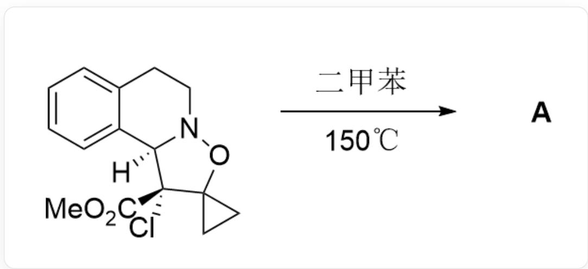  
[H][C@]12C3=CC=CC=C3CCN1OC4(CC4)[C@]2(C(OC)=O)Cl> Xylene,  $150^{\circ}\mathrm{C} > [\mathbf{A}],\mathbf{A}$  is the product

Given that reaction product  $\mathbf{A}$  contains an amide bond, and the first step of the reaction is a pericyclic reaction, without considering enantiomers, provide the structural formula of reaction product  $\mathbf{A}$ .

A. All other options are incorrect  
B.

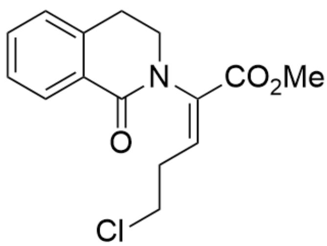  
$\mathrm{O = C1C2 = CC = CC = C2CCN1 / C(C(OC) = O) = C\backslash CCCI}$

C.  
  
$\mathrm{O = C1C2 = CC = CC = C2CCN1 / C(C(OC) = O) = C / CCCl}$

D.  
E.  
  
O=C1[C@]2(Cl)C(CCO2)=C3C4=CC=CC=C4CCN31

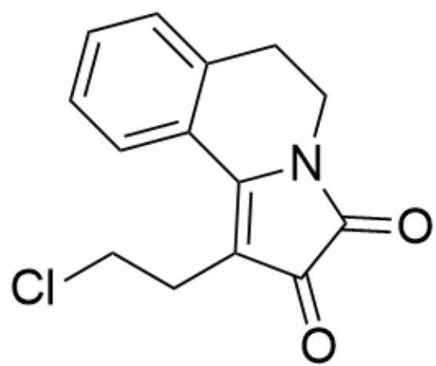  
F.

$\mathrm{O = C(N1C(C2 = CC = CC = C2CC1) = C3CCCl)C3 = O}$

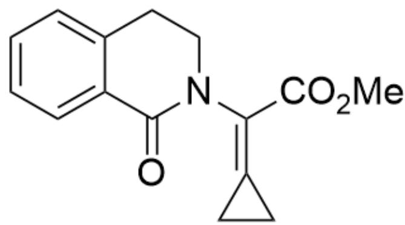  
G.

$\mathrm{O = C1C2 = CC = CC = C2CCN1 / C(C(OC) = O) = C3CC}\backslash 3$

  
H.

$\mathrm{O = C1NC(C2(CC2)C(C(OC) = O) = O)C3 = CC = CC = C3C1}$

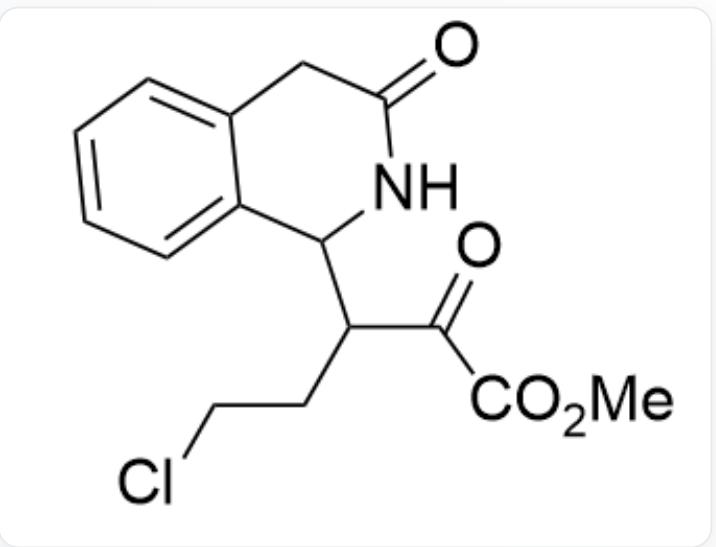

$\mathrm{O = C1NC(C(CCCl)C(C(OC) = O) = O)C2 = CC = CC = C2C1}$

# Answer

Correct Answer: E

# Detailed Explanation

According to the question prompt, the first step is a pericyclic reaction of the substrate, inferring that a reverse  $[3 + 2]$  reaction should have occurred to obtain intermediate 1 and intermediate 2

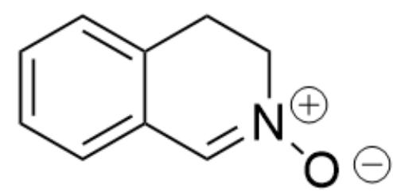

intermediate1：[O-]N1[CH+]C2=CC=CC=C2CC1

# CHECKPOINT

1 PTS

intermediate 1 : [O-]N1[CH+]C2=CC=CC=C2CC1

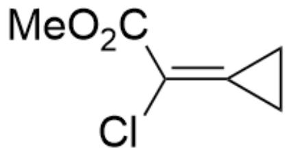

intermediate2:Cl/C(C(OC)=O)=C1CC\1

# CHECKPOINT

1 PTS

intermediate 2 : Cl/C(C(OC)=O)=C1CC\1

Then, another  $[3 + 2]$  reaction occurs again to form a ring again, yielding intermediate 3

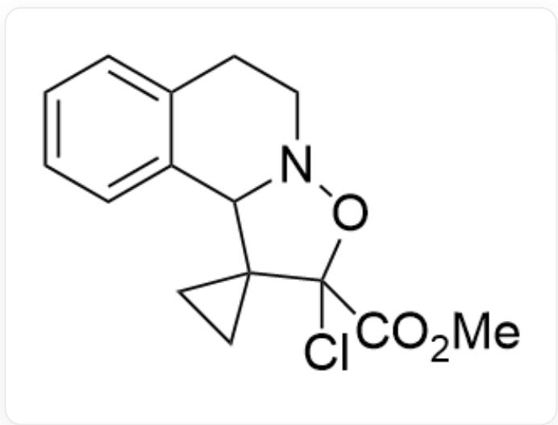

intermediate3:ClC1(C(OC)=O)C2(CC2)C3C4=CC=CC=C4CCN3O1

# CHECKPOINT

1 PTS

intermediate 3 : ClC1(C(OC)=O)C2(CC2)C3C4=CC=CC=C4CCN3O1

At this point,  $\mathrm{Cl}^{-}$  easily departs to form intermediate 4

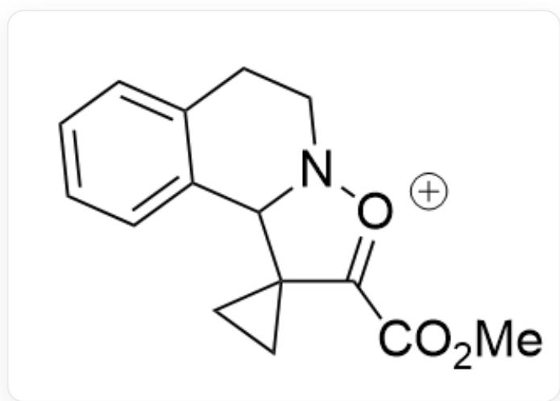

intermediate4:  $O = C(C1 = [O + ]N2C(C13CC3)C4 = CC = CC = C4CC2)OC$

# CHECKPOINT

1 PTS

intermediate4：  $\mathrm{O = C(C1 = [O + ]N2C(C13CC3)C4 = CC = CC = C4CC2)OC}$

Subsequently, an elimination reaction occurs to give intermediate 5

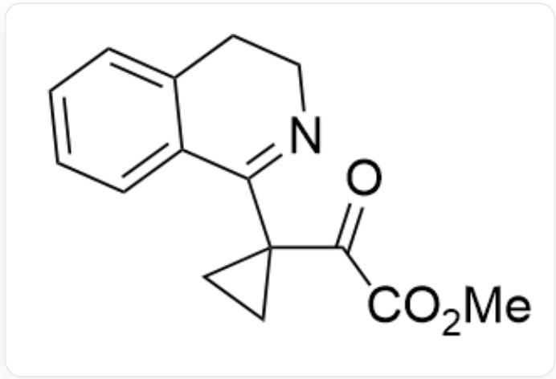

intermediate5：O=C(C(OC)=O)C1(CC1)C2=NCCC3=CC=CC=C32

# CHECKPOINT

1 PTS

intermediate5：  $\mathrm{O = C(C(OC) = O)C1(CC1)C2 = NCCC3 = CC = CC = C32}$

At this point, the three-membered ring is subject to electron-withdrawing inductive effects from two electron-withdrawing groups and is easily opened by nucleophilic attack by  $\mathrm{Cl}^-$  to give intermediate 6

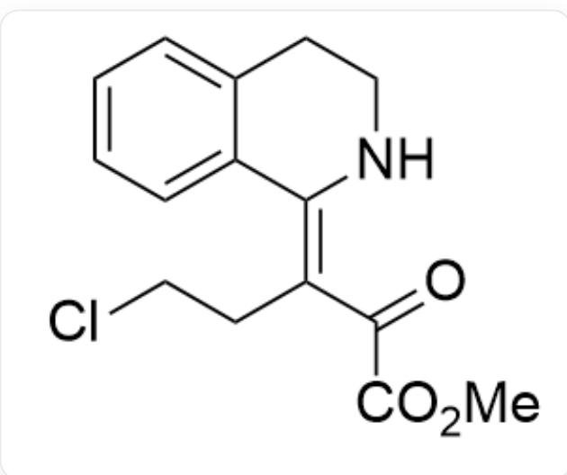

intermediate6 : O=C(C(OC)=O)/C(CCCL)=C1C2=CC=CC=CC2CCN/1

# CHECKPOINT

1 PTS

intermediate 6 :  $\mathrm{O} = \mathrm{C}\left( {\mathrm{C}\left( \mathrm{{OC}}\right)  = \mathrm{O}}\right) /\mathrm{C}\left( \mathrm{{CCCl}}\right)  = \mathrm{C}1\mathrm{C}2 = \mathrm{{CC}} = \mathrm{{CC}} = \mathrm{C}2\mathrm{{CCN}}/1$

According to the question stem, the product  $\mathbf{A}$  contains an amide bond, so the next step is an intramolecular nucleophilic substitution reaction to obtain intermediate 7

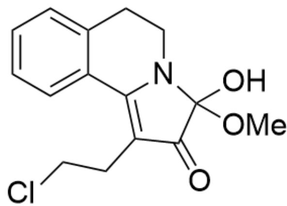

intermediate7 : O=C1C(CCCI)=C2C3=CC=CC=C3CCN2C1(OC)O

# CHECKPOINT

1 PTS

intermediate7：  $\mathrm{O = C1C(CCCl) = C2C3 = CC = CC = C3CCN2C1(OC)O}$

Then, a molecule of methanol is eliminated to obtain the final product A containing an amide bond

productA:O=C(N1C(C2=CC=CC=C2CC1)=C3CCCl)C3=O