# 题目

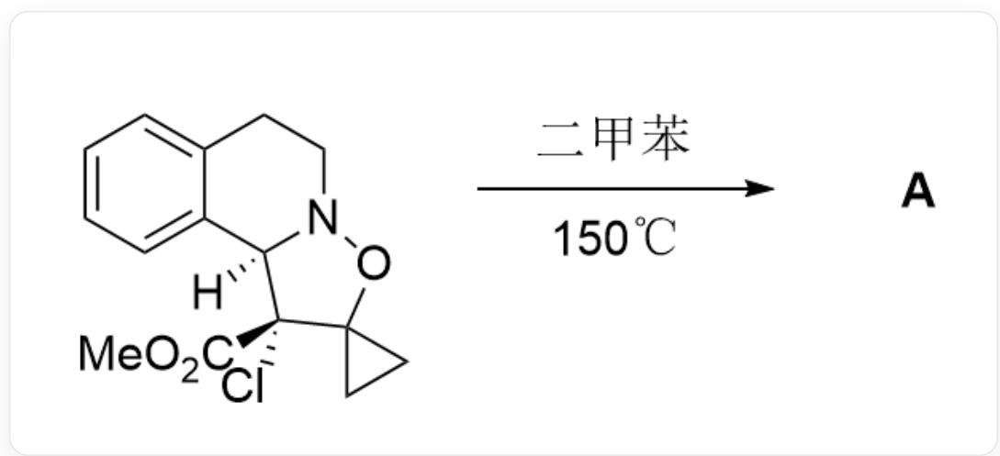  
[H][C@]12C3=CC=CC=C3CCN1OC4(CC4)[C@]2(C(OC)=O)Cl>二甲苯,  $150^{\circ}\mathrm{C} > [\mathbf{A}],\mathbf{A}$  是产物

已知反应产物 A 含有酰胺键, 且第一步反应为周环反应, 不考虑对映异构的条件下, 试给出反应产物 A 的结构式

A. 其他选项均不正确  
B.

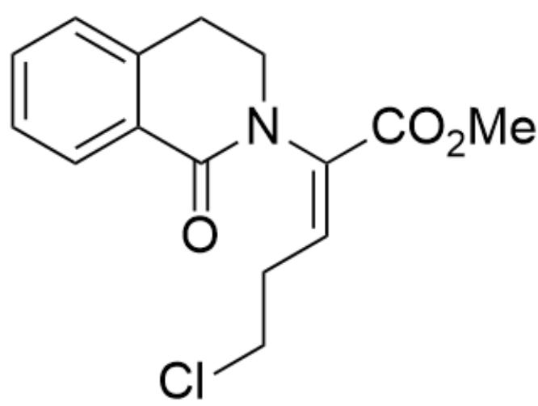  
$\mathrm{O = C1C2 = CC = CC = C2CCN1 / C(C(OC) = O) = C\backslash CCCI}$

C.  
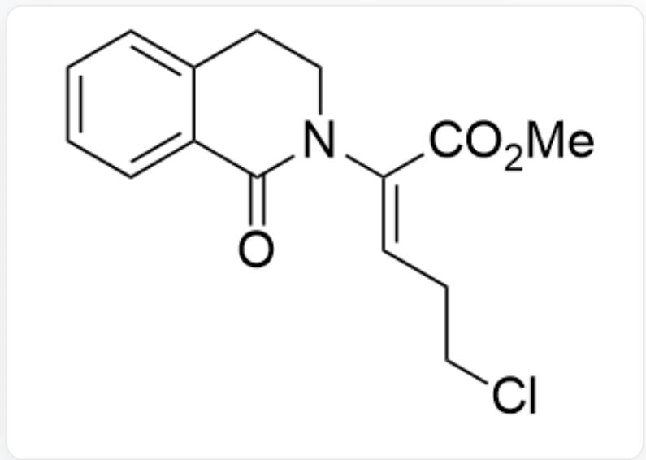  
$\mathrm{O = C1C2 = CC = CC = C2CCN1 / C(C(OC) = O) = C / CCCl}$

D.  
E.  
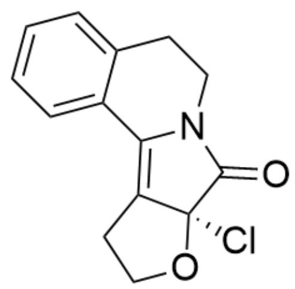  
O=C1[C@]2(Cl)C(CCO2)=C3C4=CC=CC=C4CCN31

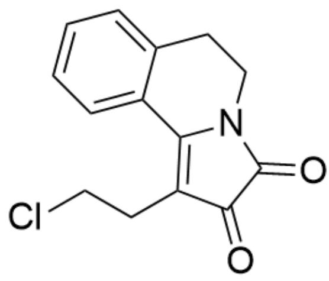  
F.

$\mathrm{O = C(N1C(C2 = CC = CC = C2CC1) = C3CCCl)C3 = O}$

  
G.

$\mathrm{O = C1C2 = CC = CC = C2CCN1 / C(C(OC) = O) = C3CC}\backslash 3$

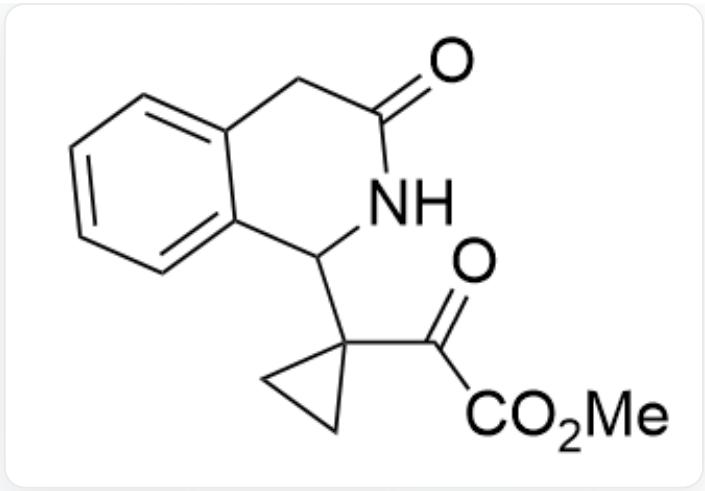  
H.

$\mathrm{O = C1NC(C2(CC2)C(C(OC) = O) = O)C3 = CC = CC = C3C1}$

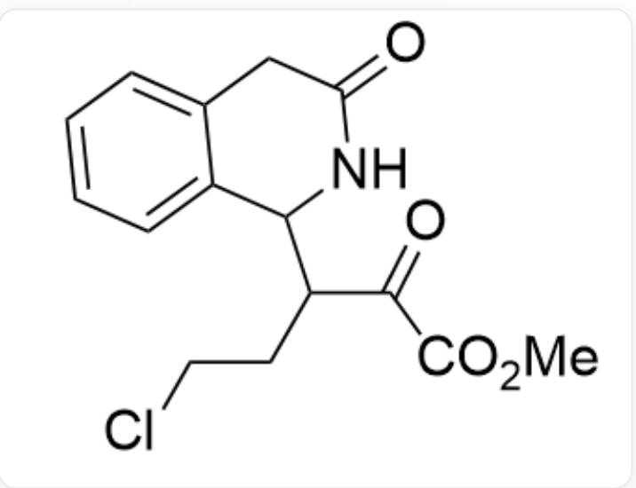

$\mathrm{O = C1NC(C(CCCl)C(C(OC) = O) = O)C2 = CC = CC = C2C1}$

# 答案

正确答案: E

# 详细解析

根据题目提示，第一步底物发生一步周环反应，推知应当发生了逆的  $[3 + 2]$  反应得到中间体1和中间体2

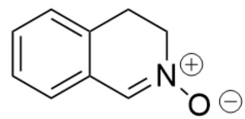  
中间体1：[O-]N1[CH+]C2=CC=CC=C2CC1

# CHECKPOINT

1 PTS

中间体1：[O-]N1[CH+]C2=CC=CC=C2CC1

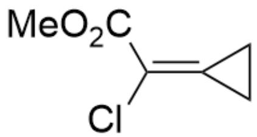

中间体2：C/C(C(OC)=O)=C1CC\1

# CHECKPOINT

1 PTS

中间体2：Cl/C(C(OC)=O)=C1CC\1

接着再次发生  $[3 + 2]$  反应重新成环，得到中间体 3

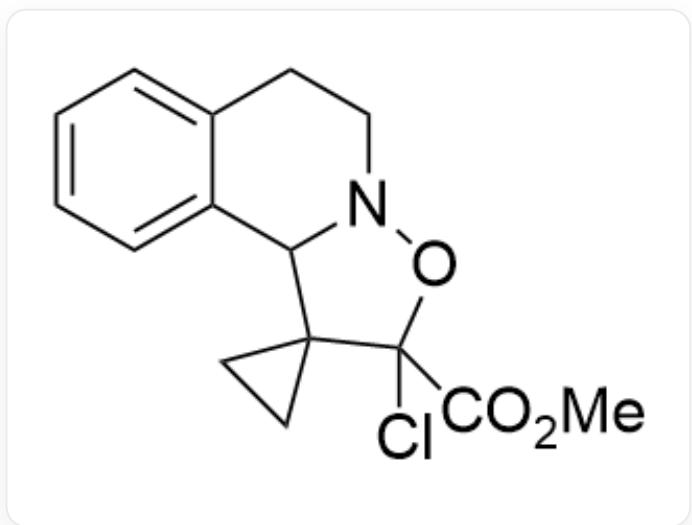

中间体3：CIC1(C(OC)=O)C2(CC2)C3C4=CC=CC=C4CCN3O1

# CHECKPOINT

1 PTS

中间体3：ClC1(C(OC)=O)C2(CC2)C3C4=CC=CC=C4CCN3O1

此时  $\mathrm{Cl}^-$  很容易离去形成中间体4

  
中间体4：O=C(C1=[O+]N2C(C13CC3)C4=CC=CC=C4CC2)OC

# CHECKPOINT

1 PTS

中间体4：O=C(C1=[O+]N2C(C13CC3)C4=CC=CC=C4CC2)OC

进而发生消除反应得到中间体5

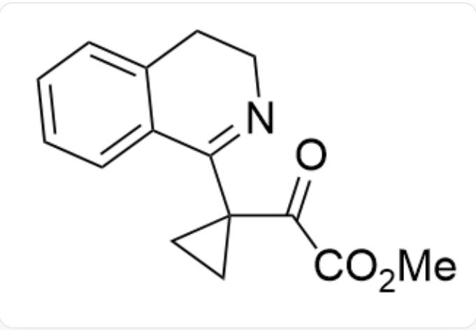

中间体5：O=C(C(OC)=O)C1(CC1)C2=NCCC3=CC=CC=C32

# CHECKPOINT

1 PTS

中间体5：  $O = C(C(OC) = O)C1(CC1)C2 = NCCC3 = CC = CC = C32$

此时三元环受到两个吸电子基团的吸电子诱导作用，极易被  $\mathrm{Cl}^{-}$  亲核进攻开环得到中间体6

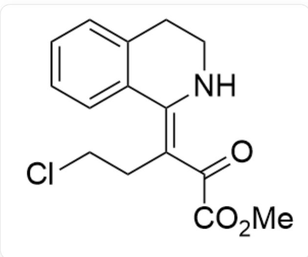

中间体6：  $0 = C(C(OC) = O) / C(CCCI) = C1C2 = CC = CC = C2CCN / 1$

# CHECKPOINT

1 PTS

中间体6：O=C(C(OC)=O)/C(CCCI)=C1C2=CC=CC=C2CCN/1

根据题干，产物A中含有酰胺键，故接下来发生分子内亲核取代反应得到中间体7

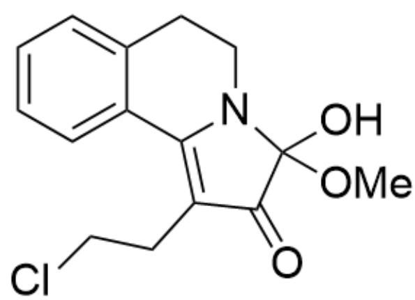  
中间体7：O=C1C(CCCI)=C2C3=CC=CC=C3CCN2C1(OC)O

# CHECKPOINT

1 PTS

中间体7：O=C1C(CCCI)=C2C3=CC=CC=C3CCN2C1(OC)O

进而脱去一分子甲醇得到最终含有酰胺键的产物A

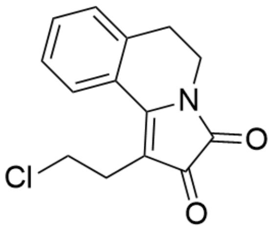

产物A：  $O = C(N1C(C2 = CC = CC = C2CC1) = C3CCCl)C3 = O$