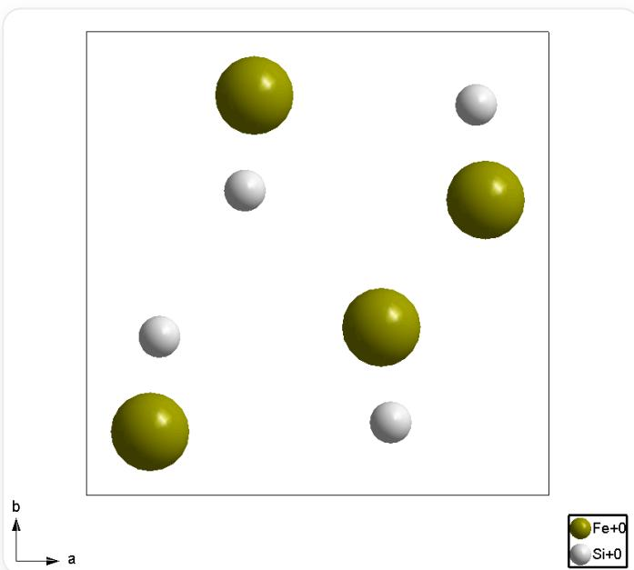
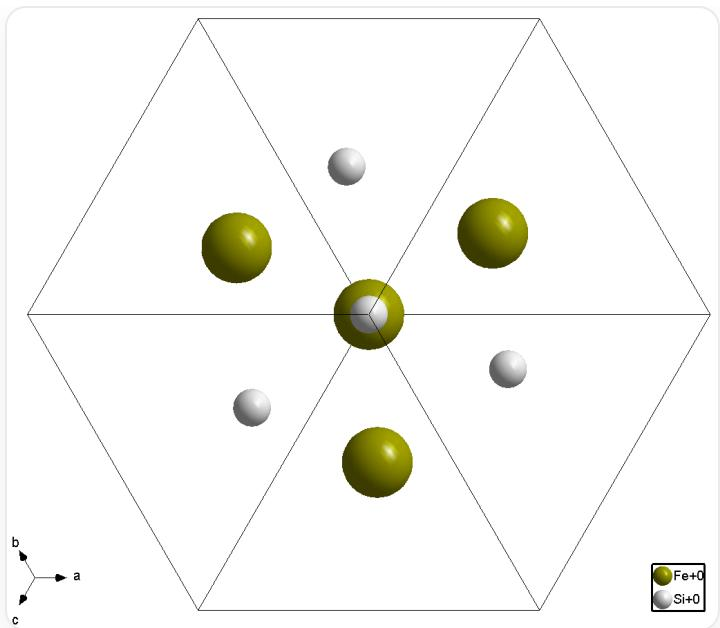
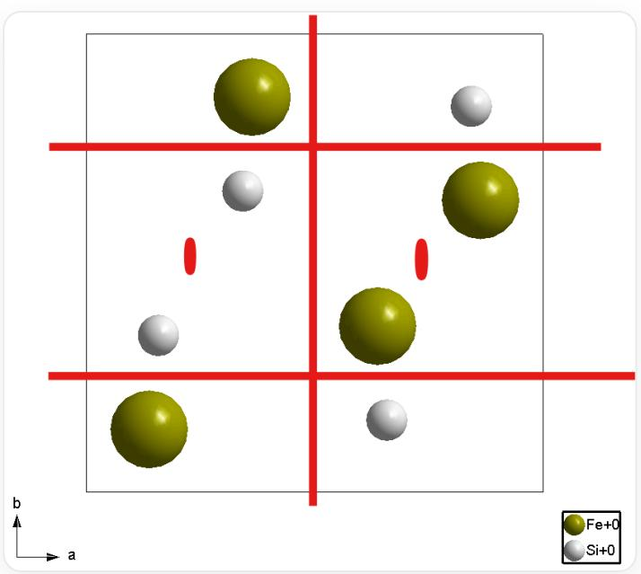

# Question

The following two figures describe the crystal structure of a mineral (the coordinate system is a right-handed system):

  
Figure A.  $c$ -axis projection  
Figure B [111] direction projection

This is a structural diagram showing a square frame outlined by thin black lines. Inside this frame are 4 spheres of each of two colors. Specifically, for the large green spheres, their coordinates are approximately  $(\frac{1}{8}, \frac{1}{8})(\frac{3}{8}, \frac{7}{8})(\frac{5}{8}, \frac{3}{8})(\frac{7}{8}, \frac{5}{8})$ ; for the small silver spheres, their coordinates are approximately  $(\frac{5}{6}, \frac{5}{6})(\frac{4}{6}, \frac{1}{6})(\frac{2}{6}, \frac{4}{6})(\frac{1}{6}, \frac{2}{6})$ . The lower left of the image marks the axes: horizontal to the right is the  $a$ -axis, vertical upwards is the  $b$ -axis, and the center is the origin. The lower right of the image is a legend: the green sphere has the text "Fe+0" to its right, and the silver sphere has the text "Si+0" to its right.

This is a structural diagram showing a hexagonal frame outlined by thin black lines (the upper and lower opposite sides are horizontal), and 6 thin black lines connect the center of the hexagon to the 6 vertices, dividing the hexagon into 6 equilateral triangles. Inside this frame are 4 spheres of each of two colors. Specifically, there is 1 large green sphere and 1 small silver sphere at the center of the hexagon, the small sphere is not obscured by the large sphere; each of the 6 equilateral triangles has 1 sphere, with the bottom, top left, and top right being large green spheres, and the top, bottom right, and bottom left being small silver spheres. The distance between these 6 spheres and the center is between  $\frac{1}{3}$  and  $\frac{2}{3}$  of the side length of the hexagon, and none of these 6 spheres are on the angle bisector of the equilateral triangles. The entire image has 3-fold rotational symmetry. The lower left of the image marks the axes: horizontal to the right is the  $a$ -axis, the  $b$ -axis is at a  $60^{\circ}$  angle to the horizontal line in the top left, the  $c$ -axis is at a  $60^{\circ}$  angle to the horizontal line in the bottom left, and the center is the origin. The lower right of the image is a legend: the green sphere has the text "Fe+0" to its right, and the silver sphere has the text "Si+0" to its right.

Select the option combination that contains the most correct descriptions

1. Chemical formula is FeSi  
2. Crystal structure contains a center of symmetry  
3. Crystal structure contains a threefold roto inversion axis  
4. Crystal structure contains a  $2_{1}$  screw axis  
5. The 4 identical atoms in the unit cell shown form a regular tetrahedron

6. All atoms in the unit cell are located at the position with the highest symmetry in their space group  
7. The space group number is greater than 210  
8. The space group number is less than or equal to 210

A. 125  
B. 345  
C. 1346  
D. 1358  
E. 12467  
F. 4568  
G. 1468  
H. There is more than one combination of options that contains the most correct descriptions.

# Answer

Correct Answer: G

# Detailed Explanation

Figure A and Figure B show that the structure has 4 Fe (green spheres) and 4 Si (silver spheres), and the projection represents all atoms of a unit cell. Therefore, the chemical formula is  $\mathrm{Fe_4Si_4}$  within the unit cell, simplified to FeSi

# CHECKPOINT

1 PTS

The chemical formula is  $\mathrm{Fe_4Si_4}$  within the unit cell, simplified to FeSi

In the [111] direction projection of Figure B, the positions of the spheres do not have a center of symmetry relationship. Therefore, the structure as a whole has no center of symmetry.

# CHECKPOINT

1 PTS

The structure as a whole has no center of symmetry

A rotoinversion axis of order three contains a center of symmetry, so if there is no center of symmetry, there must be no rotoinversion axis of order three.

# CHECKPOINT

1 PTS

If there is no center of symmetry, there must be no roto inversion axis of order three

Excluding the center of symmetry, the associated equivalent atoms in the  $c$ -axis projection can only be twofold axes, and the two atoms in the  $a$ -axis and  $b$ -axis directions are not directly opposite each other, so it can be determined that it is a  $2_{1}$  screw axis.

  
21 screw axis position

# CHECKPOINT

1 PTS

$2_{1}$  screw axis exists

The cubic crystal system point groups that do not contain a center of symmetry are only  $T, O, T_d$ , and as can be seen from Figure A, there is no fourfold axis in the  $c$ -axis direction, so it can only be the  $T$  point group, and all

numbers in the  $T$  group are less than 210. In fact, this mineral is named Naqu mineral and belongs to the  $P2_{1}3$  space group.

# CHECKPOINT

1 PTS

There is no fourfold axis in the  $c$ -axis direction, so it can only be the  $T$  point group

# CHECKPOINT

1 PTS

This mineral belongs to the  $P2_{1}3$  space group

The space group  $P2_{1}3$  lacks two-fold rotation axes, possessing only  $2_{1}$  screw axes. Consequently, the formation of a regular tetrahedron is impossible.

# CHECKPOINT

1 PTS

4 identical atoms cannot form a regular tetrahedron

Correct description is 1468

# CHECKPOINT

1 PTS

Correct description is 1 4 6 8

The answer is G