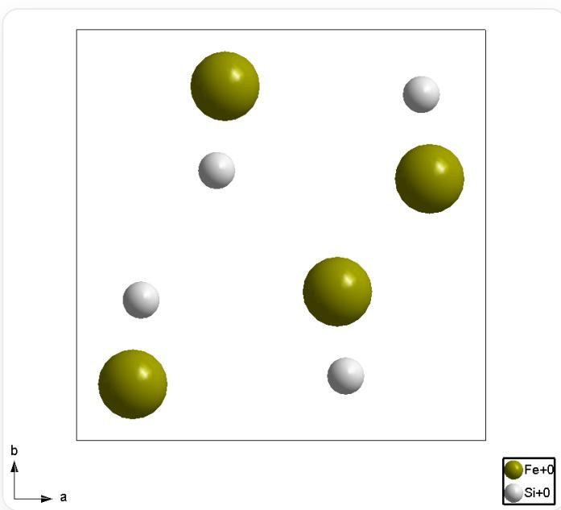
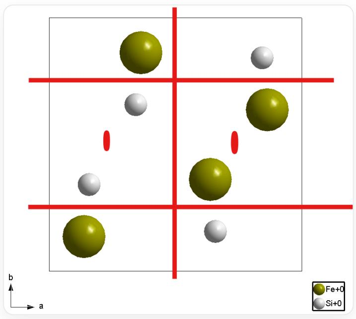

# 题目

以下两图描述了一种矿石的晶体结构（坐标系为右手系）：

  
图A.  $c$  轴投影  
图B[111]方向投影

这是一张结构示意图，显示了一个由黑色细线勾勒出的正方形边框。在这个边框的内部分布着两种颜色的圆球各4个。具体来说，对于绿色大球，其坐标近似于  $\left(\frac{1}{8},\frac{1}{8}\right)\left(\frac{3}{8},\frac{7}{8}\right)\left(\frac{5}{8},\frac{3}{8}\right)\left(\frac{7}{8},\frac{5}{8}\right)$ ；对于银色小球，其坐标近似于  $\left(\frac{5}{6},\frac{5}{6}\right)\left(\frac{4}{6},\frac{1}{6}\right)\left(\frac{2}{6},\frac{4}{6}\right)\left(\frac{1}{6},\frac{2}{6}\right)$ 。图片左下部标记了轴向：水平向右为  $a$  轴，竖直向上为  $b$  轴，中心为原点。图片右下部为图例：绿色球右侧为文字“Fe+0”，银色球右侧为文字“Si+0”。

这是一张结构示意图，显示了一个由黑色细线勾勒出的正六边形边框（上下两个对边水平），此外还有6条黑色细线连接正六边形中心和6个顶点，并将正六边形分割为6个正三角形。在这个边框内部分布着两种颜色的圆球各4个。具体来说，正六边形中心有1个绿色大球和1个银色小球，小球未被大球遮挡；在6个正三角形中各有1个球，其中正下方、左上方、右上方为绿色大球，正上方、右下方、左下方为银色小球，这6个球与中心的距离在正六边形边长的  $\frac{1}{3}$  至  $\frac{2}{3}$  之间，且这6个球均不在正三角形的角平分线上。整张图具有3重旋转对称性。图片左下部标记了轴向：水平向右的是  $a$  轴，左上与水平线成  $60^{\circ}$  角的是  $b$  轴，左下与水平线成  $60^{\circ}$  角的是  $c$  轴，中心为原点。图片右下部为图例：绿色球右侧为文字“Fe+0”，银色球右侧为文字“Si+0”。

# 选出包含正确描述最多的选项组合

1. 化学式为FeSi  
2. 晶体结构中含有对称中心  
3. 晶体结构中含有三重反轴  
4. 晶体结构中含有  $2_{1}$  螺旋轴  
5. 图示晶胞中4个相同原子组成正四面体  
6. 晶胞中所有原子均处在所属空间群中对称性最高的位置  
7. 所属空间群编号大于210  
8. 所属空间群编号小于或等于210

A. 125  
B. 345  
C. 1346  
D. 1358  
E. 12467  
F. 4568  
G. 1468  
H. 包含正确描述最多的选项组合不止一个

# 答案

正确答案: G

# 详细解析

图A和图B显示结构中有4个Fe（绿色球）和4个Si（银色球），且投影图代表一个晶胞的全部原子。因此化学式为单位晶胞内  $\mathrm{Fe_4Si_4}$ ，简化为  $\mathrm{FeSi}$

# CHECKPOINT

1 PTS

化学式为单位晶胞内  $\mathrm{Fe_4Si_4}$ , 简化为  $\mathrm{FeSi}$

图B的[111]方向投影中，球的位置不存在对称中心关系。因此结构整体无对称中心

# CHECKPOINT

1 PTS

结构整体无对称中心

三重反轴包含对称中心, 因此没有对称中心一定没有三重反轴

# CHECKPOINT

1 PTS

没有对称中心一定没有三重反轴

排除对称中心后，  $c$  轴投影图中关联等价的原子只能是二重轴，且  $a$  轴与  $b$  轴方向上并两原子没有正对，可以确定是  $2_{1}$  螺旋轴

  
$2_{1}$  螺旋轴所在位置

# CHECKPOINT

1 PTS

存在  $2_{1}$  螺旋轴

不包含对称中心的立方晶系点群仅有  $T, O, T_{d}$ , 而从图A中可以看出,  $c$  轴方向没有四重轴, 因此只能是  $T$  点群, 而  $T$  群所有编号均小于210. 实际上, 此矿物名为那曲矿属于  $P 2_{1} 3$  空间群

# CHECKPOINT

1 PTS

$c$  轴方向没有四重轴, 因此只能是  $T$  点群

# CHECKPOINT

1 PTS

此矿物属于  $P2_{1}3$  空间群

$P2_{1}3$  空间群没有二重旋转轴，只有  $2_{1}$  螺旋轴，因此不可能组成正四面体。

# CHECKPOINT

1 PTS

4个相同原子无法组成正四面体

正确描述为1468

# CHECKPOINT

1 PTS

正确描述为1468

答案为G