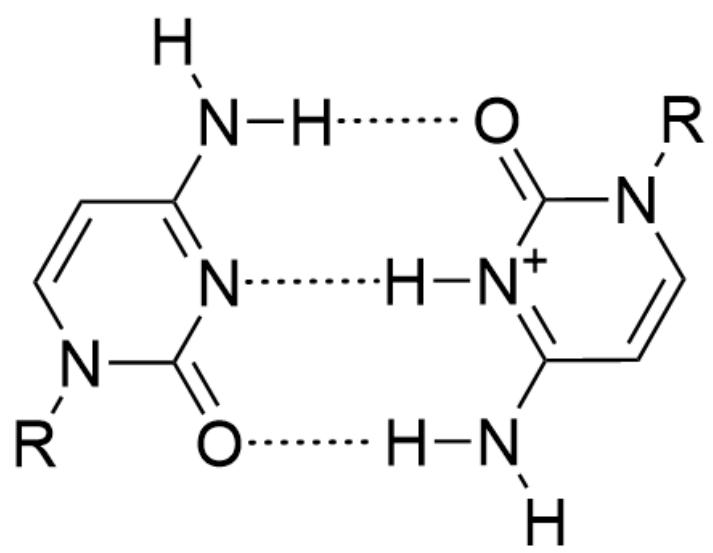

# Question

DNA is an important biomolecule. In organisms, the four bases  $A, T, C, G$  in DNA molecules have strict matching rules: the Watson-Crick base pairing rule. However, in rare organisms, or under in vitro conditions, bases may form combinations that do not conform to Watson-Crick pairing. For example, if a base is protonated, it can form unusual pairing patterns; in addition, DNA can also form triple helix structures, mainly divided into pyrimidine-purine-pyrimidine and purine-purine-pyrimidine pairing modes.

Replace one H atom on the N atom of acrylamide with the following two DNA single strands: (1)  $5^{\prime} - (AAA)_7 - 3^{\prime}$ ; (2)  $5^{\prime} - (AAACCCC)_2 - 3^{\prime}$ ; then copolymerize these two substituted acrylamides together with acrylamide to prepare polyacrylamide containing a certain number of DNA side chains. Studies have shown that the polymer undergoes different conformational changes in aqueous systems with different pH values and exists in the form of hydrogels or ordinary aqueous solutions. Please determine the form in which the polymer exists in each of the following scenarios.

(a) When the pH of the system is 1.1;  
(b) When the  $\mathsf{pH}$  of the system is 5.2;  
(c) When the pH of the system is 7.2;  
(d) Continue to add the following two DNA single strands to system (c) in sequence,  $5^{\prime} - (TTT)_{7} - 3^{\prime}$ ;  $5^{\prime} - (TTT)_{15} - 3^{\prime}$ ;  
(e) When the pH of the system is 10.2;  
(f) Continue to add the following two DNA single strands to system (e) in sequence,  $5^{\prime} - (TTT)_{7} - 3^{\prime}$ ;  $5^{\prime} - (TTT)_{15} - 3^{\prime}$ ;

When answering, please select six correct answers in sequence from the options below to form an answer sequence (such as AAABB):

A. Hydrogel B. Aqueous solution

A. All other options are incorrect  
B. AAAAAA  
C. AABAAA  
D. AABABA  
E. ABAABB  
F. BBABAA  
G. AAAABB  
H. ABAABA  
I. AAAABA  
J. BBBBBB  
K. ABBABB

# Answer

Correct Answer: A

# Detailed Explanation

After the bases are protonated, they can form unusual pairing patterns. The bases given in the question are mainly  $A$  and  $C$ , so consider the pairing situations after these two bases are protonated.

After  $A$  is protonated, it can produce  $A H^{+} - H^{+}A$  pairing, and its structure is shown in the figure below:

The figure shows two  $[H][N+](C=NC1=C2N=CN1[R])=C2N([H])[H]$  forming hydrogen bonds with each other. The amine group at the 6-position of each purine ring forms a hydrogen bond with the nitrogen atom at the 7-position of the other purine ring.

CHECKPOINT

1 PTS

Protonated  $A$  can form  $AH^{+} - H^{+}A$  pairing

Similarly, protonated  $C$  can also form hydrogen bonds with unprotonated  $C$ , and its structure is as follows:

The figure shows three hydrogen bonds formed between O=C1N([R])C=CC(N([H])[H])=[N+]1[H] and O=C2N([R])C=CC(N([H])[H])=N2. The carbonyl group at the 2-position of the pyrimidine ring forms a hydrogen bond with the amine group at the 4-position of the other pyrimidine ring, and the nitrogen atoms at the 3-position of the two pyrimidine rings form a hydrogen bond through a proton.

# CHECKPOINT

1 PTS

Protonated  $C$  can form  $\mathrm{H}^{+}C:C$  pairing with unprotonated  $C$

In addition, the question also mentions a triple helix structure. In this question, a pyrimidine-purine-pyrimidine pairing method can be formed, such as  $T \cdot A - T$  pairing, and its structure is shown in the figure below:

The figure shows the three-base pairing structure formed between two CC(C(N1[H])=O)=CN(C1=O)[R] and one [H]N(C1=NC=NC2=C1N=CN2[R])[H]. The nitrogen atom at the 1-position and the amine group at the 6-position of the purine ring form two hydrogen bonds with the amine group at the 3-position and the carbonyl group at the 4-position of one pyrimidine ring, respectively. The nitrogen atom at the 7-position and the amine group at the 6-position of the same purine ring form two hydrogen bonds with the amine group at the 3-position and the carbonyl group at the 4-position of the other pyrimidine ring, respectively.

# CHECKPOINT

1 PTS

$T$  can form  $T\cdot A - T$  pairing with  $A$

With these three pairing methods, we can start analyzing the options.

(a) When the pH of the system is 1.1, the bases  $A$  in the acrylamide side chain  $5' - (AAA)_7 - 3'$  are largely protonated to  $AH^+$ , and cross-linking between chains is achieved through  $AH^+ - H^+A$  pairing, resulting in its existence in the form of a hydrogel.

# CHECKPOINT

1 PTS

When  $\mathrm{pH} = 1.1$ , cross-linking between chains is achieved through  $AH^{+} - H^{+}A$  pairing, existing in the form of a hydrogel

(b) When the pH of the system is 5.2, the bases  $C$  in the acrylamide side chain  $5' - (AAACCCC)_2 - 3'$  are partially protonated to  $CH^+$ , and cross-linking between chains is achieved through  $H^+ C : C$  pairing, resulting in its existence in the form of a hydrogel.

# CHECKPOINT

1 PTS

When  $\mathrm{pH} = 5.2$ , cross-linking between chains is achieved through  $\mathrm{H}^{+}C: C$  pairing, existing in the form of a hydrogel

(c) When the pH of the system is 7.2,  $A$  and  $C$  are hardly protonated, and cross-linking between chains is difficult, resulting in its existence in the form of an aqueous solution.

# CHECKPOINT

1 PTS

When the pH of the system is 7.2,  $A$  and  $C$  are hardly protonated, and cross-linking between chains is difficult

(d) After adding  $5^{\prime} - (TTT)_7 - 3^{\prime}$ ;  $5^{\prime} - (TTT)_{15} - 3^{\prime}$ , a triple helix structure of  $T \cdot A - T$  pairing is formed in the system. Since the length of  $5^{\prime} - (AAA)_7 - 3^{\prime}$  and  $5^{\prime} - (TTT)_7 - 3^{\prime}$  are equal, and the length of  $5^{\prime} - (TTT)_{15} - 3^{\prime}$  is slightly larger than twice the length of  $5^{\prime} - (AAA)_7 - 3^{\prime}$ , each  $5^{\prime} - (TTT)_{15} - 3^{\prime}$  can pair with two  $5^{\prime} - (AAA)_7 - 3^{\prime}$  of the side chain (as well as two  $5^{\prime} - (TTT)_{15} - 3^{\prime}$ ) to achieve cross-linking between chains, resulting in its existence in the form of a hydrogel.

# CHECKPOINT

2 PTS

Each  $5^{\prime} - (TTT)_{15} - 3^{\prime}$  can pair with two  $5^{\prime} - (AAA)_{7} - 3^{\prime}$  of the side chain to achieve cross-linking between chains, forming a triple helix structure of  $T\cdot A - T$  pairing

(e) (f) When the pH of the system is 10.2, the  $\mathrm{N - H}$  of the base  $T$  is deprotonated, making it difficult to form a  $T\cdot A - T$  pairing structure, resulting in its existence in the form of an aqueous solution.

# CHECKPOINT

1 PTS

When  $\mathrm{pH} = 10.2$ , the  $\mathbf{N} - \mathbf{H}$  of the base  $T$  is deprotonated, making it difficult to form a  $T \cdot A - T$  pairing structure

Therefore, the answer is AABABB, and option A is correct.