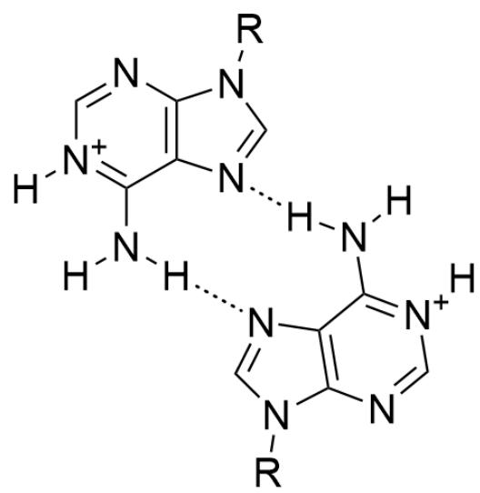
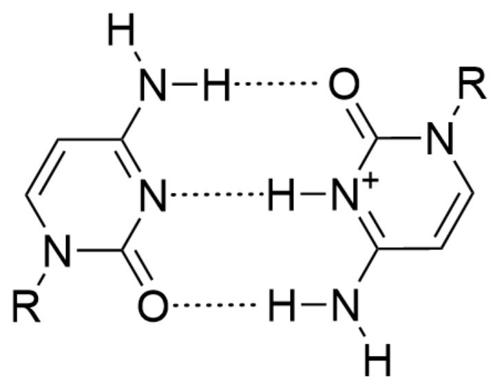
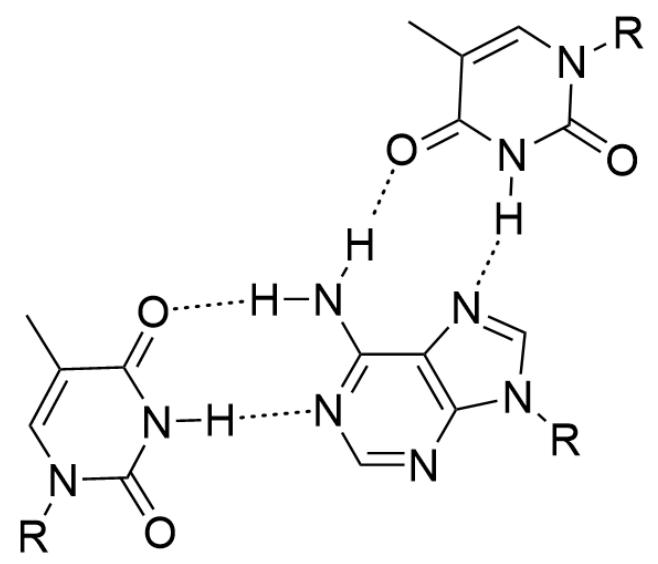

# 题目

DNA是一种重要的生物分子。在生物体中，DNA分子中的四种碱基A、T、C、G之间有着严格的匹配规则：Watson-Crick碱基互补配对规则。但是，在极少数的生物体中，或者在体外条件下，碱基有可能形成不符合Watson-Crick配对的组合模式。例如，若碱基被质子化，则可以形成不同寻常的配对形式；此外，DNA还可形成三螺旋结构，主要分为嘧啶-嘌呤-嘧啶和嘌呤-嘌呤-嘧啶两种配对模式。

将丙烯酰胺的  $\mathrm{N}$  原子上的1个H原子用以下两种DNA单链取代，  $(1)5^{\prime} - (AAA)_{7} - 3^{\prime};(2)$ $5^{\prime} - (AAACCCC)_{2} - 3^{\prime}$  ；然后将这两种取代丙烯酰胺和丙烯酰胺一起进行共聚，可以制得含有一定数量的DNA侧链的聚丙烯酰胺。研究表明，该聚合物在不同pH的水体系中会发生不同的变构反应，并以水凝胶或普通水溶液的形体存在。请分别判断下列几个情形中该聚合物的存在形式是什么。

(a) 体系的  $\mathrm{pH} = 1.1$  时;  
(b) 体系的  $\mathrm{pH} = 5.2$  时;  
（c）体系的  $\mathrm{pH} = 7.2$  时；  
(d) 继续向体系 (c) 依次加入以下两种DNA单链,  $5^{\prime} - (TTT)_{7} - 3^{\prime}$ ;  $5^{\prime} - (TTT)_{15} - 3^{\prime}$  时;  
(e) 体系的  $\mathrm{pH} = 10.2$  时;  
(f) 继续向体系 (e) 依次加入以下两种DNA单链,  $5^{\prime} - (TTT)_{7} - 3^{\prime}$ ;  $5^{\prime} - (TTT)_{15} - 3^{\prime}$  时;

作答时请从下面的选项中进行依次选择六个正确的答案组成答案序列（如AAABB）：

A.水凝胶 B.水溶液

A. 其他选项均不正确  
B. AAAAAA  
C. AABAAA

D. AABABA  
E. ABAABB  
F. BBABAA  
G. AAAABB  
H. ABAABA  
I. AAAABA  
J. BBBBBB  
K. ABBABB

# 答案

正确答案: A

# 详细解析

碱基被质子化后可以形成不同寻常的配对形式，题中所给的碱基主要为  $A$  和  $C$  ，因此考虑这两种碱基质子化后的配对情况。

A被质子化后可以产生  $AH^{+} - H^{+}A$  配对，其结构如下图所示：

  
图中展示了两个[H][N+](C=NC1=C2N=CN1[R])=C2N([H])[H]互相形成氢键，每个嘌呤环6号位上的胺基与另一个嘌呤环上7号位的氮原子形成氢键。

CHECKPOINT

1 PTS

质子化的  $A$  之间可以形成  $A H^{+} - H^{+} A$  配对

类似的，质子化的  $C$  与未质子化的  $C$  之间也可以形成氢键，其结构如下：

  
图中展示了  $O = C 1 N ([ R ]) C = C C (N ([ H ]) [ H ]) = [ N + ] 1 [ H ]$  与  $O = C 2 N ([ R ]) C = C C (N ([ H ]) [ H ]) = N 2$  之间形成三根氢键，嘧啶环2号位的羰基与另一个嘧啶环4号位的胺基形成氢键，两个嘧啶环3号位的氮原子通过一个质子形成一根氢键。

# CHECKPOINT

1 PTS

质子化的  $C$  与未质子化的  $C$  之间可以形成  $\mathrm{H}^{+} C: C$  配对

除此之外，题目中还提到了三螺旋结构，在此题中可以形成嘧啶-嘌呤-嘧啶型配对方式，如  $T\cdot A - T$  配对，其结构如下图所示：

图中展示了两个CC(C(N1[H])=O)=CN(C1=O)[R]和一个[H]N(C1=NC=NC2=C1N=CN2[R])[H]之间形成的三碱基配对结构，嘌呤环1号位的氮原子和6号位的胺基分别与一个嘧啶环3号位的胺基和4号位的羰基形成两根氢键，同一个嘌呤环7号位的氮原子和6号位的胺基分别与另一个嘧啶环3号位的胺基和4号位的羰基形成两根氢键。

# CHECKPOINT

1 PTS

$T$  与  $A$  之间可以形成  $T \cdot A - T$  配对

有了这三种配对方式后就可以开始分析选项了。

(a) 体系的  $\mathrm{pH} = 1.1$  时, 丙烯酰胺侧链的  $5^{\prime} - (AAA)_{7} - 3^{\prime}$  中的碱基  $A$  大量被质子化为  $\mathrm{AH^{+}}$ , 并通过  $\mathrm{AH^{+}} - \mathrm{H^{+}} A$  配对实现链间交联, 导致其以水凝胶的形体存在。

# CHECKPOINT

1 PTS

$\mathrm{pH} = 1.1$  时通过  $A H^{+} - H^{+} A$  配对实现链间交联，以水凝胶的形体存在

(b) 体系的  $\mathrm{pH} = 5.2$  时, 丙烯酰胺侧链的  $5^{\prime} - (AAACCCC)_{2} - 3^{\prime}$  中的碱基  $C$  部分被质子化为  $CH^{+}$ , 并通过  $\mathrm{H}^{+} C: C$  配对实现链间交联, 导致其以水凝胶的形体存在。

# CHECKPOINT

1 PTS

$\mathrm{pH} = 5.2$  时通过  $\mathrm{H}^{+} C: C$  配对实现链间交联，以水凝胶的形体存在

(c) 体系的  $\mathrm{pH} = 7.2$  时,  $A, C$  几乎不发生质子化, 链间难以交联, 导致其以水溶液的形体存在。

# CHECKPOINT

1 PTS

体系的  $\mathrm{pH} = 7.2$  时  $A, C$  几乎不发生质子化，链间难以交联

(d) 加入  $5^{\prime} - (TTT)_{7} - 3^{\prime}$ ;  $5^{\prime} - (TTT)_{15} - 3^{\prime}$  后, 体系内形成  $T \cdot A - T$  配对的三螺旋结构, 又由于  $5^{\prime} - (AAA)_{7} - 3^{\prime}$  与  $5^{\prime} - (TTT)_{7} - 3^{\prime}$  的长度相等,  $5^{\prime} - (TTT)_{15} - 3^{\prime}$  的长度稍大于  $5^{\prime} - (AAA)_{7} - 3^{\prime}$  长度的2倍, 因此每条  $5^{\prime} - (TTT)_{15} - 3^{\prime}$  可以与两条侧链的  $5^{\prime} - (AAA)_{7} - 3^{\prime}$  （以及两条  $5^{\prime} - (TTT)_{15} - 3^{\prime}$ ）进行配对实现链间交联, 导致其以水凝胶的形体存在。

# CHECKPOINT

2 PTS

每条  $5^{\prime} - (TTT)_{15} - 3^{\prime}$  可以与两条侧链的  $5^{\prime} - (AAA)_{7} - 3^{\prime}$  进行配对实现链间交联，形成  $T\cdot A - T$  配对的三螺旋结构

(e) (f) 体系的  $\mathrm{pH} = 10.2$  时, 碱基  $T$  的  $\mathrm{N}-\mathrm{H}$  被去质子化, 难以形成  $T \cdot A - T$  配对结构, 导致其以水溶液的形体存在。

# CHECKPOINT

1 PTS

$\mathrm{pH} = 10.2$  时碱基  $T$  的  $\mathrm{N}-\mathrm{H}$  被去质子化难以形成  $T \cdot A - T$  配对结构

因此答案为AABABB，选项A正确。