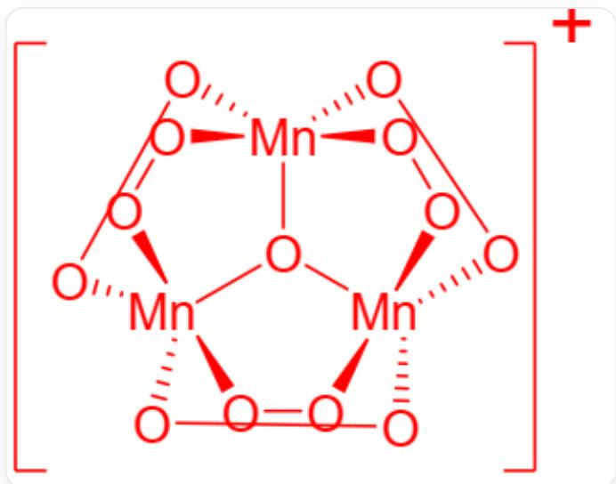

# 题目

分布广泛的常见金属元素M的羰基化合物A可与  $\mathrm{N}_2\mathrm{O}_4$  反应，得到不常见的  $+1$  价M的化合物B并放出无色气体。A也可以直接与溴反应得另一种  $+1$  价M的化合物C。电解M的常见价态乙酸盐水溶液可以得到一种多核配合物，其阳离子D中包含一个3配位氧原子且M的质量分数为 $30.80\%$

以下选项正确的是

A. M位于第IB族  
B. A 的分子式可以表达为  $\mathrm{M}(\mathrm{CO})_{6}$  
C. A 中存在桥接的羰基配体  
D. A 可与  $\mathrm{N}_{2} \mathrm{O}_{4}$  反应生成  $\mathrm{B}$  的过程中放出  $\mathrm{CO}$  
E. 在元素周期表中位于  $\mathrm{M}$  正下方且相邻的金属  $\mathrm{M}^{\prime}$  有稳定的非放射性同位素  
F. 用  $\mathbf{M}$  的最高价含氧酸根和亚硫酸根反应, 可得一种含  $\mathbf{M}$  的不稳定含氧酸根, 这种含氧酸根的钠盐可在水溶液中歧化, 将歧化方程式配平并将系数化为最简整数比, 方程式左边系数和大于右边系数和。  
G. 阳离子  $\mathrm{D}$  的价态为 +1 价  
H. 以上选项均不正确

# 答案

正确答案: G

# 详细解析

题目中提到  $\mathbf{D}$  是一个多核配合物阳离子,包含一个3配位氧原子（ $\mu_{3}-0$ ），并且  $\mathbf{D}$  中  $\mathbf{M}$  的质量分数为  $30.80\%$  。具有  $\mu_{3}-0$  桥联氧原子的多核金属乙酸盐配合物是一个经典结构，其通式通常为  $\left[\mathrm{M}_{3}(\mu_{3}-0)(\mu_{2}-\mathrm{CH}_{3} \mathrm{COO})_{6}\right]^{n+}$ ，阳离子  $\mathbf{D}$  的摩尔质量  $= 3 \times Ar(\mathbf{M}) + 370.26$  ，因此得到方程：

$$
3 \times A r (\mathbf {M}) = 0. 3 0 8 \times (3 \times A r (\mathbf {M}) + 3 7 0. 2 6)
$$

解得  $\mathbf{M}$  的质量为54.93，符合这个质量的金属元素是Mn，A错误

# CHECKPOINT

1 PTS

M是Mn

金属元素M的羰基化合物A的分子式应该为  $\mathrm{Mn_2(CO)_10}$  ，由两个  $(\mathrm{CO})_{5}\mathrm{Mn}$  亚基通过  $\mathrm{Mn - Mn}$  金属键轴向连接，没有桥接的羰基配体，B、C错误

# CHECKPOINT

1 PTS

A 为  $\mathrm{Mn}_{2}(\mathrm{CO})_{10}$

A 可与  $\mathrm{N}_{2} \mathrm{O}_{4}$  反应，得到不常见的 +1 价  $\mathbf{M}$  的化合物  $\mathbf{B}$  并放出无色气体。 $\mathrm{Mn}_{2}(\mathrm{CO})_{10}$  中金属价态为 0，反应中被氧化，方程式为

$$
2 \mathrm {N} _ {2} \mathrm {O} _ {4} + \mathrm {M n} _ {2} (\mathrm {C O}) _ {1 0} = 2 \mathrm {O} _ {2} \mathrm {N O M n} (\mathrm {C O}) _ {5} + 2 \mathrm {N O}
$$

B 为  $\mathrm{O}_{2} \mathrm{NOMn}(\mathrm{CO})_{5}, \mathrm{~A}$  可与  $\mathrm{N}_{2} \mathrm{O}_{4}$  反应生成  $\mathrm{B}$  的过程中放出  $\mathrm{NO}$ , D 错误

# CHECKPOINT

1 PTS

B 为  $\mathrm{O}_{2} \mathrm{NOMn}(\mathrm{CO})_{5}$

A 也可以直接与溴反应得另一种  $+1$  价  $\mathbf{M}$  的化合物 C，方程式为

$$
\mathrm {B r} _ {2} + \mathrm {M n} _ {2} (\mathrm {C O}) _ {1 0} = 2 \mathrm {B r M n} (\mathrm {C O}) _ {5}
$$

C为  $\mathrm{BrMn(CO)}_5$

在元素周期表中位于M正下方且相邻的金属  $\mathbf{M}^{\prime}$  为Tc，是第一个用人工方法制得的金属，没有稳定的非放射性同位素，只有放射性同位素，E错误

# CHECKPOINT

1 PTS

$\mathbf{M}^{\prime}$  为  $\mathrm{Tc}$ ，没有稳定的非放射性同位素

用M的最高价含氧酸根和亚硫酸根反应，可得一种含M的不稳定含氧酸根，最高价含氧酸根中Mn为  $+7$  价，和亚硫酸根反应后变为  $+5$  价。这种含氧酸根的钠盐可在水溶液中歧化，方程式为

$$
2 \mathrm {N a} _ {3} \mathrm {M n O} _ {4} + 2 \mathrm {H} _ {2} \mathrm {O} = \mathrm {N a} _ {2} \mathrm {M n O} _ {4} + \mathrm {M n O} _ {2} + 4 \mathrm {N a O H}
$$

，左边系数和小于右边系数和，F错误

# CHECKPOINT

1 PTS

歧化方程式为

$$
2 \mathrm {N a} _ {3} \mathrm {M n O} _ {4} + 2 \mathrm {H} _ {2} \mathrm {O} = \mathrm {N a} _ {2} \mathrm {M n O} _ {4} + \mathrm {M n O} _ {2} + 4 \mathrm {N a O H}
$$

阳离子D的结构如图所示

阳离子D的结构，结构式为  $\left[\mathrm{Mn}_{3}\left(\mu_{3}-\mathrm{O}\right)\left(\mu_{2}-\mathrm{CH}_{3} \mathrm{COO}\right)_{6}\right]^{+}, \mathrm{O}-\mathrm{O}$  代表乙酸根双齿配体，其中存在3个  $\mathrm{Mn}, 1$  个  $\mu_{3}-\mathrm{O}$  和6个乙酸根配体，每个  $\mathrm{Mn}$  和4个乙酸根的O以及  $\mu_{3}-\mathrm{O}$  相连，价态为  $+1$  价

阳离子  $\mathbf{D}$  的结构式为  $[\mathrm{Mn}_3(\mu_3 - \mathrm{O})(\mu_2 - \mathrm{CH}_3\mathrm{COO})_6]^+$ ,  $\mathrm{O} - \mathrm{O}$  代表乙酸根双齿配体, 其中存在3个  $\mathrm{Mn},1$  个  $\mu_3 - \mathrm{O}$  和6个乙酸根配体, 每个  $\mathrm{Mn}$  和4个乙酸根的  $\mathrm{O}$  以及  $\mu_3 - \mathrm{O}$  相连, 价态为  $+1$  价

# CHECKPOINT

1 PTS

阳离子  $\mathbf{D}$  的结构式为  $[\mathrm{Mn}_3(\mu_3 - \mathrm{O})(\mu_2 - \mathrm{CH}_3\mathrm{COO})_6]^+$