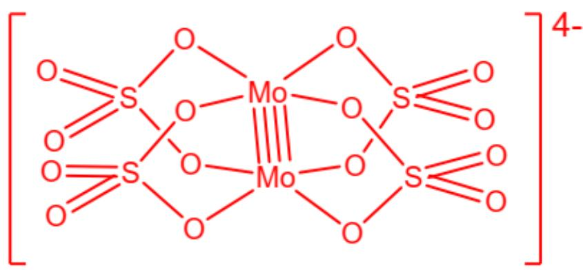

# Question

X-ray diffraction reveals that the anion of the diamagnetic pink potassium salt  $\mathrm{K}_2\mathrm{Mo}(\mathrm{SO}_4)_2$  is a binuclear complex ion, in which the sulfate ion acts as a bridging ligand, and the nuclear distance between molybdenum atoms is  $211~\mathrm{pm}$ . Recrystallization of this double salt yields a potassium salt with the chemical formula  $\mathrm{K}_3\mathrm{Mo}_2(\mathrm{SO}_4)_4 \cdot 3.5\mathrm{H}_2\mathrm{O}$ , whose anion retains the structure of the  $\mathrm{K}_2\mathrm{Mo}(\mathrm{SO}_4)_2$  anion but exhibits a different overall charge. Calculate the product of the Mo - Mo bond orders for the two anions mentioned above.

A. 0.5  
B. 1.5  
C. 3  
D. 5  
E. 7.5  
F. 10.5  
G. 14  
H. 18  
1. 22.5  
J. 33

K. 39  
L. 12  
M. 16

# Answer

Correct Answer: G

# Detailed Explanation

According to the problem statement, the dinuclear anion in  $\mathrm{K}_2\mathrm{Mo}(\mathrm{SO}_4)_2$  is  $[\mathrm{Mo}_2(\mathrm{SO}_4)_4]^{4-}$ , which contains 2 Mo atoms and 4 sulfate groups, with a total charge of -4.

# CHECKPOINT

1 PTS

The dinuclear anion is  $\left[\mathrm{Mo}_2(\mathrm{SO}_4)_4\right]^{4-}$

In this anion, the oxidation state of Mo is  $\frac{1}{2} (-4 + 2 \times 4) = +2$ , and the number of valence electrons is  $6 - 2 = 4$ .

# CHECKPOINT

1 PTS

The oxidation state of Mo is  $+2$ , and the number of valence electrons is 4.

Each Mo atom contributes 4 valence electrons, forming a diamagnetic anion, making it reasonable for a Mo - Mo quadruple bond to form.

# CHECKPOINT

1 PTS

The bond order of  $\mathrm{Mo - Mo}$  in the  $[\mathrm{Mo}_2(\mathrm{SO}_4)_4]^{4 - }$  anion is 4

Based on the above analysis, the structure of  $\left[\mathrm{Mo}_{2}(\mathrm{SO}_{4})_{4}\right]^{4-}$  can be drawn as:

[Structure of [Mo_2(SO_4)] $\wedge$  {4-}, containing 2 Mo, 4 S, 16 O, enclosed by square brackets with a 4- superscript at the upper right. A quadruple bond exists between Mo-Mo, with 4 five-membered rings arranged in the Mo-O-S-O-Mo sequence. The Mo-O and S-O bonds in the rings are single bonds. The 8 O atoms bonded to Mo form parallel and orientationally overlapping squares. Each S is connected to two terminal O atoms via S=O double bonds outside the rings.]

The anion in the crystal  $\mathrm{K}_3\mathrm{Mo}_2(\mathrm{SO}_4)_4\cdot 3.5\mathrm{H}_2\mathrm{O}$  is  $[\mathrm{Mo}_2(\mathrm{SO}_4)_4]^{3-}$ , which has one fewer electron compared to  $[\mathrm{Mo}_2(\mathrm{SO}_4)_4]^{4-}$ .

# CHECKPOINT

1 PTS

The anion in another salt is  $\left[\mathrm{Mo}_2\left(\mathrm{SO}_4\right)_4\right]^{3-}$

Considering the electronic structure of the central metal in  $\left[\mathrm{Mo}_{2}\left(\mathrm{SO}_{4}\right)_{4}\right]^{4-}$ , the 8 coordinating oxygen atoms from the 4 bridging sulfate groups form a square coordination. Each Mo contributes 4 valence electrons, forming a

Mo - Mo quadruple bond, with the corresponding electronic structure being  $\sigma^2\pi^4\delta^2$

# CHECKPOINT

1 PTS

The electronic structure of  $\left[\mathrm{Mo}_{2}(\mathrm{SO}_{4})_{4}\right]^{4-}$  is  $\sigma^2\pi^4\delta^2$ .

After losing one electron,  $\left[\mathrm{Mo}_{2}\left(\mathrm{SO}_{4}\right)_{4}\right]^{3-}$  is obtained, with the lost electron originating from the highest-energy  $\delta$  bonding orbital. The electronic structure becomes  $\sigma^{2}\pi^{4}\delta^{1}$ , and the bond order is 3.5.

# CHECKPOINT

1 PTS

The electronic structure of  $\left[\mathrm{Mo}_2(\mathrm{SO}_4)_4\right]^{3-}$  is  $\sigma^2\pi^4\delta^1$ , and the bond order is 3.5.

Thus, the product of the Mo - Mo bond orders for the two anions is  $4 \times 3.5 = 14$ .

# CHECKPOINT

1 PTS

The product of the Mo - Mo bond orders for the two anions is  $4 \times 3.5 = 14$ .