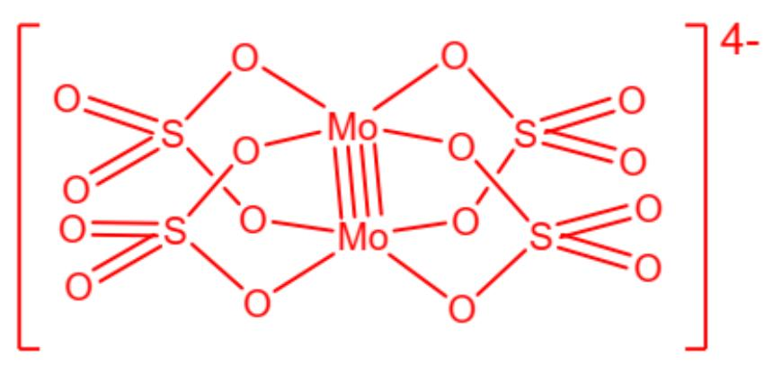

# 题目

X-射线衍射表明, 抗磁性粉红色钾盐  $\mathrm{K}_{2} \mathrm{Mo}(\mathrm{SO}_{4})_{2}$  的阴离子为双核配离子, 其中硫酸根离子为桥连配体, 钽原子的核间距为  $211 \mathrm{pm}$  。若将此复盐进行重结晶, 则可制得化学式为  $\mathrm{K}_{3} \mathrm{Mo}_{2}(\mathrm{SO}_{4})_{4} \cdot 3.5 \mathrm{H}_{2} \mathrm{O}$  的钾盐, 该复盐的阴离子仍保持了  $\mathrm{K}_{2} \mathrm{Mo}(\mathrm{SO}_{4})_{2}$  阴离子的结构, 但整个阴离子的电荷数却有所不同。求上述提到的两种阴离子之间  $\mathrm{Mo}-\mathrm{Mo}$  键级的乘积。

A. 0.5  
B. 1.5  
C. 3  
D. 5  
E. 7.5  
F. 10.5  
G. 14  
H. 18  
1. 22.5  
J. 33  
K. 39

L. 12

M. 16

# 答案

正确答案: G

# 详细解析

由题意， $\mathrm{K}_2\mathrm{Mo}(\mathrm{SO}_4)_2$  中的双核阴离子为  $[\mathrm{Mo}_2(\mathrm{SO}_4)_4]^{4-}$ ，其中含有2个Mo原子和4个硫酸根，总电荷数为-4。

# CHECKPOINT

1 PTS

双核阴离子为  $\left[\mathrm{Mo}_{2}\left(\mathrm{SO}_{4}\right)_{4}\right]^{4-}$

在该阴离子中，Mo的氧化数为  $\frac{1}{2} (-4 + 2\times 4) = +2$  ，价电子数为  $6 - 2 = 4$  。

# CHECKPOINT

1 PTS

Mo的氧化数为  $+2$  ，价电子数为4。

每个Mo原子贡献4个价电子，形成抗磁性阴离子，形成Mo-Mo四重键是合理的。

# CHECKPOINT

1 PTS

$\left[\mathrm{Mo}_{2}\left(\mathrm{SO}_{4}\right)_{4}\right]^{4-}$  阴离子中  $\mathrm{Mo}-\mathrm{Mo}$  的键级为 4

由上述分析，可画出  $\left[\mathrm{Mo}_{2}(\mathrm{SO}_{4})_{4}\right]^{4-}$  的结构为：

[Mo_2(SO_4)]^{\wedge \{4-\}}的结构，包含2个Mo，4个S，16个O，整体由中括号包围，中括号右上角标有4-，Mo-Mo之间为四重键，有4个按Mo-O-S-O-Mo顺序构成的五元环，五元环上的Mo-O和S-O均为单键，与Mo相连的8个O构成相互平行且取向重叠的正方形，每个S在环外以S=O双键连接两个端基O。

$\mathrm{K_3Mo_2(SO_4)_4}\cdot 3.5\mathrm{H_2O}$  晶体的阴离子为  $[\mathrm{Mo}_2(\mathrm{SO}_4)_4]^{3 - }$  ，与  $[\mathrm{Mo}_2(\mathrm{SO}_4)_4]^{4 - }$  相比，减少了一个电子。

# CHECKPOINT

1 PTS

另一种盐的阴离子为  $\left[\mathrm{Mo}_{2}\left(\mathrm{SO}_{4}\right)_{4}\right]^{3-}$

考虑  $\left[\mathrm{Mo}_{2}\left(\mathrm{SO}_{4}\right)_{4}\right]^{4-}$  的中心金属的电子结构，4个桥联硫酸根的8个配位氧以四方形配位，每个Mo各自贡献4个价电子，形成Mo-Mo四重键，相应的电子结构为  $\sigma^{2} \pi^{4} \delta^{2}$ 。

# CHECKPOINT

1 PTS

$\left[\mathrm{Mo}_{2}\left(\mathrm{SO}_{4}\right)_{4}\right]^{4-}$  的电子结构为  $\sigma^{2} \pi^{4} \delta^{2}$ .

失去一个电子后，得到  $\left[\mathrm{Mo}_{2}\left(\mathrm{SO}_{4}\right)_{4}\right]^{3-}$ ，失去的电子位于能量最高的δ成键轨道，电子结构变为  $\sigma^{2} \pi^{4} \delta^{1}$ ，键级为3.5。

# CHECKPOINT

1 PTS

$\left[\mathrm{Mo}_{2}\left(\mathrm{SO}_{4}\right)_{4}\right]^{3-}$  的电子结构为  $\sigma^{2} \pi^{4} \delta^{1}$ ，键级为  $3.5$ 。

故两种阴离子的  $\mathrm{Mo - Mo}$  键级乘积为  $4\times 3.5 = 14$  。

# CHECKPOINT

1 PTS

两种阴离子的Mo-Mo键级乘积为  $4 \times 3.5 = 14$  。