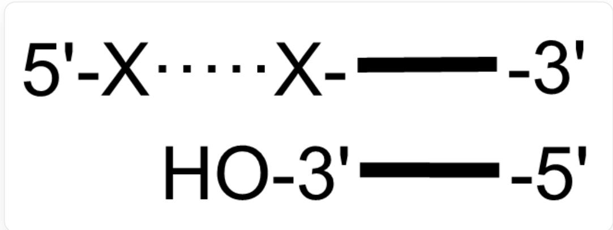
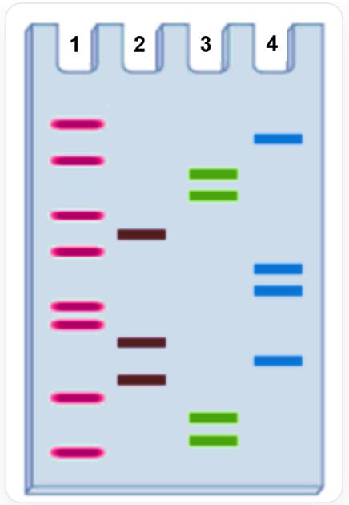

# Question

The following DNA fragment  $\mathbf{A}$  is available, combined with a  $^{32}\mathrm{P}$  labeled primer:

The figure shows the DNA fragment bound to the primer. In the fragment, there is a sequence at the  $5^{\prime}$  end that is not bound to the primer, denoted as  $\mathrm{X}\cdot \cdot \cdot \cdot \cdot \cdot \mathrm{X}$

Where  $\mathbf{X}$  represents one of  $\mathrm{A / T / C / G}$ .

DNA polymerase,  $^{32}\mathrm{P}$  labeled primer,  $\mathrm{Mg}^{2+}$ , and four dNTPs were added to four test tubes, and a small amount of the following substrates were added separately:

1. Test tube 1: ddTTP  
2. Test tube 2: ddGTP  
3. Test tube 3: ddATP  
4. Test tube 4: ddCTP

After the reaction is completed, the product fragments are separated by PAGE gel and autoradiographed to obtain the following band diagram:

  
The band diagram has four lanes, labeled 1/2/3/4 respectively. In the figure, the lane numbers in which each band appears from top to bottom are 1413312144112421331

Based on this band diagram, please find out which polypeptide sequence cannot be synthesized from the following options for the part of DNA fragment A that is not bound to the primer.

A. All other options are incorrect  
B. Gln-Ile-Thr-Gly-Thr-His  
C. Met-Arg-Ser-Cys-Gly-Ser  
D. Arg-Leu-Gln-Glu-Arg-Ile  
E. Asp-Tyr-Arg-Asn-Ala-Leu  
F. Asn-Ala-Phe-Leu-Ser-Ile  
G. Met-Arg-Ser-Cys-Gln-Ser

H. Unable to form a polypeptide chain.

# Answer

Correct Answer: C

# Detailed Explanation

The method designed for this question is a typical application of Sanger dideoxy chain termination sequencing using PAGE.

# CHECKPOINT

0.5 PTS

The question involves Sanger dideoxy chain termination sequencing using PAGE

This method has the following characteristics:

- For single-stranded DNA A , its 3' end is bound to a

P-labeled primer (i.e., the primer serves as the  $5^{\prime}\rightarrow 3^{\prime}$  starting point for the newly synthesized strand)

- Four reaction systems, with ddTTP, ddGTP, ddATP, and ddCTP added separately, generate DNA fragments terminated by each dideoxy  
- PAGE electrophoresis runs from top to bottom, short to long (the top end is short chains, close to the upper edge)  
- Each band represents the primer plus extension until encountering the corresponding termination (e.g., ddTTP, terminates at the next A)  
- The sequence read should be in the  $5'$  to  $3'$  direction of the newly synthesized strand

Read the PAGE information in the second image, and analyze each row (from bottom to top) according to the lane bands:

<table><tr><td>Position</td><td>Tube 1 (T)</td><td>Tube 2 (G)</td><td>Tube 3 (A)</td><td>Tube 4 (C)</td></tr><tr><td>1 (Bottom)</td><td>+</td><td></td><td></td><td></td></tr><tr><td>2</td><td></td><td></td><td>+</td><td></td></tr><tr><td>3</td><td></td><td></td><td>+</td><td></td></tr><tr><td>4</td><td>+</td><td></td><td></td><td></td></tr><tr><td>5</td><td></td><td>+</td><td></td><td></td></tr><tr><td>6</td><td></td><td></td><td></td><td>+</td></tr><tr><td>7</td><td></td><td>+</td><td></td><td></td></tr><tr><td>8</td><td>+</td><td></td><td></td><td></td></tr><tr><td>9</td><td>+</td><td></td><td></td><td></td></tr><tr><td>10</td><td></td><td></td><td></td><td>+</td></tr><tr><td>11</td><td></td><td></td><td></td><td>+</td></tr><tr><td>12</td><td>+</td><td></td><td></td><td></td></tr><tr><td>13</td><td></td><td>+</td><td></td><td></td></tr><tr><td>14</td><td>+</td><td></td><td></td><td></td></tr><tr><td>15</td><td></td><td></td><td>+</td><td></td></tr><tr><td>16</td><td></td><td></td><td>+</td><td></td></tr><tr><td>17</td><td>+</td><td></td><td></td><td></td></tr><tr><td>18</td><td></td><td></td><td></td><td>+</td></tr><tr><td>19</td><td>+</td><td></td><td></td><td></td></tr></table>

# CHECKPOINT

1 PTS

The determined sequence of the newly synthesized strand is: 5'-TAATGCGTTCCTGTAATCTG-3'

The question requires giving the sequence of the un-primer-bound portion of DNA fragment A, which is the 5' end sequence of the template, and the newly synthesized strand is complementary to the template. Therefore, the sequence of the X...X strand (template) is the complement of the new strand: CAGATTACAGGAACGCATTA-3'

# CHECKPOINT

1 PTS

The  $\mathbf{X}\cdot \cdot \cdot \cdot \cdot \cdot \mathbf{X}$  strand is  $5^{\prime}$  -CAGATTACAGGAACGCATTA-3

(1) The X……X strand is the coding strand, and the corresponding mRNA is 5'-CAGAUUACAGGAACGCAUUA-3', which has three possible reading frame forms:

# CHECKPOINT

0.5 PTS

In  $\mathbf{A}$ , the  $\mathrm{X} \cdots \cdots \mathrm{X}$  strand may be the coding or template strand during translation

, consider the possibility of each case:

1. Starting from the 1st position: CAG (Gln) - AUU (Ile) - ACA (Thr) - GGA (Gly) - ACG (Thr) - CAU (His), producing the polypeptide: Gln-Ile-Thr-Gly-Thr-His, i.e., option B  
2. Starting from the 2nd position: AGA (Arg) - UUA (Leu) - CAG (Gln) - GAA (Glu) - CGC (Arg) - AUU (Ile) producing the polypeptide: Arg-Leu-Gln-Glu-Arg-Ile, i.e., option D

3. Starting from the 3rd position: GAU (Asp) - UAC (Tyr) - AGG (Arg) - AAC (Asn) - GCA (Ala) - UUA (Leu) producing the polypeptide: Asp-Tyr-Arg-Asn-Ala-Leu, i.e., option E

# CHECKPOINT

1 PTS

When the  $\mathrm{X}\cdots\cdots\mathrm{X}$  strand in  $\mathbf{A}$  is the coding strand, the corresponding polypeptides are Gln-Ile-Thr-Gly-Thr-His, Arg-Leu-Gln-Glu-Arg-Ile, Asp-Tyr-Arg-Asn-Ala-Leu

(2) The X...X strand is the template strand, and the corresponding mRNA is 5'-UAAUGCGUUCCUGUCAAUCUG-3', which has three possible reading frame forms:

1. Starting from the 1st position: UAA (Stop codon) Result: Translation will terminate immediately, and a polypeptide chain cannot be formed.  
2. Starting from the 2nd position: AAU (Asn) - GCG (Ala) - UUC (Phe) - CUG (Leu) - UCA (Ser) - AUC (Ile) producing the polypeptide: Asn-Ala-Phe-Leu-Ser-Ile, i.e., option F  
3. Starting from the 3rd position: AUG (Met, Start codon) - CGU (Arg) - UCC (Ser) - UGU (Cys) - CAA (Gln) - UCU (Ser) producing the polypeptide: Met-Arg-Ser-Cys-Gln-Ser, i.e., option G

# CHECKPOINT

1 PTS

When the  $\mathrm{X}\cdot \cdot \cdot \cdot \cdot \mathrm{X}$  strand in A is the template strand, the corresponding polypeptides are "a polypeptide chain cannot be formed", Asn-Ala-Phe-Leu-Ser-Ile, Met-Arg-Ser-Cys-Gln-Ser

Therefore, only option C: Met-Arg-Ser-Cys-Gly-Ser is an impossible polypeptide to form.