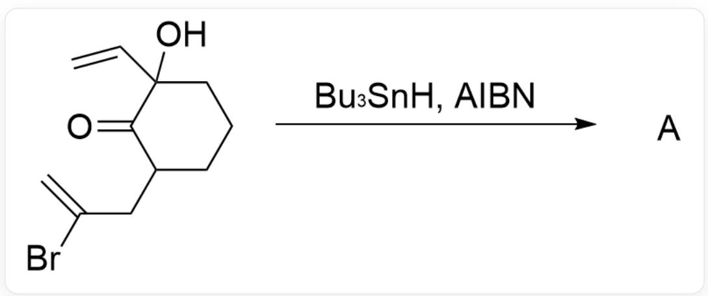
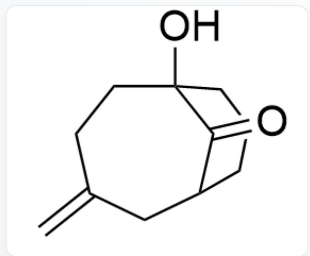
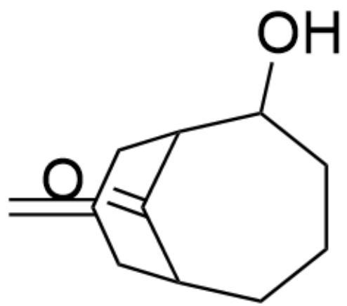
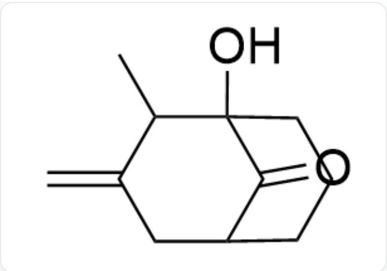
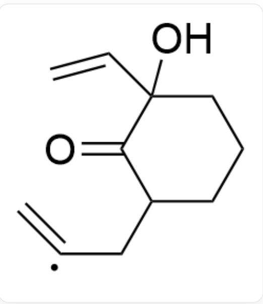
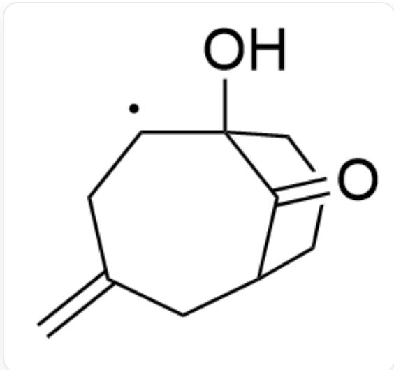
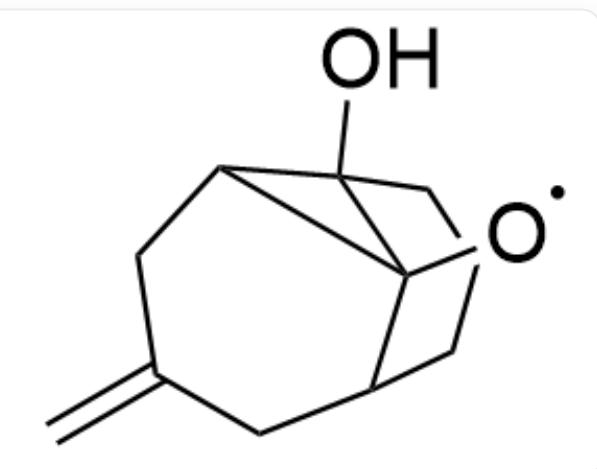
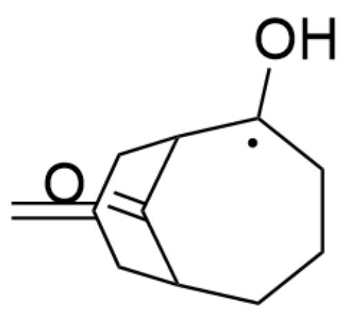

# Question

  
A.

O=C1C(CC(Br)=C)CCCCC1(C=C)O>Bu₃SnH, AIBN>A, where Bu₃SnH is tributyltin hydride, AIBN is azobisisobutyronitrile, and the hydroxyl and hydrogen groups on the two α-positions of the carbonyl group are cis

Please select the major product A of the reaction.

  
O=C1C(C2)CCCC1(O)CCC2=C  
B.

  
C.

O=C1C(C2)CCCC(O)C1CC2=C

  
D.

$\mathrm{O = C1C(CC = C)CCCC1(C = C)O}$

  
$\mathrm{O = C1C(CC2 = C)CCCC1(C2C)O}$

# Answer

Correct Answer: B

# Detailed Explanation

After radical initiation, an alkenyl radical is first generated.

  
$\mathrm{O = C1C(C[C] = C)CCCC1(C = C)O}$

# CHECKPOINT

1 PTS

After radical initiation, an alkenyl radical  $\mathrm{O = C1C(C[C] = C)CCCC1(C = C)O}$  is first generated

Since a secondary carbon radical is more stable than a primary carbon radical, a 7-endo-trig radical cyclization then occurs, forming a secondary carbon radical.

$\mathrm{O = C1C(C2)CCCC1(O)[C]CC2 = C}$

# CHECKPOINT

1 PTS

Since a secondary carbon radical is more stable than a primary carbon radical, a 7-endo-trig radical cyclization then occurs, forming a secondary carbon radical  $\mathrm{O = C1C(C2)CCCC1(O)[C]CC2 = C}$

This radical then attacks the carbon atom of the carbonyl group, rapidly forming an oxygen radical containing a three-membered ring.

[O]C12C(C3)CCCC1(O)C2CC3=C

# CHECKPOINT

1 PTS

This radical then attacks the carbon atom of the carbonyl group, rapidly forming an oxygen radical containing a three-membered ring [O]C12C(C3)CCCC1(O)C2CC3=C

The three-membered ring then undergoes cleavage, forming a more stable radical intermediate.

$$
\mathrm {O} = \mathrm {C} 1 \mathrm {C} (\mathrm {C} 2) \mathrm {C C C} [ \mathrm {C} ] (\mathrm {O}) \mathrm {C} 1 \mathrm {C C} 2 = \mathrm {C}
$$

# CHECKPOINT

1 PTS

The three-membered ring then undergoes cleavage, forming a more stable radical intermediate  $\mathrm{O = C1C(C2)CCC[C](O)C1CC2 = C}$

Finally, this radical is quenched by  $Bu_{3}SnH$  to obtain the final product A.

# CHECKPOINT

1 PTS

Finally, this radical is quenched by  $Bu_{3}SnH$