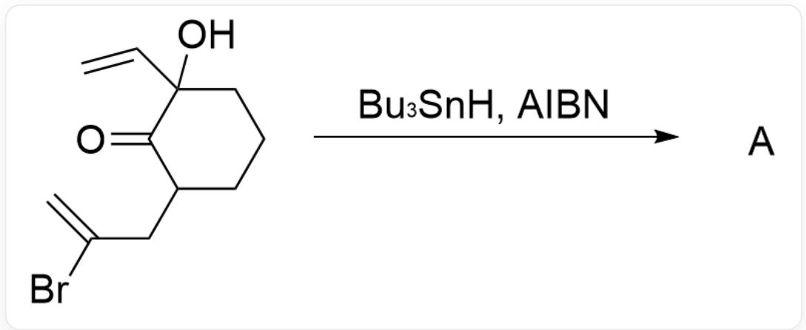
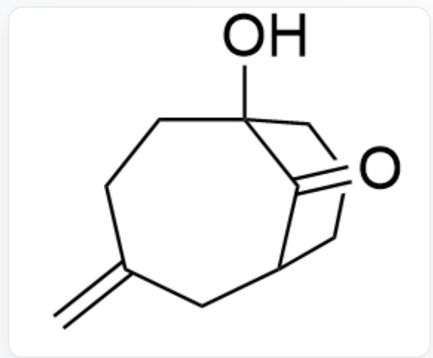
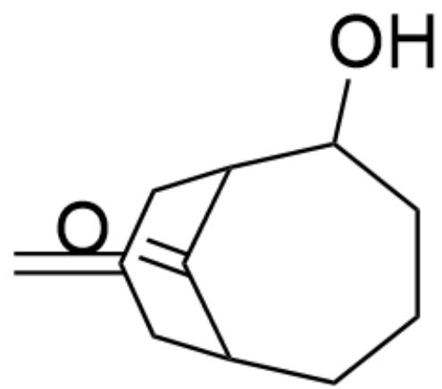
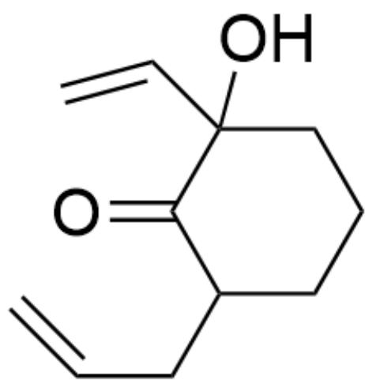
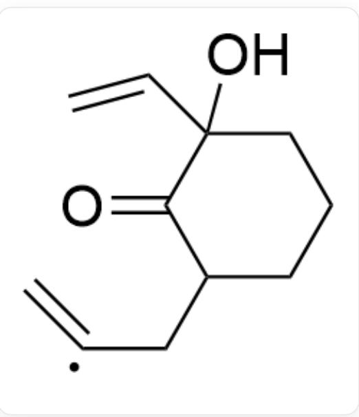
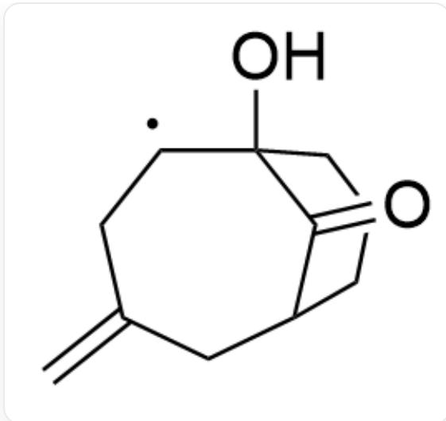
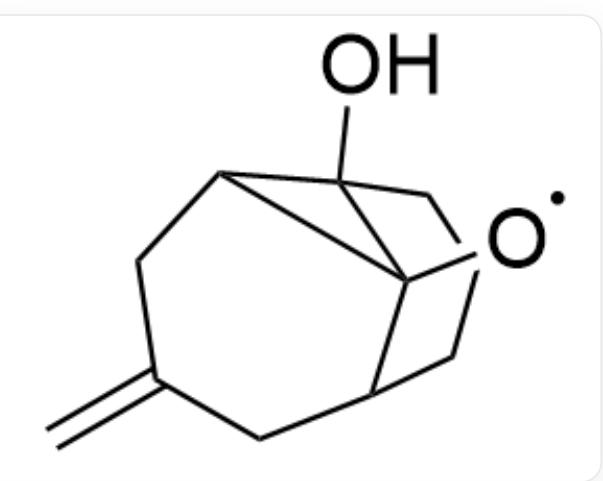
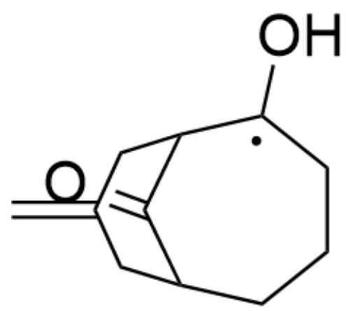

# 题目

$\mathrm{O = C1C(CC(Br) = C)CCC}1(\mathrm{C = C})\mathrm{O > Bu_{3}SnH, AIBN > A}$ , 其中  $Bu_{3}SnH$  为三丁基氢化锡,  $AIBN$  为偶氮二异丁腈, 羰基的两个  $\alpha$ -位上的羟基与氢为顺式

请选择反应的主产物A

A.

$\mathrm{O = C1C(C2)CCCC1(O)CCC2 = C}$

B.

  
C.

O=C1C(C2)CCCC(O)C1CC2=C

  
D.

$\mathrm{O = C1C(CC = C)CCCC1(C = C)O}$

  
$\mathrm{O = C1C(CC2 = C)CCCC1(C2C)O}$

# 答案

正确答案: B

# 详细解析

自由基引发之后首先生成烯基自由基

  
$\mathrm{O = C1C(C[C] = C)CCCC1(C = C)O}$

CHECKPOINT

1 PTS

自由基引发之后首先生成烯基自由基  $\mathrm{O} = \mathrm{C}1\mathrm{C}(\mathrm{C}[\mathrm{C}] = \mathrm{C})\mathrm{CCCC}1(\mathrm{C} = \mathrm{C})\mathrm{O}$

由于二级碳自由基比一级碳自由基更稳定，随后发生7-endo-trig自由基成环，形成二级碳自由基

$\mathrm{O = C1C(C2)CCCC1(O)[C]CC2 = C}$

# CHECKPOINT

1 PTS

二级碳自由基比一级碳自由基更稳定，随后发生7-endo-trig自由基成环，形成二级碳自由基  $\mathrm{O = C1C(C2)CCCC1(O)[C]CC2 = C}$

该自由基随即进攻羰基的碳原子快速形成含三元环的氧自由基

[O]C12C(C3)CCCC1(O)C2CC3=C

# CHECKPOINT

1 PTS

该自由基随即进攻羰基的碳原子快速形成含三元环的氧自由基[O]C12C(C3)CCCC1(O)C2CC3=C

随后三元环发生裂解，形成更加稳定的自由基中间体

$\mathrm{O = C1C(C2)CCC[C](O)C1CC2 = C}$

# CHECKPOINT

1 PTS

随后三元环发生裂解，形成更加稳定的自由基中间体O=C1C(C2)CCC[C](O)C1CC2=C

最后该自由基被  $B u_{3} S n H$  所淬灭，得到最终产物A

# CHECKPOINT

1 PTS

最后该自由基被  $B u_{3} S n H$  所淬灭