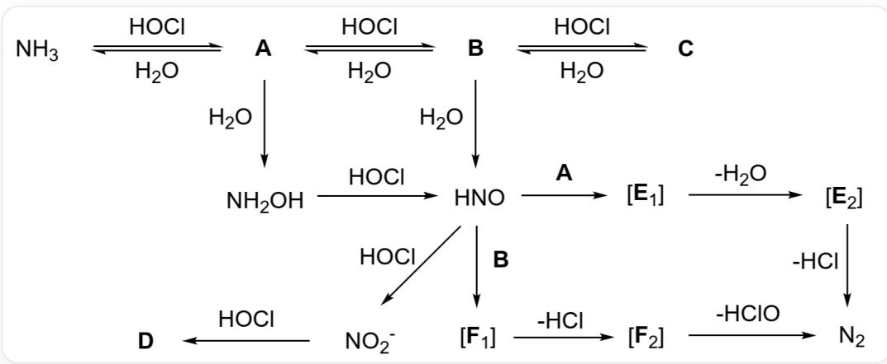

# Question

Ammonia and chlorine are two common industrial gases with complex interconversion relationships. For example, chlorine can react with ammonia to produce nitrogen gas, a method often used to remove ammonia from water. The diagram below illustrates the interconversion relationships in the chlorine-ammonia system.

The image is a flowchart of chemical reactions, with the specific process described as follows: Ammonia reversibly forms compound A in the presence of hypochlorous acid and water. A reversibly forms compound B in the presence of hypochlorous acid and water. B reversibly forms compound C in the presence of hypochlorous acid and water. A reacts with water to form hydroxylamine, which reacts with hypochlorous acid to form HNO. B also reacts with water to form HNO. HNO reacts with hypochlorous acid to form nitrite ions, and nitrite ions react with hypochlorous acid to form compound D. There are two pathways for HNO to form nitrogen gas: Pathway 1 involves HNO reacting with compound A to form intermediate  $\mathbf{E}_1$ , which eliminates a water molecule to form intermediate  $\mathbf{E}_2$ , and  $\mathbf{E}_2$  eliminates a hydrogen chloride molecule to form nitrogen gas. Pathway 2 involves HNO reacting with compound B to form intermediate  $\mathbf{F}_1$ , which eliminates a hydrogen chloride molecule to form intermediate  $\mathbf{F}_2$ , and  $\mathbf{F}_2$  eliminates a hypochlorous acid molecule to form nitrogen gas. The reactions forming compounds A, B, C are reversible, while the other reactions are unidirectional.

Regarding the unknown nitrogen-containing compounds  $\mathbf{A},\mathbf{B},\mathbf{C},\mathbf{D}$  and reaction intermediates  $\mathbf{E}_1,\mathbf{E}_2,\mathbf{F}_1,\mathbf{F}_2$  in the diagram, the following statements are made:

1. The relative molecular masses of  $\mathbf{A},\mathbf{B},\mathbf{C}$  increase sequentially.  
2. D can be used for agricultural purposes.

3. If atoms of different elements are treated as spheres of the same size, the absolute geometric configurations of  $\mathbf{A},\mathbf{B},\mathbf{C}$  are identical.  
4.  $\mathbf{E}_1$  has more conformational isomers than  $\mathbf{E}_2$ .  
5.  $\mathbf{F}_1$  contains a  $\pi$  bond.  
6.  $\mathbf{E_2}$  has only two configurational isomers.  
7. Hydrolysis of  $\mathbf{C}$  can yield  $\mathbf{D}$ .  
8. According to the diagram, A and B can react with HNO to produce nitrogen gas, and C can similarly react with HNO via a mechanism analogous to that of A and B to produce nitrogen gas.

Which of the following options contains all correct statements?

A. 1,2,3,4,5  
B. 1,3,4,5,6  
C. 1,2,3,4,6  
D. 2, 3, 4, 6, 7  
E. 1,3,4,6,8  
F. 1,4,6,7,8  
G. 2,5,6,7,8

# Answer

Correct Answer: C

# Detailed Explanation

Let us first deduce the identities of these eight unknown substances.

The reactions generating  $\mathbf{A},\mathbf{B},\mathbf{C}$  are clearly the stepwise chlorination of ammonia by hypochlorous acid,

# CHECKPOINT

1 PTS

Stepwise chlorination of ammonia by hypochlorous acid

where hypochlorous acid acts as the oxidizing agent. Thus,  $\mathbf{A}$  is  $\mathrm{NH}_2\mathrm{Cl}$ ,  $\mathbf{B}$  is  $\mathrm{NHCl}_2$ , and  $\mathbf{C}$  is  $\mathrm{NCl}_3$ . Therefore, Statement 1 is correct.

# CHECKPOINT

1 PTS

Statement 1 is correct

The reaction generating  $\mathbf{D}$  is also straightforward. Nitrite reacts with the strong oxidizing agent hypochlorous acid, and the oxidation product is clearly nitric acid. Since the question specifies that  $\mathbf{D}$  is a compound, it cannot be interpreted as nitrate here,

# CHECKPOINT

1 PTS

$\mathbf{D}$  is specified as a compound and cannot be interpreted as nitrate here.

so  $\mathbf{D}$  is  $\mathrm{HNO}_3$ . Nitric acid can be used to prepare its ammonium salt for nitrogen fertilizer, so Statement 2 is correct.

# CHECKPOINT

1 PTS

Statement 2 is correct

According to VSEPR theory,  $\mathbf{A},\mathbf{B},\mathbf{C}$  are all trigonal pyramidal molecules. If atoms of different elements are treated as spheres of the same size, the absolute geometric configurations of  $\mathbf{A},\mathbf{B},\mathbf{C}$  are identical, so Statement 3 is correct.

# CHECKPOINT

1 PTS

A,B,C are trigonal pyramidal

# CHECKPOINT

1 PTS

Statement 3 is correct

$\mathrm{NCl}_3$  hydrolyzes to form nitrogen gas, hypochlorous acid, and hydrochloric acid, but not nitric acid, so Statement 7 is incorrect.

# CHECKPOINT

1 PTS

Statement 7 is incorrect

The reaction of HNO with compounds  $\mathbf{A},\mathbf{B}$  is essentially an addition reaction where the  $\mathrm{N - H}\sigma$  bond in  $\mathbf{A},\mathbf{B}$  adds to the weak  $\mathrm{N} = \mathrm{O}\pi$  bond in HNO,

# CHECKPOINT

1 PTS

Addition reaction of the  $\mathrm{N - H}\sigma$  bond in  $\mathbf{A},\mathbf{B}$  to the weak  $\mathrm{N} = 0\pi$  bond in HNO

forming an unstable  $\mathrm{N} - \mathrm{N}$  single bond, with the hydrogen atom adding to the oxygen atom. Since C lacks hydrogen atoms, it cannot undergo this addition reaction, so Statement 8 is incorrect.

# CHECKPOINT

1 PTS

Statement 8 is incorrect

The transformation from  $\mathbf{E_1}$  to  $\mathbf{E_2}$  involves a dehydration reaction, clearly a process where the  $\mathrm{N} - \mathrm{N}$  single bond undergoes elimination to form a double bond. Double bonds only exhibit cis-trans isomerism, while single bonds can rotate, so  $\mathbf{E_1}$  has more conformational isomers than  $\mathbf{E_2}$ , making Statement 4 correct.

# CHECKPOINT

1 PTS

Statement 4 is correct

Based on the mechanism described above,  $\mathbf{E}_1, \mathbf{F}_1$  only contain  $\mathrm{N} - \mathrm{N}$  single bonds, and the  $\mathrm{N} = \mathrm{O} \pi$  bond disappears after the addition reaction, so Statement 5 is incorrect.

# CHECKPOINT

1 PTS

Statement 5 is incorrect

$\mathbf{E}_2, \mathbf{F}_2$  are both products with eliminated  $\mathrm{N} = \mathrm{N}$  double bonds. It is observed that  $\mathbf{E}_2$  can release a molecule of hydrogen chloride to form nitrogen gas, indicating that the structural formula of  $\mathbf{E}_2$  is  $\mathrm{H} - \mathrm{N} = \mathrm{N} - \mathrm{Cl}$ , which only exhibits cis-trans isomerism, so Statement 6 is correct.

# CHECKPOINT

1 PTS

Structural formula of  $\mathbf{E_2}$  is  $\mathrm{H} - \mathrm{N} = \mathrm{N} - \mathrm{Cl}$

# CHECKPOINT

1 PTS

Statement 6 is correct

In summary, the correct statements are 1, 2, 3, 4, and 6. The answer is C.

# CHECKPOINT

1 PTS

Correct statements are 1, 2, 3, 4, and 6. The answer is C