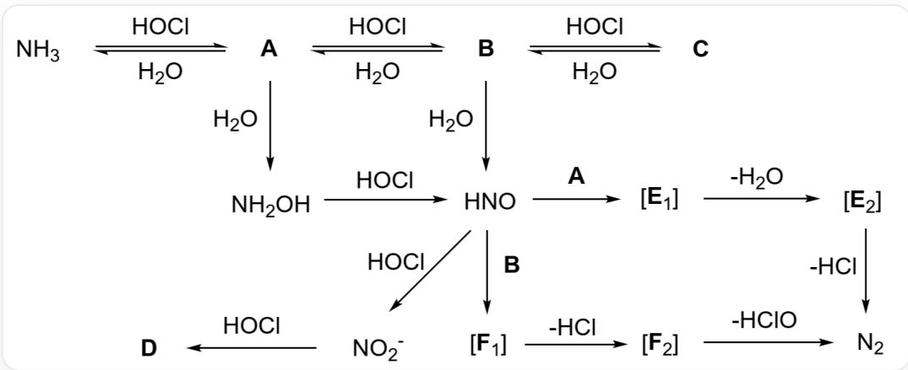

# 题目

氨气与氯气是两种工业上常见的气体物质，其相互转化关系较为复杂，例如氯气与氨气反应可以生成氮气，此方法常用于去除水中的氨。下图为氯-氨体系的相互转化关系图解。

该图像是一个化学反应流程图，具体流程描述如下：氨气在次氯酸和水存在下可逆地生成化合物A，A在次氯酸和水存在下可逆地生成化合物B，B在次氯酸和水存在下可逆地生成化合物C。A与水反应生成羟胺，羟胺与次氯酸反应生成HNO，B与水反应同样生成HNO。HNO与次氯酸反应生成亚硝酸根离子，亚硝酸根离子与次氯酸反应生成化合物D。HNO生成氮气的路径有两条：路径其一是HNO与化合物A反应生成中间体E1，E1消除一分子水生成中间体E2，E2消除一分子氯化氢生成氮气。路径其二是HNO与化合物B反应生成中间体F1，F1消除一分子氯化氢生成中间体F2，F2消除一分子次氯酸生成氮气。生成化合物A,B,C的反应为可逆箭头，其余反应均为单箭头。

关于图中出现的未知含氮化合物A,B,C,D和反应中间体  $\mathbf{E}_1,\mathbf{E}_2,\mathbf{F}_1,\mathbf{F}_2$  ，有下列几种说法：

1. A, B, C 的相对分子质量依次越来越大。  
2. D可用于农业用途。  
3. 如果将不同元素的原子都视为同样大小的球体，A,B,C的绝对几何构型完全一致  
4.  $\mathbf{E}_1$  比  $\mathbf{E}_2$  的构象异构体更多。  
5.  $\mathbf{F_1}$  存在  $\pi$  键。  
6.  $\mathbf{E}_2$  只存在两种构型异构体。  
7. C水解后可以生成D。

8. 根据上图，A,B 可以与 HNO 反应得到氮气，C 同样可以以与 A,B 类似的机理与 HNO 反应得到氮气。

以下选项中的哪一个包含的说法全部正确？

A. 1,2,3,4,5  
B. 1,3,4,5,6  
C. 1,2,3,4,6  
D. 2,3,4,6,7  
E. 1,3,4,6,8  
F. 1,4,6,7,8  
G. 2,5,6,7,8

# 答案

正确答案: C

# 详细解析

让我们首先推断这八种未知物质。

生成A,B,C的反应很明显，是次氯酸对氨气的逐步氯代反应，

# CHECKPOINT

1 PTS

次氯酸对氨气的逐步氯代反应

次氯酸作为氧化剂，从而A为  $\mathrm{NH_2Cl}$  ，B为  $\mathrm{NHCl}_2$  ，C为  $\mathrm{NCI}_3$  ，故说法1正确。

# CHECKPOINT

1 PTS

说法1正确

生成D的反应同样简单，亚硝酸根与强氧化剂次氯酸作用，氧化产物很明显是硝酸。因为题目明确D为化合物，此处不能将其视作硝酸根，

# CHECKPOINT

1 PTS

明确D为化合物，此处不能将其视作硝酸根

从而  $\mathbf{D}$  为  $\mathrm{HNO}_{3}$  。硝酸可用于制备其铵盐用于氮肥，故说法2正确。

# CHECKPOINT

1 PTS

说法2正确

根据VSEPR理论，A,B,C都是三角锥型分子，如果将不同元素的原子都视为同样大小的球体，A,B,C的绝对几何构型完全一致，说法3正确。

# CHECKPOINT

1 PTS

A,B,C为三角锥型

# CHECKPOINT

1 PTS

说法3正确

$\mathrm{NCl}_{3}$  水解生成氮气，次氯酸和氯化氢，并不生成硝酸，说法7错误。

# CHECKPOINT

1 PTS

说法7错误

HNO与化合物A,B的反应，本质上是A,B内的N-Hσ键对HNO中弱的N=Oπ键的加成反应，

# CHECKPOINT

1 PTS

A,B内的  $\mathrm{N - H}\sigma$  键对HNO中弱的  $\mathrm{N} = 0\pi$  键的加成反应

生成不稳定的  $\mathrm{N}-\mathrm{N}$  单键，氢原子加成到氧原子上，从而  $\mathbf{C}$  因为没有氢原子无法进行该加成反应，说法8错误。

# CHECKPOINT

1 PTS

说法8错误

$\mathbf{E}_1$  到  $\mathbf{E}_2$  经历了脱水反应，很明显是  $\mathrm{N} - \mathrm{N}$  单键发生消除变为双键的过程，双键只存在顺反异构体，而单键可以旋转，故  $\mathbf{E}_1$  比  $\mathbf{E}_2$  的构象异构体更多，说法4正确。

# CHECKPOINT

1 PTS

说法4正确

由上所述的机理， $\mathbf{E}_1, \mathbf{F}_1$  都只存在  $\mathrm{N} - \mathrm{N}$  单键， $\mathrm{N} = 0$ $\pi$  键被加成后消失了，说法5错误。

# CHECKPOINT

1 PTS

说法5错误

$\mathbf{E}_2, \mathbf{F}_2$  均为消除后的  $\mathrm{N} = \mathrm{N}$  双键产物，观察到  $\mathbf{E}_2$  消除一分子氯化氢即可得到氮气，说明  $\mathbf{E}_2$  的结构式为  $\mathrm{H} - \mathrm{N} = \mathrm{N} - \mathrm{Cl}$ ，只存在顺反异构体，说法6正确。

# CHECKPOINT

1 PTS

$\mathbf{E_2}$  的结构式为  $\mathrm{H - N = N - Cl}$

# CHECKPOINT

1 PTS

说法6正确

综上，正确说法为1,2,3,4,6，选C

# CHECKPOINT

1 PTS

正确说法为1,2,3,4,6，选C