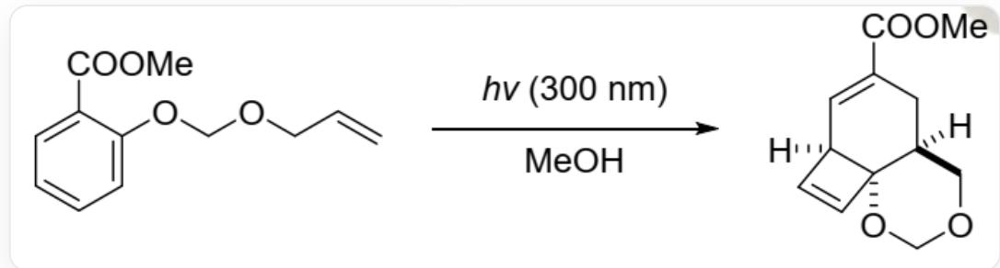
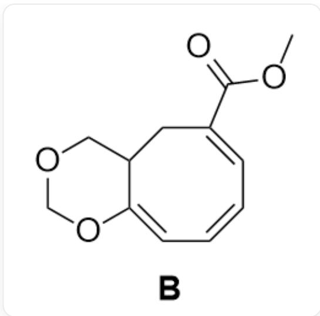

# Question

A methanol solution of the following substrate transforms into a tricyclic compound under light irradiation; the reaction successively goes through two intermediates  $\mathbf{A}$  and  $\mathbf{B}$ .

  
`C=CCOCOC1=CC=CC=C1C(=O)OC` in methanol, irradiated with light of wavelength 300nm, yields `[H]  
[C@@]12C=C[C@@]13[C@@](CC(C(OC)=O)=C2)(COCO3)[H]

Select the correct option from the following options.

A. All other options are incorrect  
B. B has 3 rings  
C. A has two rings  
D. A exhibits aromaticity  
E. B contains three conjugated carbon-carbon double bonds.  
F. A does not contain highly strained ring systems.

# Answer

Correct Answer: E

# Detailed Explanation

The reaction occurring under illumination is an electrocyclic reaction. The double bond in the starting material can react with the benzene ring, but the resulting product is difficult to determine. First, deduce the structure of  $\mathbf{B}$  from the product. It is not difficult to find that the four-membered ring in the product should be produced under illumination. Break the corresponding bond to obtain  $\mathbf{B}$ : `O=C(OC)/C1=C/C=C\C=C2OCOCC\2C1` .  $\mathbf{B}$  has only one eight-membered ring and one six-membered ring.

# CHECKPOINT

1 PTS

The structure of B is  $\mathrm{O = C(OC) / C1 = C / C = C\backslash C = C2OCOCC\backslash 2C1}$ , and it has two rings. Option B is incorrect.

The eight-membered ring of  $\mathbf{B}$  has three conjugated carbon-carbon double bonds.

# CHECKPOINT

1 PTS

B has three conjugated carbon-carbon double bonds. Option E is correct.

The large ring system in  $\mathbf{B}$  should be obtained by the ring-opening of  $\mathbf{A}$ . Deduce from  $\mathbf{B}$ ,  $\mathbf{A}$  may have the following structures:

A1  
  
A1：O=C(OC)C12CC3COCOC31C=CC=C2；A2：O=C(OC)C12CC3COCOC3=CC1C=C2

  
A2

Only A1 can be produced from the starting material. Therefore, the structure of A is  $\mathrm{O = C(OC)C12CC3COCOC31C = CC = C2^{\prime}}$ , which does not have an aromatic ring.

# CHECKPOINT

1 PTS

The structure of  $\mathbf{A}$  is  ${}^{\backprime}\mathrm{O} = \mathrm{C}(\mathrm{OC})\mathrm{C}12\mathrm{CC}3\mathrm{COCOC}31\mathrm{C} = \mathrm{CC} = \mathrm{C}2^{\prime}$ , which does not have an aromatic ring. Option D is incorrect.

A has 1 four-membered ring and two six-membered rings, a total of 3 rings.

# CHECKPOINT

1 PTS

A has 1 four-membered ring and two six-membered rings, a total of 3 rings and has a highly strained ring system. Options C and F are incorrect.

Choose E.

Structure of B:  $\mathrm{O} = \mathrm{C}(\mathrm{OC}) / \mathrm{C}1 = \mathrm{C} / \mathrm{C} = \mathrm{C}\backslash \mathrm{C} = \mathrm{C}2\mathrm{OC}\mathrm{O}\mathrm{C}\backslash 2\mathrm{C}1$