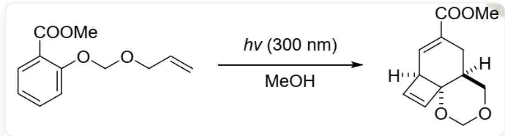
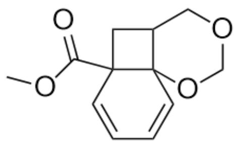
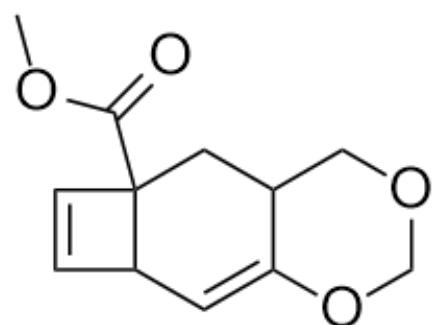
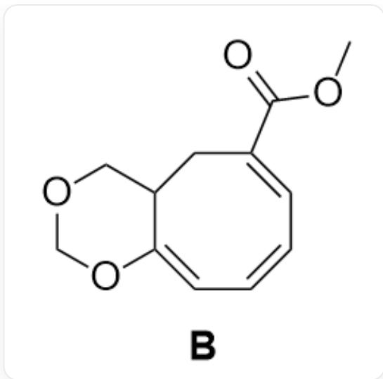

# 题目

以下底物的甲醇溶液在光照下会转化为一种三环化合物；该反应先后历经两个中间体 A 和 B。

  
$\mathrm{C = CCOCOC1 = CC = CC = C1C(=O)OC}$  在甲醇中接受波长为300nm的光照，生成[H]  $[\mathrm{C}@\mathbb{Q}]12\mathrm{C} = \mathrm{C}[\mathrm{C}@\mathbb{Q}]13[\mathrm{C}@\mathbb{Q}](\mathrm{CC}(\mathrm{C}(\mathrm{OC}) = \mathrm{O}) = \mathrm{C}2)(\mathrm{COCO3})(\mathrm{H}]^{\prime}$

选出下列选项中正确的一项

A. 其他选项均不正确  
B. B 具有 3 个环  
C. A 具有两个环  
D. A 具有芳香性  
E. B中具有三个共轭的碳碳双键  
F. A 中不存在高张力环系

# 答案

正确答案: E

# 详细解析

在光照下发生的反应为电环化反应，原料中的双键可以与苯环发生反应，但生成的产物难以确定。先从产物推断B的结构，不难发现产物中的四元环应为光照条件产生的，将相应的键断开，得到B：`O=C(OC)/C1=C/C=C\C=C2OCOCC\2C1`。B仅有一个八元环和一个六元环

# CHECKPOINT

1 PTS

B 的结构为`O=C(OC)/C1=C/C=C\C=C2OCOCC\2C1`，有两个环，选项B错误

B 的八元环中有三个共轭的碳碳双键

# CHECKPOINT

1 PTS

B中具有三个共轭的碳碳双键，选项E正确

B中的大环体系应为A开环所得。由B倒推，A可能有以下几种结构：

A1  
  
A1: `O=C(OC)C12CC3COCOC31C=CC=C2'; A2: `O=C(OC)C12CC3COCOC3=CC1C=C2`

  
A2

其中仅有A1可由原料产生，因此A的结构为  $\mathrm{O = C(OC)C12CC3COCOC31C = CC = C2^{\prime}}$  ，其中不具有芳香环

# CHECKPOINT

1 PTS

A 的结构为`O=C(OC)C12CC3COCOC31C=CC=C2`，其中不具有芳香环，选项D错误

A中具有1个四元环和两个六元环，共3个环

# CHECKPOINT

1 PTS

A中具有1个四元环和两个六元环，共3个环且有高张力环系，选项C、F错误

选E

B的结构为  $\mathrm{O} = \mathrm{C}(\mathrm{OC}) / \mathrm{C}1 = \mathrm{C} / \mathrm{C} = \mathrm{C}\backslash \mathrm{C} = \mathrm{C}2\mathrm{OC}\mathrm{O}\mathrm{C}\backslash 2\mathrm{C}1$