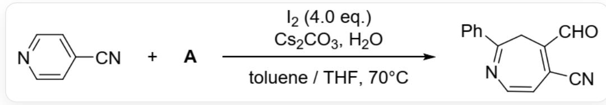
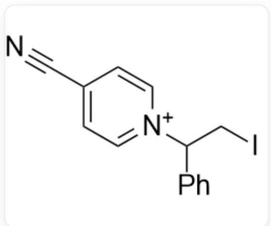
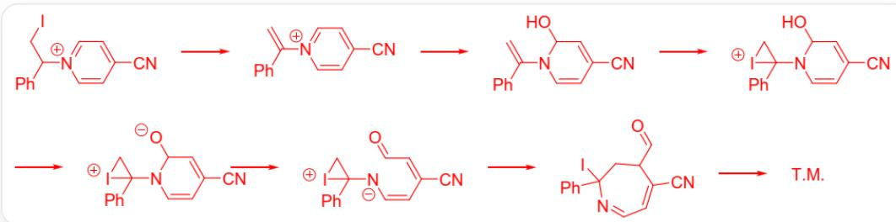
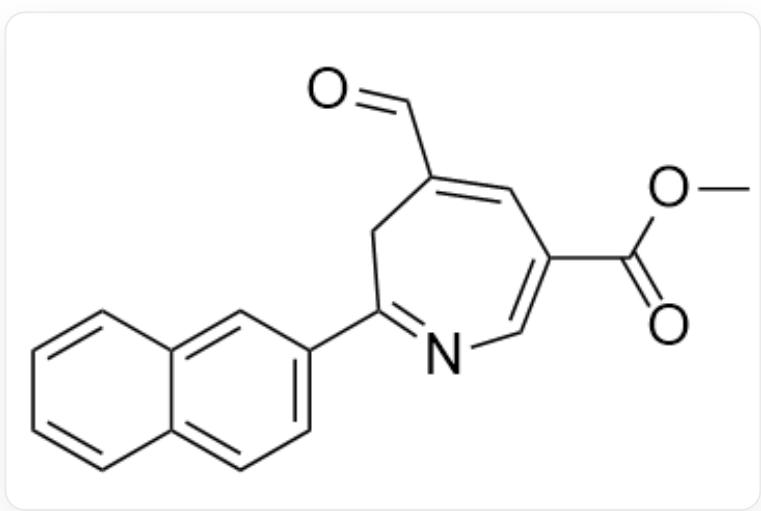

# Question

People utilized the following reaction to construct the azepine ring system:

In a mixed solvent of toluene and THF, at 70 degrees Celsius,  $\mathrm{N}\# \mathrm{CC}1 = \mathrm{CC} = \mathrm{NC} = \mathrm{C}1$  and A react with  $C s_{2} C O_{3}, H_{2} O$ , and 4 equivalents of iodine to yield  $\mathrm{O} = \mathrm{CC}1 = \mathrm{C}(\mathrm{C}\# \mathrm{N}) \mathrm{C} = \mathrm{CN} = \mathrm{C}(\mathrm{C}2 = \mathrm{CC} = \mathrm{CC} = \mathrm{C}2) \mathrm{C}1$

Mechanism studies indicate that the reaction proceeds through the key intermediate  $\mathbf{X}^{+}(C_{14}H_{12}IN_{2})$ ; the salt of  $\mathbf{X}^{+}$  can be isolated even if  $CsCO_{3}$  and  $H_{2}O$  are not added to the reaction.  $\mathbf{X}^{+}$  further reacts with  $I_{2}$  under the above reaction conditions to generate the final product.

Choose the correct option from the following:

A. All other options are incorrect  
B. The molecular weight of  $\mathbf{A}$  is approximately 92.  
C. The degree of unsaturation of  $\mathbf{A}$  is 4.  
D.  $\mathbf{X}^{+}$  contains only 1 hexagon  
E.  $\mathbf{X}^{+}$  to obtain the product also requires consuming 1 molecule of iodine and 4 molecules of cesium carbonate (considered as a monobasic base)

F. To obtain  $\mathrm{COC} (= \mathrm{O}) \mathrm{C} 1 = \mathrm{CN} = \mathrm{C} (\mathrm{CC} (= \mathrm{C} 1) \mathrm{C} = \mathrm{O}) \mathrm{C} 2 = \mathrm{CC} = \mathrm{C} 3 \mathrm{C} = \mathrm{CC} = \mathrm{CC} 3 = \mathrm{C} 2$  under the same conditions, the two required reactants are  $\mathrm{O} = \mathrm{C} (\mathrm{OC}) \mathrm{C} 1 = \mathrm{CC} = \mathrm{NC} = \mathrm{C} 1$  and  $\mathrm{C} = \mathrm{CC} 1 = \mathrm{CC} 2 = \mathrm{CC} = \mathrm{CC} = \mathrm{C} 2 \mathrm{C} = \mathrm{C} 1$

# Answer

Correct Answer: E

# Detailed Explanation

$\mathbf{X}^{+}$  has  $C_{8}H_{8}$  and one iodine more than  $\mathrm{N}\# \mathrm{CC1} = \mathrm{CC} = \mathrm{NC} = \mathrm{C1}$ , so the molecular formula of  $\mathbf{A}$  should be  $C_{8}H_{8}$ . The most reasonable  $C_{8}H_{8}$  alkene is styrene. Therefore, the molecular weight of  $\mathbf{A}$  is 104 and the degree of unsaturation is 5.

# CHECKPOINT

2 PTS

The molecular formula of  $\mathbf{A}$  should be  $C_8H_8$ , the molecular weight is 104 and the degree of unsaturation is 5, options BC are incorrect

After the double bond in  $\mathbf{A}$  reacts with iodine, it is nucleophilically attacked by  $\mathrm{N}\# \mathrm{CC}1 = \mathrm{CC} = \mathrm{NC} = \mathrm{C}1$  to obtain  $\mathbf{X}^{+}$ :  $\mathrm{ICC}(\mathrm{C}1 = \mathrm{CC} = \mathrm{CC} = \mathrm{C}1)[\mathrm{N} + ]2 = \mathrm{CC} = \mathrm{C}(\mathrm{C}\# \mathrm{N})\mathrm{C} = \mathrm{C}2^{\prime}$ , which has two six-membered rings.

$\mathrm{ICC}(\mathrm{C1} = \mathrm{CC} = \mathrm{CC} = \mathrm{C1})[\mathrm{N} + ]2 = \mathrm{CC} = \mathrm{C}(\mathrm{C}\# \mathrm{N})\mathrm{C} = \mathrm{C}2$

# CHECKPOINT

1 PTS

The structure of  $\mathbf{X}^{+}$  is  $\mathrm{ICC(C1 = CC = CC = C1)[N + ]2 = CC = C(C\#N)C = C2^{\prime}}$  , which has two six-membered rings, option D is incorrect

The mechanism for obtaining the product from  $\mathbf{X}^{+}$  is:

First, cesium carbonate, as a base, eliminates  $HI$  in  $\mathbf{X}^{+}$  to generate a double bond:  ${}^{\backprime}\mathrm{C} = \mathrm{C}(\mathrm{C}1 = \mathrm{CC} = \mathrm{CC} = \mathrm{C}1)$ $[N + ]2 = CC = C(C\# N)C = C2$ , then a water molecule attacks and departs a proton to generate a hydroxyl group:  ${}^{\backprime}\mathrm{C} = \mathrm{C}(\mathrm{N}1\mathrm{C} = \mathrm{CC}(\mathrm{C}\# N) = \mathrm{CC}10)\mathrm{C}2 = \mathrm{CC} = \mathrm{CC} = \mathrm{C}2$ , the newly generated double bond is attacked by a molecule of new iodine:  ${}^{\backprime}\mathrm{N}\# \mathrm{CC}1 = \mathrm{CC}(\mathrm{O})\mathrm{N}(\mathrm{C}2(\mathrm{C}3 = \mathrm{CC} = \mathrm{CC} = \mathrm{C}3)\mathrm{C}[I + ]2)\mathrm{C} = \mathrm{C}1$ , the hydrogen of the newly generated hydroxyl group is abstracted by a base:  ${}^{\backprime}\mathrm{N}\# \mathrm{CC}1 = \mathrm{CC}([O - ])\mathrm{N}(\mathrm{C}2(\mathrm{C}3 = \mathrm{CC} = \mathrm{CC} = \mathrm{C}3)\mathrm{C}[I + ]2)\mathrm{C} = \mathrm{C}1$ , then the six-membered ring opens:  ${}^{\backprime}\mathrm{N}\# \mathrm{CC}(/C = C\backslash [N - ]C1(C2 = CC = CC = C2)C[I + ]1) = C / C = O$ , the negative charge on the nitrogen attacks along the conjugated double bond to open the iodine three-membered ring to generate a seven-membered ring:  ${}^{\backprime}\mathrm{N}\# \mathrm{CC}1 = \mathrm{CC} = \mathrm{NC}(I)(\mathrm{C}2 = \mathrm{CC} = \mathrm{CC} = \mathrm{C}2)\mathrm{CC}1\mathrm{C} = \mathrm{O}$ , finally the base abstracts the  $\alpha$ -hydrogen of the aldehyde group with the strongest acidity, and the iodine atom leaves to obtain the product

According to the mechanism, one molecule of iodine is consumed and 4 protons need to be consumed. Each molecule of cesium carbonate can neutralize 1 proton (cesium bicarbonate is not basic enough), so 1 molecule of iodine and 4 molecules of base need to be consumed.

# CHECKPOINT

1 PTS

Obtaining the product from  $\mathbf{X}^{+}$  requires consuming 1 molecule of iodine and 4 molecules of base, option E is correct

According to the mechanism, the aryl group on the alkene is located at the 2-position, the newly generated aldehyde group is located at the 4-position, the two 2-positions of the original pyridine are the 7-position and the aldehyde carbon of the seven-membered ring, respectively, the two 3-positions of the pyridine are the 6-position and the 4-position of the seven-membered ring, respectively, and the 4-position of the pyridine is the 5-position of the seven-membered ring. The aryl group of  $\mathrm{^{\prime}COC(=O)C1 = CN = C(CC(=C1)C = O)C2 = CC = C3C = CC = CC3 = C2^{\prime}}$  is a naphthyl group, so the corresponding alkene in the reaction is  $\mathrm{^{\prime}C = CC1 = CC2 = CC = CC = C2C = C1^{\prime}}$ ; the substituent methyl ester group is located at the 6-position of the seven-membered ring, corresponding to the 3-position of the original pyridine, and the pyridine derivative is  $\mathrm{^{\prime}O = C(OC)C1 = CC = CN = C1^{\prime}}$ .

# CHECKPOINT

1 PTS

The two reactants are  $\mathrm{C = CC1 = CC2 = CC = CC = C2C = C1}$  and  $\mathrm{O = C(OC)C1 = CC = CN = C1}$  respectively, option F is incorrect

The structure of  $\mathrm{COC(=O)C1 = CN = C(CC(=C1)C = O)C2 = CC = C3C = CC = CC3 = C2}$  is:

`COC(=O)C1=CN=C(CC(=C1)C=O)C2=CC=C3C=CC=CC3=C2`