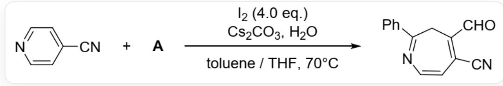
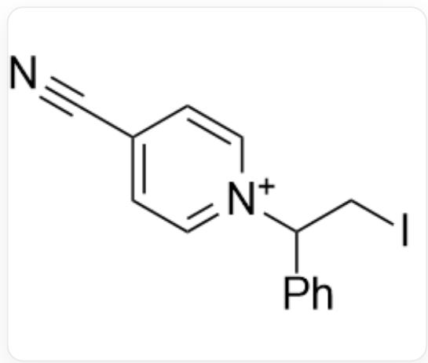
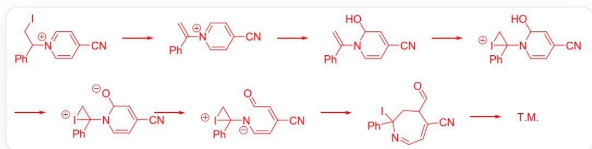
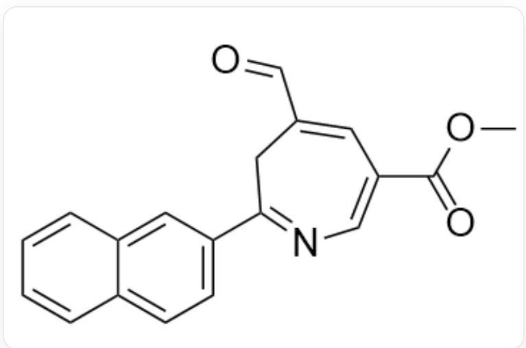

# 题目

人们利用以下反应构建了氮杂七元环系：

在甲苯、THF混合溶剂，70摄氏度下，`N#CC1=CC=NC=C1`和A与  $C s_{2} C O_{3}$  、  $H_{2}O$  和4当量碘反应得到`O=CC1=C(C#N)C=CN=C(C2=CC=CC=C2)C1`

机理研究表明, 反应经历关键中间体  $\mathrm{X}^{+}\left(C_{14} H_{12} I N_{2}\right)$ ; 反应即使不加入  $C s C O_{3}$  和  $H_{2} O$  也可以分离得到  $\mathrm{X}^{+}$ 的盐。  $\mathrm{X}^{+}$ 在以上反应条件下继续与  $I_{2}$  反应生成最终产物。

选择以下选项中正确的一项：

A. 其他选项均不正确  
B. A 的分子量约为92  
C. A 的不饱和度为4  
D.  $\mathbf{X}^{+}$ 中仅有1个六元环  
E.  $\mathbf{X}^{+}$ 得到产物还需消耗1分子碘和4分子碳酸铯（视为一元碱）  
F. 若想要在相同条件下得到  $\mathrm{COC}(= 0) \mathrm{C} 1 = \mathrm{CN} = \mathrm{C} (\mathrm{CC}(= \mathrm{C} 1) \mathrm{C} = 0) \mathrm{C} 2 = \mathrm{CC} = \mathrm{C} 3 \mathrm{C} = \mathrm{CC} = \mathrm{CC} 3 = \mathrm{C} 2^{\prime}$ , 需要的两种反应物为  $\mathrm{O} = \mathrm{C} (\mathrm{OC}) \mathrm{C} 1 = \mathrm{CC} = \mathrm{NC} = \mathrm{C} 1$  和  $\mathrm{C} = \mathrm{CC} 1 = \mathrm{CC} 2 = \mathrm{CC} = \mathrm{CC} = \mathrm{C} 2 \mathrm{C} = \mathrm{C} 1$

# 答案

正确答案: E

# 详细解析

$\mathbf{X}^{+}$ 比  $\mathrm{N}\# \mathrm{CC1} = \mathrm{CC} = \mathrm{NC} = \mathrm{C}1$  多出  $C_8H_8$  并含一个碘，故A的分子式应为  $C_8H_8$  。最合理的  $C_8H_8$  烯烃就是苯乙烯。因此A的分子量为104且不饱和度为5。

# CHECKPOINT

2 PTS

A 的分子式应为  $C_{8} H_{8}$ , 分子量为 104 且不饱和度为 5 , 选项BC错误

A中的双键与碘反应后，被`N#CC1=CC=NC=C1`亲核进攻，得到  $\mathbf{X}^{+}$ ：`ICC(C1=CC=CC=C1)[N+]2=CC=C(C#N)C=C2`，有两个六元环。

`ICC(C1=CC=CC=C1)[N+]2=CC=C(C#N)C=C2`

# CHECKPOINT

1 PTS

$\mathbf{X}^{+}$  的结构为  $\mathrm{ICC}(\mathrm{C}1 = \mathrm{CC} = \mathrm{CC} = \mathrm{C}1)[\mathrm{N} + ]2 = \mathrm{CC} = \mathrm{C}(\mathrm{C}\# \mathrm{N})\mathrm{C} = \mathrm{C}2^{\prime}$  ，有两个六元环，选项D错误

从  $\mathbf{X}^{+}$ 得到产物的机理为：

首先碳酸铯作为碱，消除  $\mathbf{X}^{+}$ 中的  $HI$  ，产生双键：`C=C(C1=CC=CC=C1)[N+]2=CC=C(C#N)C=C2`，随后水分子进攻，离去质子产生羟基：`C=C(N1C=CC(C#N)=CC1O)C2=CC=CC=C2`，新产生的双键被一分子新的碘进

攻： $\mathrm{N}\# \mathrm{CC}1 = \mathrm{CC}(\mathrm{O})\mathrm{N}(\mathrm{C}2(\mathrm{C}3 = \mathrm{CC} = \mathrm{CC} = \mathrm{C}3)\mathrm{C}[I + ]2)\mathrm{C} = \mathrm{C}1$ ，新产生羟基的氢被碱拔去：

`N#CC1=CC([O-])N(C2(C3=CC=CC=C3)C[I+]2)C=C1`，随后六元环开环：`N#CC(/C=C\

[N-]C1(C2=CC=CC=C2)C[I+1]=C/C=O\`，氮上的负电荷沿共轭双键进攻打开碘三元环产生七元环：

`N#CC1=CC=NC(I)(C2=CC=CC=C2)CC1C=O`，最后碱拔去酸性最强的醛基α氢，离去碘原子得到产物

根据机理可知，共消耗一分子碘且需消耗4个质子，每分子碳酸铯可中和1个质子（碳酸氢铯碱性不足），则还需消耗1分子碘和4分子碱。

# CHECKPOINT

1 PTS

$\mathbf{X}^{+}$ 得到产物还需消耗1分子碘和4分子碱，选项E正确。

结合机理可知，烯烃所带的芳基位于2号位，新产生的醛基位于4号位，原先吡啶的两个2号位分别为七元环的7号位和醛基碳，吡啶的两个3号位分别为七元环的6号位和4号位，吡啶的4号位为七元环的5号位。 $\mathrm{COC(=O)C1 = CN = C(CC(=C1)C = O)C2 = CC = C3C = CC = CC3 = C2^{\prime}}$  的芳基为萘基，则对应反应中的烯烃为

`C=CC1=CC2=CC=C2C=C1`；其中的取代基甲酯基位于七元环6号位，对应原先吡啶的3号位，吡啶衍生物为`O=C(OC)C1=CC=CN=C1`。

# CHECKPOINT

1 PTS

两种反应物分别为  $\mathrm{C} = \mathrm{CC} 1 = \mathrm{CC} 2 = \mathrm{CC} = \mathrm{CC} = \mathrm{C} 2 \mathrm{C} = \mathrm{C} 1$  和  $\mathrm{O} = \mathrm{C} (\mathrm{OC}) \mathrm{C} 1 = \mathrm{CC} = \mathrm{CN} = \mathrm{C} 1$ , 选项F错误

  
$\mathrm{COC(=O)C1 = CN = C(CC(=C1)C = O)C2 = CC = C3C = CC = CC3 = C2}$