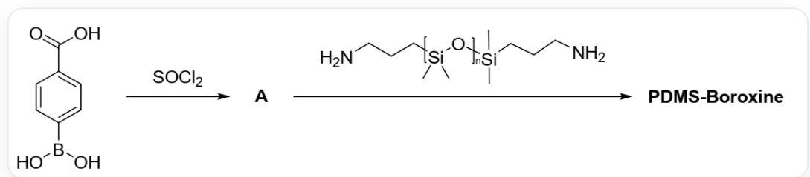
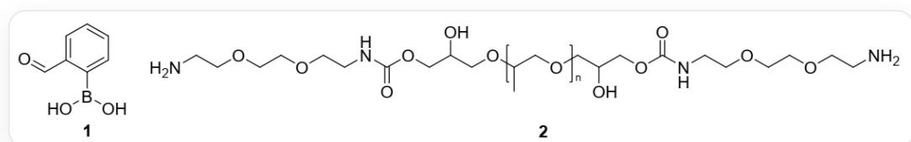
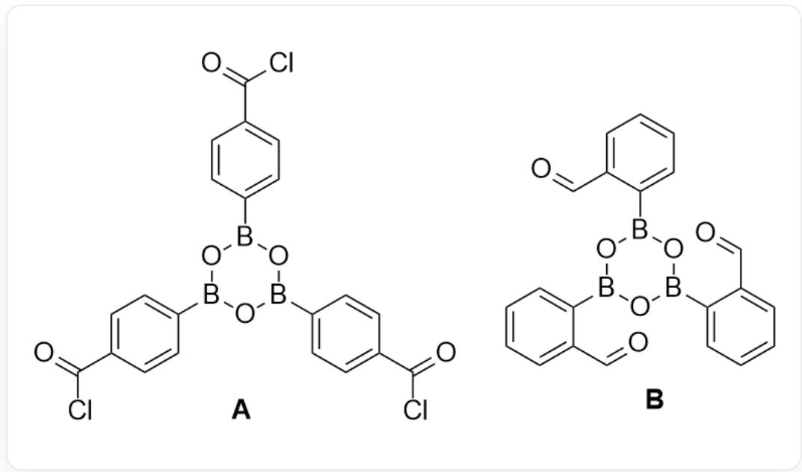

# Question

Due to the irreversibility of covalent bonds, traditional polymer materials are difficult to restore to their initial properties after damage through repair, making them difficult to recycle. To reduce resource waste, there is an urgent need to develop repairable and recyclable polymer materials, which include polymers based on dynamic covalent bonds. The following figure shows the preparation process of the polymer PDMS-Boroxine:

  
`O=C(O)C1=CC=C(B(O)O)C=C1` obtains A under the action of  $SOCl_{2}$ , and then reacts with the polymer, whose basic structure is `C[Si](C)(CCCN)O[Si](C)(C)CCCN` (degree of polymerization is 1), the repeating unit is `C[Si](C)([^*])O[*]` ([*] represents the position where the polymer monomer is bonded), to obtain PDMS-Boroxine

Monomer 1 obtains B, similar to A, under the action of molecular sieves. B undergoes a condensation reaction with 2 to obtain a thermosetting polymer C. These polymers have flexible self-healing mechanisms.

  
The structure of 1 is  $\mathrm{OB(O)C1 = C(C = O)C = CC = C1}$ , the basic structure of polymer 2 is  $\mathrm{CC(COCC(O)COC(NCCOCCOCCN)} = \mathrm{O})\mathrm{COCC(O)COC(NCCOCCOCCN)} = \mathrm{O}$  (degree of polymerization is 1), the repeating unit is  $\mathrm{CC([^{*}])CO^{*}}$  ([*] represents the position where the polymer monomer is bonded)

The following statements are made:

1. A has 4 six-membered rings

2. PDMS-Boroxine is a linear polymer  
3. Studies have shown that PDMS-Boroxine has good self-healing properties. The prepared PDMS-Boroxine was cut into two pieces, the two cut surfaces were wetted with water and the two cut surfaces were brought into contact with each other, and after drying at 70 degrees Celsius for 24 hours, it was found that the two cut surfaces were bonded together. This process involves changes in the form of boron-containing groups  
4. In addition to self-healing under conditions similar to those in statement 3,  $\mathbf{C}$  can also achieve self-healing under heating conditions. The realization of this process mainly involves changes in the form of boron-containing groups.

Select the option that contains all the correct statements

A. All statements are incorrect.  
B. 1  
C. 2  
D. 3  
E. 4  
F. 1,2  
G. 1,3  
H. 1,4  
1. 2,3

J. 2,4  
K. 3,4  
L. 1,2,3  
M. 1,2,4  
N. 1,3,4  
O. 2,3,4  
P. 1,2,3,4

# Answer

Correct Answer: G

# Detailed Explanation

Thionyl chloride is a strong dehydrating agent and chlorinating agent, which converts carboxyl groups into more reactive acyl chlorides and also dehydrates boronic acid groups. Three molecules of boric acid will lose three molecules of water to form a six-membered ring composed of alternating three boron atoms and three oxygen atoms. The structure of A is thus:

$$
\mathrm {^ O = C (C l) C (C = C 1) = C C = C 1 B 2 O B (C 3 = C C = C (C (C l) = O) C = C 3) O B (C 4 = C C = C (C (C l) = O) C = C 4) O 2 ^ {\cdot}}.
$$

# CHECKPOINT

1 PTS

The

structure

of

A

is:

$$
\begin{array}{l} \text {` O = C (C l) C (C = C 1) = C C = C 1 B 2 O B (C 3 = C C = C (C (C l) = O) C = C 3) O B (C 4 = C C = C (C (C l) = O) C = C 4) O 2 ^ {\prime} , \quad w h i c h} \\ \text {h a s 4 s i x - m e m b e r e d r i n g s . S t a t e m e n t 1 i s c o r r e c t} \end{array}
$$

Subsequently, the acyl chloride of  $\mathbf{A}$  reacts with the amino groups in the polymer molecule to produce PDMS-Boroxine, where the functionality of  $\mathbf{A}$  is 3, and each polymer molecule has two amino groups, with a functionality of 2. The average polymerization functionality of the two must be greater than 2, so PDMS-Boroxine is a bulk polymer.

# CHECKPOINT

1 PTS

The average functionality of PDMS-Boroxine is greater than 2, so it is a bulk polymer. Statement 2 is incorrect

Cutting the polymer breaks the chemical bonds at the cut surface. The addition of water will shift the chemical equilibrium to the left, causing the boroxine ring at the cut surface to hydrolyze, regenerating boronic acid groups. Bringing the two cut surfaces into contact and heating will evaporate the water, promoting the re-dehydration condensation of the boronic acid groups at the interface, forming new boroxine rings. These newly formed chemical bonds "stitch" the two cut surfaces together, achieving healing.

# CHECKPOINT

1 PTS

Adding water causes the boroxine ring to hydrolyze to produce boric acid, and subsequent heating dehydrates the boric acid, forming bonds between the cross-sections to achieve adhesion. Statement 3 is correct

Under the action of molecular sieves, 1 dehydrates to produce B similar to A:  $\mathrm{O = CC1 = CC = CC = C1B2OB(C3 = CC = CC = C3C = O)OB(C4 = CC = CC = C4C = O)O2^{\cdot}}$ . Subsequently, the aldehyde group reacts with the amino group in 2 to produce an imine, generating C similar to PDMS-Boroxine. Since the formation of imine is a dynamic equilibrium, under heating conditions, trace amounts of free amino groups in the system will attack the imine, thereby realizing the reversible exchange of imine bonds. Since chain segment movement becomes easier under heating conditions, the active groups on the two cut surfaces can approach and react, thereby achieving the self-healing process.

# CHECKPOINT

1 PTS

Under heating conditions, a small amount of free amino groups of C can attack the imine group, realizing the reversible exchange of imines, thereby achieving self-healing. Statement 4 is incorrect

Statements 1 and 3 are correct, select G.

The structures of  $\mathbf{A}$  and  $\mathbf{B}$  are shown below:

  
A:  $\mathrm{O = C(Cl)C(C = C1) = CC = C1B2OB(C3 = CC = C(C(Cl) = O)C = C3)OB(C4 = CC = C(C(Cl) = O)C = C4)O2}}$  ; B :  $\mathrm{O = CC1 = CC = CC = C1B2OB(C3 = CC = CC = C3C = O)OB(C4 = CC = CC = C4C = O)O2}$