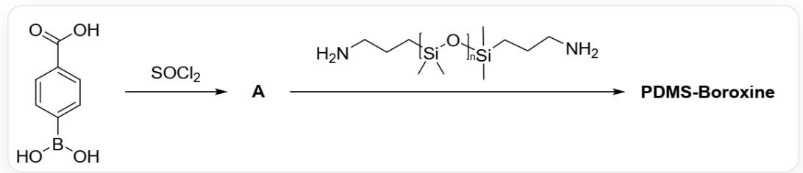
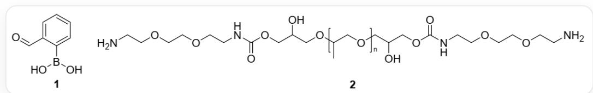
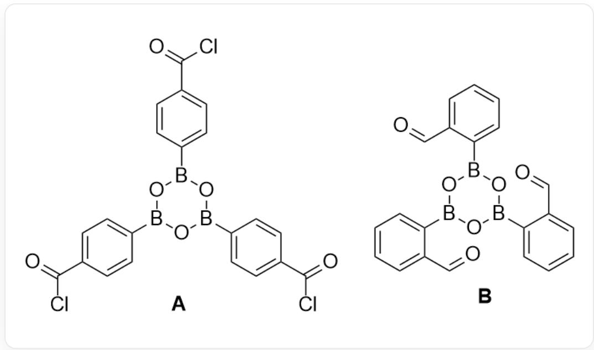

# 题目

由于共价键的不可逆性，传统聚合物材料在损伤后很难通过修复恢复其初始性能，也就难以循环利用。为了减少资源浪费，急需发展可修复与可循环利用的聚合物材料，其中便包括了基于动态共价键的聚合物。下图为聚合物PDMS-Boroxine的制备过程：

  
`O=C(O)C1=CC=C(B(O)O)C=C1`在SOCl2作用下得到A，随后和聚合物反应，其基本结构为`C[Si](C)(CCCN)O[Si](C)(C)CCCN`（聚合度为1)，重复单元为`C[Si](C)([^*])O[*]`（[*]表示聚合物单体成键的位置），得到PDMS-Boroxine

单体1在分子筛作用下得到与A类似的B。B与2发生缩合反应可得到一种热固性聚合物C。这类聚合物具有灵活的自愈合机制。

  
1的结构为 $\mathrm{OB(O)C1 = C(C = O)C = CC = C1}$ , 聚合物2的基本结构为  
CC(COCC(O)COC(NCCOCCOCCN)=O)COCC(O)COC(NCCOCCOCCN)=O（聚合度为1），重复单元为 $\mathrm{CC}([\ast])\mathrm{CO}[\ast]$  （[表示聚合物单体成键的位置）

有以下说法：

1. A 有4个六元环  
2.PDMS-Boroxine为线型高分子

3. 研究表明，PDMS-Boroxine具有良好的自愈合性能。将制得的PDMS-Boroxine切割成两块，用水浸湿两个切面并使两切面相互接触，于70摄氏度条件下干燥24小时后，发现两切面发生了粘合。这一过程涉及其中含硼基团存在形式的变化  
4. 除了能在说法3类似的条件下自愈合外，C在加热条件下也能实现自愈合。这一过程的实现主要涉及其中含硼基团存在形式的变化。

选出所含说法全部正确的选项

A. 所有说法均不正确  
B. 1  
C. 2  
D. 3  
E. 4  
F. 1,2  
G. 1,3  
H. 1,4  
1. 2,3  
J. 2,4

K. 3,4  
L. 1,2,3  
M. 1,2,4  
N. 1,3,4  
O. 2,3,4  
P. 1,2,3,4

# 答案

正确答案: G

# 详细解析

亚硫酰氯是一个强脱水剂和氯化剂，会将羧基转化为更活泼的酰氯，也会使硼酸基团脱水。三分子硼酸会脱去三分子水，形成一个由三个硼原子和三个氧原子交替组成的六元环。则  $\mathbf{A}$  的结构为： ${}^{\backprime}\mathrm{O} = \mathrm{C(Cl)}\mathrm{C(C = C1)} = \mathrm{CC} = \mathrm{C1B2OB(C3 = CC = C(C(Cl) = O)C = C3)}\mathrm{OB(C4 = CC = C(C(Cl) = O)C = C4)}\mathrm{O2}^{\prime \prime}$

# CHECKPOINT

1 PTS

A

的

结

构

为

：

`O=C(Cl)C(C=C1)=CC=C1B2OB(C3=CC=C(C(Cl)=O)C=C3)OB(C4=CC=C(C(Cl)=O)C=C4)O2`，有4个六元环，说法1正确

随后A的酰氯与聚合物分子中的氨基反应，产生PDMS-Boroxine，其中A的官能度为3，每个聚合物分子中有两个氨基，官能度为2，二者聚合平均官能度一定大于2，则PDMS-Boroxine为体型高分子。

# CHECKPOINT

1 PTS

PDMS-Boroxine平均官能度大于2，为体型高分子，说法2错误

将聚合物切开，破坏了切面处的化学键，水的加入会使化学平衡向左移动，导致切面处的硼氧六环水解，重新生成硼酸基团。将两个切面接触，加热会使水蒸发，促使界面处的硼酸基团重新脱水缩合，形成新的硼氧六环。这些新形成的化学键将两个切面“缝合”在一起，实现愈合。

# CHECKPOINT

1 PTS

加入水后导致硼氧六环水解产生硼酸，随后加热使得硼酸脱水，在断面间成键实现粘合，说法3正确。

在分子筛作用下1脱水产生类似A的B： $\mathrm{O = CC1 = CC = CC = C1B2OB(C3 = CC = CC = C3C = O)OB(C4 = CC = CC = C4C = O)O2^{\prime}}$  ，随后醛基与2中的氨基反应产生亚胺，生成类似于PDMS-Boroxine的C。由于亚胺的形成是一个动态平衡，加热条件下，体系中微量的游离氨基会进攻亚胺，从而实现亚胺键的可逆交换。由于加热条件下链段运动变得更加容易，两个切面上的活性基团得以靠近发生反应，进而实现自愈合过程。

# CHECKPOINT

1 PTS

加热条件下C的少量游离氨基可以进攻亚胺基团，实现亚胺的可逆交换，进而实现自愈合。说法4错误

说法1，3正确，选G

A和B的结构如下所示：

  
A: `O=C(Cl)C(C=C1)=CC=C1B2OB(C3=CC=C(C(Cl)=O)C=C3)OB(C4=CC=C(C(Cl)=O)C=C4)O2`; B: `O=CC1=CC=CC=C1B2OB(C3=CC=CC=C3C=O)OB(C4=CC=CC=C4C=O)O2`